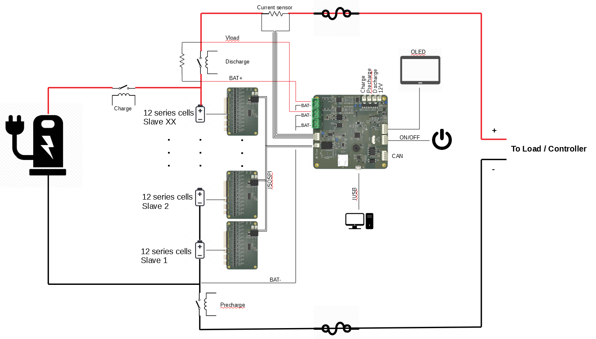
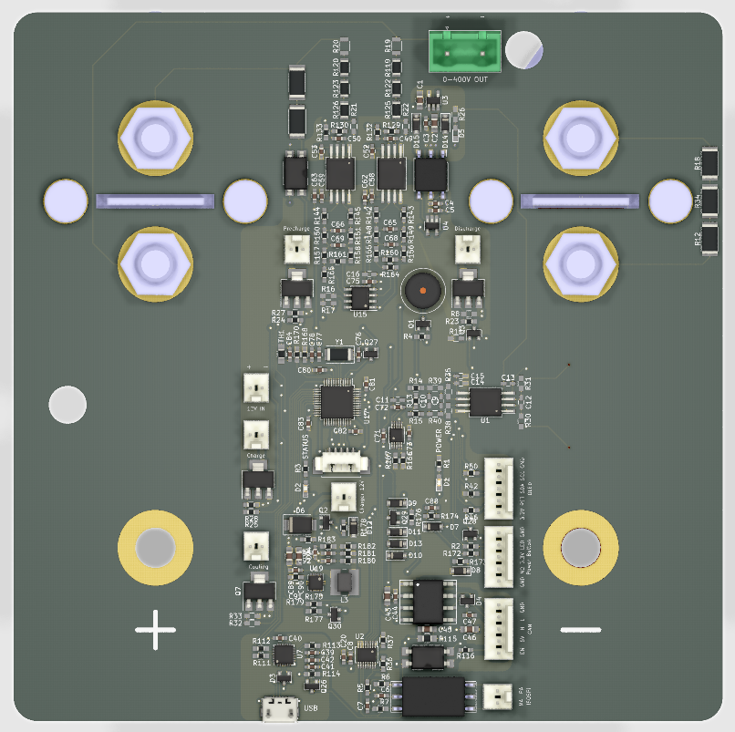

# ENNOID - BMS

ENNOID-BMS is a configurable battery management system consisting of a Master board based on an STM32 microcontroller connected through an ISOSPI interface to several modular slave boards. ENNOID-BMS can monitor the specifics temperatures, currents & voltages that are critical for any lithium-ion battery packs. Based on the monitored inputs & the configured parameters, the master board can allow or interrupt the flow of energy from the battery pack by switching the state of external heavy-duty contactors. ENNOID-BMS can measure each cell voltage level & can trigger the passive balancing function during charging for cells above the configured limit to ensure that all cells have a similar State-Of-Charge (SOC). Parameters can be configured through the ENNOID-BMS-Tool software running on a USB connected host computer.

## Block diagram

The evolution of the BMS can be followed on this thread:

https://endless-sphere.com/forums/viewtopic.php?f=14&t=92952

Related ENNOID project:
  - [Scalable Battery Pack](https://github.com/EnnoidMe/ENNOID-PACK)

For ordering assembled BMS or battery packs, please visit:

https://www.ennoid.me/battery/bms

## Features:

- Up to 400V operation
- Up to 500A continuous operation
- Modular with master/slave topology
- Isolation between battery pack & components
- Communication between slaves & master through a two-wire daisy chained ISOSPI interface
- Isolated CAN bus interface
- Isolated charger detection circuit
- Isolated voltage measurement for battery & load 
- Isolated bi-directional current monitoring via external delta-sigma current sensor
- 12V contactor coil outputs for charge, discharge & pre-charge circuits
- USB interface for programming and firmware upgrades through an easy to use graphical user interface
- OLED Display & power button
- 2.5V to 4.5V cell voltage operation

## Documentation:

[ENNOID-BMS Datasheet](https://www.dropbox.com/s/f0ceev75hfsckzv/Datasheet.docx?dl=0)

## Software:

ENNOID-BMS GUI configuration tool:
[ENNOID-BMS tool](https://github.com/EnnoidMe/ENNOID-BMS-Tool/releases/download/Windows_V0.30/Windows-V0.30.zip)

## Firmware:

ENNOID-BMS firmware .bin file:
[ENNOID-BMS.bin](https://github.com/EnnoidMe/ENNOID-BMS-Firmware/blob/master/MDK-ARM/DieBieMS/ENNOID-BMS.bin)

## Master board

## Slave board LTC6811

View this project on [CADLAB.io](https://cadlab.io/project/1987). 

