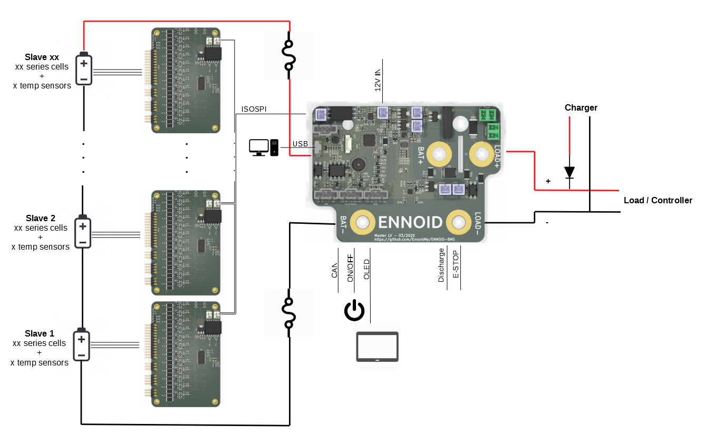

# ENNOID - BMS

ENNOID-BMS is an open-source configurable battery management system consisting of a Master board based on an STM32 microcontroller connected through an ISOSPI interface to several modular slave boards. ENNOID-BMS can monitor the specifics temperatures, currents & voltages that are critical for any lithium-ion battery packs. Based on the monitored inputs & the configured parameters, the master board can allow or interrupt the flow of energy from the battery pack by switching the state of external heavy-duty contactors. ENNOID-BMS can measure each cell voltage level & can trigger the passive balancing function during charging for cells above the configured limit to ensure that all cells have a similar State-Of-Charge (SOC). Parameters can be configured through the ENNOID-BMS-Tool software running on a USB connected host computer.

## Ordering:

For ordering assembled BMS or battery packs, please visit:

https://www.ennoid.me/bms/gen-1

## Documentation:
https://blog.ennoid.me/

## Block diagram

The evolution of the BMS can be followed on this thread:

https://endless-sphere.com/forums/viewtopic.php?f=14&t=92952

## Features:

- Modular with master/slave topology
- 12S, 15S & 18S slaves board options
- Master board options: High Voltage (Master-HV) & Low voltage (Master-LV)
- Up to 500A continuous operation
- Integrated bi-directional current sensor
- 12V drive coil outputs for charge,  discharge & auxiliary circuits
- Communication between slaves & master through a two-wire daisy chained ISOSPI interface
- Isolated CAN bus interface 
- Isolated charger detection circuit
- Voltage measurement for battery pack & load
- Build-in precharge circuits
- USB interface for programming and firmware upgrades through an easy to use graphical user interface
- OLED Display, serial output & power button
- 0V to 5V cell voltage operation

## Documentation:

[ENNOID-BMS Datasheet](https://github.com/EnnoidMe/ENNOID-BMS/blob/master/Datasheet.pdf)

## Software:

ENNOID-BMS GUI configuration tool:
[ENNOID-BMS tool](https://github.com/EnnoidMe/ENNOID-BMS-Tool)

## Firmware:

ENNOID-BMS firmware .bin file:
[ENNOID-BMS.bin](https://github.com/EnnoidMe/ENNOID-BMS-Firmware)

View this project on [CADLAB.io](https://cadlab.io/project/1987). 

