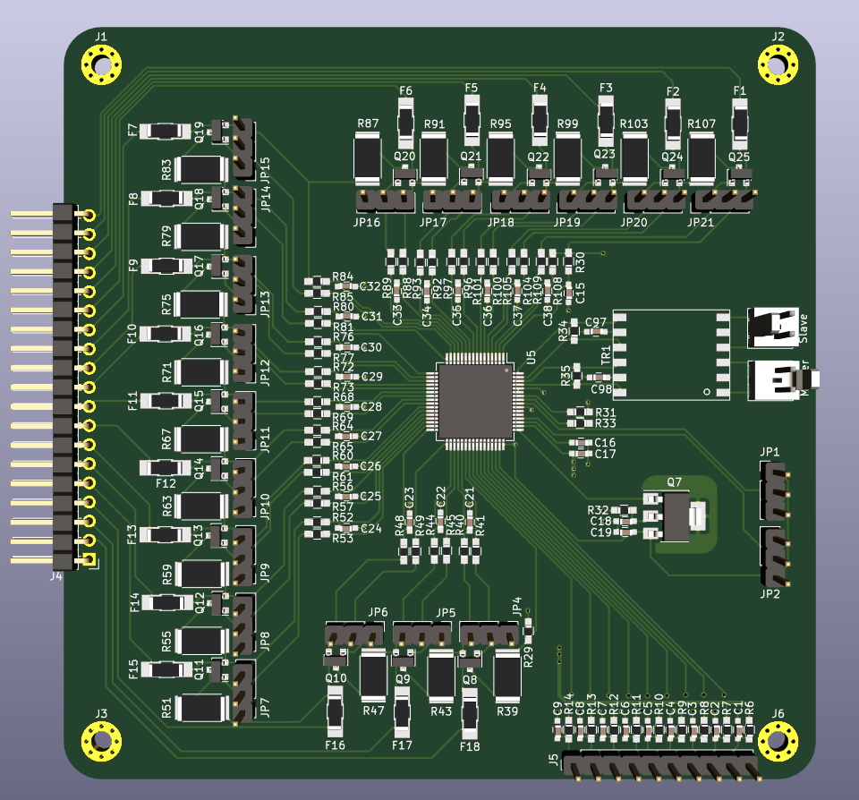

This repository is part of the open-source project: EVGE - Electric Vehicle Global Equipment:

- EVCE - Electric Vehicle Charge Equipment
  - Onboard Battery Charger
  - Charging station
- EVBE - Electric Vehicle Battery Equipment 
  - **BMS (This repository)**
  - Scalable Battery Pack
- EVPE - Electric Vehicle Powertrain Equipment
  - Motor Driver (https://github.com/EnnoidMe/VESC-controller)
  - Gate driver (https://github.com/EnnoidMe/ENNOID-Dual-Gate-Driver)
  - Scalable Three-Phase Electric Motor

# ENNOID - BMS

This project aims to create a scalable & modular open source BMS for up to 1000V lithium-ion battery packs.

# Update 

20/02/2018:
The idea behind this project has been started on this thread:

https://endless-sphere.com/forums/viewtopic.php?f=14&t=92952

31/12/2018:
- Copying DieBieMS schematics into kicad
- Switching balancing circuit to LTC6813 
- Adapting the schematics to have the MPU isolated from PSU, Balancing circuit & High voltage measurements.
- Removing high current circuits from the PCB (Traces & FET switches are now removed, the current will flow through external contactor instead. ex: EV-200 contactor)

13/01/2019:
For cost reasons:
- Master & Slave boards will be on a 2 layers PCB 100mm x 100mm 

PCB cost = 10 pcs x (Master+ Slave) = 9.80$ + shipping 

### Features:

**Master board**
- Isolated voltages measurements for Charge, Discharge & Pack buses
- Isolated bi-directional current monitoring via external delta-sigma current sensor
- Isolated CAN bus interface for cell voltage monitoring and charger detection, status monitoring + much more with future updates (like state of charge / state of health).
- Outputs for Charge, Discharge & Precharge contactors
- USB interface for serial communication and firmware upgrades (no need for a programmer -> HW serial bootloader is used).
- Wireless transceiver
- SDCard for logging (to develop a SoC and SoH algorithm)

**Slave boards**
- 18 Cells balancing/board 
- Cell voltage range 2.5V to 4.5V
- Stackable for up to 1000V packs 
- 9 Temperatures sensors/board
- Daisychain Master/Slave ISOSPI communication 
- Internal & external balancing circuit mode possible through dedicated jumpers

**Software**

- Firmware, bootloader & configuration tool are the same as [DieBieMS](https://github.com/DieBieEngineering). 
- Changes from DieBieMS code are only required to support the LTC6813 communication/balancing instead of the LTC6803. (Slave with LTC6803 would not require any changes at all)
- Isolation layer & schematic changes don't require MCU code modifications on Master board.

### Components:

- LTC6813	-> Battery stack cell voltage monitor.
- LTC6820	-> ISOSPI communication to Slaves.
- STM32F303	-> Main microcontroller.
- AMC1301	-> Isolated voltage measurement
- AMC1303	-> Current measurement
- INA226	-> Power measurement.
- BQ76200	-> Driver for Discharge, Charge and Precharge switches.
- LM5165	-> SMPS Buck converter, converting the 24V voltage to +3.3V.
- ISO1050	-> Isolated CAN-Bus transceiver.
- CP2104-F03	-> USB to serial converter for bootloader based firmware updates and debugging.

### Master

### Slave

