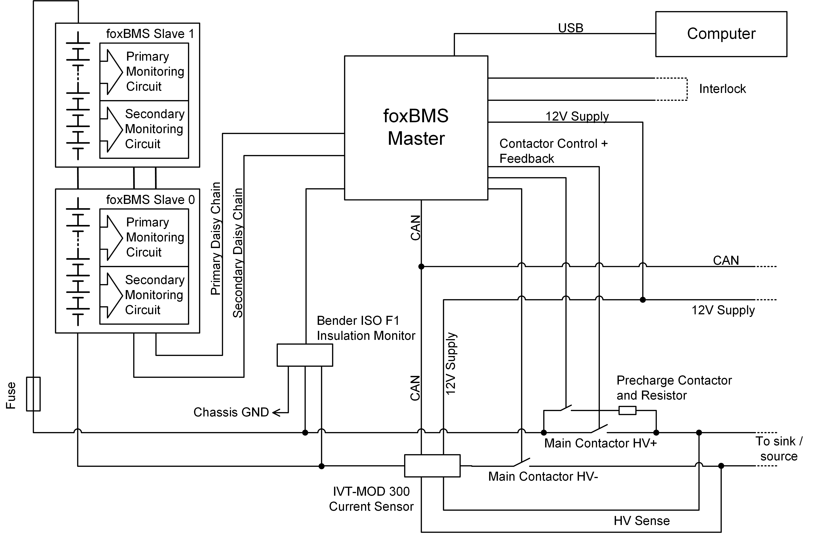
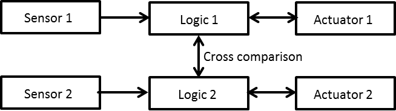

.. include:: ../../macros.rst

.. _general_information_safety:

======
Safety
======

This document describes the hazard risk analysis and assessment done for the |foxbms| platform. The content of this document must be read and understood before any tests are done with the |foxbms| hardware. All physical quantities and units used in the document are SI based.

Hazard Risk Analysis and Assessment
-----------------------------------

The risk analysis and assessment was last performed in May 2017. Following persons were involved:

.. list-table::
   :header-rows: 1
   :widths: 15 85

   * - **Name**
     - **Responsibility**
   * - Vincent Lorentz
     - Global project Management
   * - Stéphane Koffel
     - Technical Project Management
   * - Martin Wenger
     - Hardware Development (BMS-Extension)
   * - Radu Schwarz
     - Hardware Development (BMS-Master)
   * - Sebastian Wacker
     - Hardware Development (BMS-Slave)
   * - Stefan Waldhör
     - Software Development
   * - Müsfik Akdere
     - Software Development
   * - Johannes Wachtler
     - Validation and Tests
   * - Markus Freund
     - Moderation

General Description of the |foxbms| Platform
--------------------------------------------

|foxbms| is a research and development platform aimed to be used to develop battery management systems (BMS) for rechargeable energy storage systems based on lithium-ion batteries (LIB) or comparable electrochemical rechargeable accumulator cells (e.g., other chemistries like lithium-sulfur, sodium-ion or even all-solid-state batteries), lithium-ion capacitors (LIC), electric double-layer capacitors (EDLC or supercapacitors). The lithium-ion battery packs or battery modules are a major source of hazards and are not part of the |foxbms| platform (see :numref:`fig. %s <general_information_safety_battery_system>`). The main purposes of the battery management system are charge monitoring and keeping the battery cells in their safe operating area to ensure optimal safety and the longest battery lifetime.

.. _general_information_safety_battery_system:
.. figure:: ./hw_system_overview.png
   :width: 100 %

   |foxbms| in the battery system

For those tasks, the |foxbms| platform is equipped with measurement and control circuits (i.e., |BMS-Slaves|) to monitor the battery cells and to get information about their states. With this, the cell voltages, temperatures and overall battery pack current are measured, and kept in the safe operating area. The battery charge equalization (i.e., balancing) is controlled and fed back to the |master|. The setup of the system is shown in :numref:`fig. %s <general_information_safety_battery_system_block_diagram>`.

.. _general_information_safety_battery_system_block_diagram:

    Block diagram showing the typical topology of a battery system

The |foxbms| platform uses a passive balancing circuit based on the |LTC| multicell battery monitoring integrated circuit. The unique selling point of the |foxbms| platform is its virtually unlimited possibilities to be adapted the needs of the user.

Limits of the |foxbms| Platform
-------------------------------

The |foxbms| platform consists only of the |master| with the |slaves| and the provided computer software. It does not include battery cells, battery cell models, power contactors, current sensors, fuses, chargers, power supplies, ground fault detector.

The |master| and the |slaves| have a primary and a secondary side which are separated and galvanically isolated from each other.

The area of the use of |foxbms| must be free of hazardous materials like flammable gases, combustible dust or ignitable dust and fibers. The temperature should be around 20°C and may not exceed the battery cells restrictions given by the battery cell manufacturer (e.g., around 45°C to 60°C, depending on the battery cell chemistry). The operating and storage environment needs to be dry and free of static electricity with air humidity between 35% and 55%.

The lifetime of the electronics of |foxbms| is supposed to be limited to three years since the target application is research and development. During this time, hardware and software updates and bug fixes are to be expected. Besides that, the research or work on the prototypes should be finished after three years.

The interfaces of the |master| are:

.. list-table::
   :header-rows: 1
   :widths: 15 85

   * - **Connection**
     - **Description**
   * - Supply Voltage DC
     - 12VDC-24VDC supply input
   * - Ground Fault Detector
     - Connection for the insulation monitor to detect an error (Bender ISOMETER IR155-3203)
   * - |CAN0|
     - Galvanically isolated connection on |master| for additional sensors (IVT-MOD-300)
   * - Primary USB
     - Galvanically isolated USB connection to microcontroller on the primary side for flashing and communication
   * - Contactors 0-8
     - Power contactors between battery and the supplied load
   * - Interlock
     - Galvanically isolated connection between the microcontrollers and connector control
   * - Daisy Chain (Primary/Secondary)
     - Connection for the next |BMS-Slave| in the battery system
   * - Secondary USB
     - Galvanically isolated USB connection to microcontroller on the secondary side for flashing and communication
   * - |CAN1|
     - Galvanically isolated connection on |BMS-Extension|
   * - RS485
     - Galvanically isolated RS485 interface as alternative for CAN or USB
   * - Isolated GPIO
     - Galvanically isolated general purpose IO for user specific needs
   * - Isolated NOC
     - Galvanically isolated Normally Open Contact interface for any purpose left to the user
   * - Analog Inputs
     - Analog inputs for any purpose left to the user
   * - Memory Card
     - Data storage for the primary microcontroller

The interfaces of the |slave| are:

.. list-table::
   :header-rows: 1
   :widths: 15 85

   * - **Connection**
     - **Description**
   * - 12 Cells
     - 13 voltage sense connections for 12 cells
   * - 8+16 Temperatures
     - Temperature sensor connection (one for each cell)
   * - 4 Daisy Chains
     - Primary and secondary daisy chain connections to the next and to the previous |BMS-Slave|

The maximum amount of BMS-Slave units depends on the number of battery cells connected to the slaves and the voltage of each cell. The total voltage of the battery pack must never exceed 1500Vdc (continuous and peak). Battery types to be used with the system are lithium-ion batteries or comparable electrochemical rechargeable accumulator cells, lithium-ion capacitors or supercapacitors.

Targetted Users of |foxbms|
---------------------------

The persons who use the |foxbms| R&D platform must be electrically skilled according to the IEC. They must also be educated in rechargeable batteries and have knowledge in electrochemistry. With the sum of battery cells exceeding 120VDC, these persons also need to be skilled in live working. It is not enough to be an electrically instructed person. Targeted users of the |foxbms| R&D platform are R&D and test engineers working in a well-defined, safe and controlled environment, like a test bay or a test bench. Since these persons assemble the whole system by themselves, they are the only persons who can do the service and the maintenance. The R&D and test engineers are both users and servicers.

The |foxbms| R&D platform is not intended to be used by ordinary persons as they are not well and not enough educated in batteries, or in electrical subjects. This also includes students, handymen, and do-it-yourselfer or DYI enthusiasts who do not fulfil the above requirements.

Intended Use of |foxbms|
------------------------

The |foxbms| R&D platform is only for lithium-ion batteries or comparable energy storage systems. It is an evaluation kit intended only to professionals and to be used at research and development facilities for such purposes. It is designed for research, development and tests purposes to manage prototypes of lithium-ion-battery systems when developing new products.

Reasonably Foreseeable Misuse of |foxbms|
-----------------------------------------

The |foxbms| R&D platform is not intended to be used as a voltage monitoring system of any other electrical systems than battery systems build with battery cells providing a maximum single cell voltage of 5V.

Phases Throughout the System Lifecycle of |foxbms|
--------------------------------------------------

#. Development
#. Manufacturing
#. Packaging
#. Transportation
#. Assembling
#. Initial operation
#. Usage (operation)
#. Maintenance
#. Repair
#. Further operation
#. Shutting down
#. Storage
#. Disassembling
#. Disposal

Hazard Zones of |foxbms|
------------------------

Only few hazard zones are obvious. One is the |foxbms| and the other its environment with the battery system including bus bars, battery cells and other parts. Since the battery system is defined by the user, only a general consideration can be done.

Risk Assessment
---------------

Depending on the countries of the target application, there are different standards to regard. In the European Union, the applicable directives lead to different safety requirements. These have a variety of risk graphs for the risk assessment. Although they are only slightly different they are not adaptable to each other. Since the target country and use of |foxbms| is unknown, the users of the system need to do a risk assessment on their own according to their concerns.

Some European directives that can be relevant for the |foxbms| users:

- General product safety
- Low voltage
- Machinery
- etc...

Some example of safety standards that might fit the application of the |foxbms| users:

- IEC 61508 (Functional Safety)
- ISO 25119 (Agriculture)
- ISO 26262 (Road Vehicles)
- EN 13849 (Machinery)
- EN 61511 (Process Industry)
- EN 50156 (Furnaces)
- etc...

A list of standards that might fit to the target application can be found here:

- http://www.mpoweruk.com/standards.htm

Standards
---------

In order to use the |foxbms| safely, at least the following standards or similar ones should be regarded:

- DIN VDE 0100-410 (IEC 60364-4-41)
- DIN VDE 0100-600 (IEC 60361-6)
- EN 60529
- EN 50272
- etc...

Recommended readings:

- http://www.mpoweruk.com
- http://batteryuniversity.com

Safety Instructions Before Using |foxbms|
-----------------------------------------

.. danger::
    .. W012
    .. image:: ./signs/warning/w012_elektrische_spannung.png
        :scale: 50 %
        :alt: alternate text
        :align: right

    Risk of electric shock. You need to be an electrically skilled person in order to work with batteries and assemble battery systems. Regard IEC 60364-4-41, IEC 60364-6, IEC 60529 (DIN VDE 0100-410, DIN VDE 0100-600, VDE 0470-1).

.. danger::
    .. W012, M009
    .. image:: ./signs/mandatory/m009_handschutz_benutzen.png
        :scale: 50 %
        :alt: alternate text
        :align: right
    .. image:: ./signs/warning/w012_elektrische_spannung.png
        :scale: 50 %
        :alt: alternate text
        :align: right

    Risk of electric shock while assembling, repairing, maintaining, servicing or disassembling the battery system. You need skills in live working in order to work with the battery system and assemble it. Wear personal insulating protective equipment.

.. danger::
    .. W002, W016, W021, W023, W026, W028
    .. image:: ./signs/warning/w002_explosionsgefaehrliche_stoffe.png
        :scale: 50 %
        :alt: alternate text
        :align: right
    .. image:: ./signs/warning/w016_giftige_stoffe.png
        :scale: 50 %
        :alt: alternate text
        :align: right
    .. image:: ./signs/warning/w023_aetzende_stoffe.png
        :scale: 50 %
        :alt: alternate text
        :align: right
    .. image:: ./signs/warning/w026_gefahren_batterien.png
        :scale: 50 %
        :alt: alternate text
        :align: right
    .. image:: ./signs/warning/w021_feuergefaehrliche_stoffe.png
        :scale: 50 %
        :alt: alternate text
        :align: right

    Risk of fire, explosion and chemical hazards through the battery cells. You need to be a battery skilled person in order to work with the battery system and assemble it. Use safe cells with CID, PTC and OPD. Use the battery system in a confined area. Keep sand, water and fire extinguisher close to the system to fight fire. Regard local fire safety regulations.

.. danger::
    .. M008, M009, M010, M013, M014
    .. image:: ./signs/mandatory/m008_fussschutz_benutzen.png
        :scale: 50 %
        :alt: alternate text
        :align: right
    .. image:: ./signs/mandatory/m009_handschutz_benutzen.png
        :scale: 50 %
        :alt: alternate text
        :align: right
    .. image:: ./signs/mandatory/m010_schutzkleidung_benutzen.png
        :scale: 50 %
        :alt: alternate text
        :align: right
    .. image:: ./signs/mandatory/m013_gesichtsschutz_benutzen.png
        :scale: 50 %
        :alt: alternate text
        :align: right
    .. image:: ./signs/mandatory/m014_kopfschutz_benutzen.png
        :scale: 50 %
        :alt: alternate text
        :align: right

    With an electrical short, battery cells will heat up and explode. The short might create an electric arc and cause fire. Do not short-circuit battery cells or batteries. Always cover at least one terminal of the cell or battery and keep the poles away from each other. Watch out while working on the cells or batteries. Do not wear necklaces or jewelry to prevent shorts. Wear personal arc protective equipment (e.g., protection clothes, face protection, protection glasses, protection gloves). Keep other persons in a safe distance.

.. danger::
    .. W012, W026
    .. image:: ./signs/warning/w012_elektrische_spannung.png
        :scale: 50 %
        :alt: alternate text
        :align: right
    .. image:: ./signs/warning/w026_gefahren_batterien.png
        :scale: 50 %
        :alt: alternate text
        :align: right

    Battery cells and batteries expand and shrink through thermal differences and through charging and discharging during usage. If the battery cells are too tight and squeezed together, they can get damaged. The movement of the cells will loosen screws that might fall down and create an electrical shortage. A fire might start or other hazards can occur. Leave enough room between the cells and use locknuts.

.. danger::
    .. W012, W026
    .. image:: ./signs/warning/w012_elektrische_spannung.png
        :scale: 50 %
        :alt: alternate text
        :align: right
    .. image:: ./signs/warning/w026_gefahren_batterien.png
        :scale: 50 %
        :alt: alternate text
        :align: right

    Electric short and hazards through reversed polarity or wrong connection can occur. Be cautious and prevent battery cells and batteries from wrong connection.

.. danger::
    .. W023, W026, M004, M009
    .. image:: ./signs/mandatory/m004_augenschutz_benutzen.png
        :scale: 50 %
        :alt: alternate text
        :align: right
    .. image:: ./signs/mandatory/m009_handschutz_benutzen.png
        :scale: 50 %
        :alt: alternate text
        :align: right
    .. image:: ./signs/warning/w023_aetzende_stoffe.png
        :scale: 50 %
        :alt: alternate text
        :align: right
    .. image:: ./signs/warning/w026_gefahren_batterien.png
        :scale: 50 %
        :alt: alternate text
        :align: right

    Electrolyte may cause irritation or intoxication and lead to death or threaten your health. Hydrofluoric acid (HF) or phosphane (PH\ :sub:`3`\ ) might develop. Wear eye protection and gloves while working with electrolyte. Regard material safety datasheet (MSDS) from the battery cell manufacturer.

.. danger::
    .. W012, W026
    .. image:: ./signs/warning/w012_elektrische_spannung.png
        :scale: 50 %
        :alt: alternate text
        :align: right
    .. image:: ./signs/warning/w026_gefahren_batterien.png
        :scale: 50 %
        :alt: alternate text
        :align: right

    Old and new battery cells, different technologies or capacities of cells may vary very much in both voltage and current. This can lead to an overcurrent or overvoltage same as undervoltage and result in cell or battery damage with dramatic consequences. Do not use old cells or batteries with the system and do not mix cells or batteries of different chemistries or technologies. Change all cells of a battery at the same time. Do not mix cells within the battery. Use only one type of cell throughout the whole system.

.. warning::
    .. W016, W021, W026, W028
    .. image:: ./signs/warning/w016_giftige_stoffe.png
        :scale: 50 %
        :alt: alternate text
        :align: right
    .. image:: ./signs/warning/w026_gefahren_batterien.png
        :scale: 50 %
        :alt: alternate text
        :align: right
    .. image:: ./signs/warning/w021_feuergefaehrliche_stoffe.png
        :scale: 50 %
        :alt: alternate text
        :align: right
    .. image:: ./signs/warning/w028_brandfoerdernde_stoffe.png
        :scale: 50 %
        :alt: alternate text
        :align: right

    Developing gas from the battery cells or battery systems may cause fire. Use the battery cells and the battery system only in a good ventilated environment to ensure flammable and toxic gases will be removed in case of degassing of a battery cell.

.. warning::
    .. W012
    .. image:: ./signs/warning/w012_elektrische_spannung.png
        :scale: 50 %
        :alt: alternate text
        :align: right

    Overvoltage or reverse polarity at the |slaves| can cause an electrical short, fire and following hazards. Use fuses on each cell to prevent overcurrent through the electrical short. The |slaves| can take a maximum amount of 12 cells with a voltage sum between 11V and 55V. Beware of the amount of cells and the cell voltage.

.. warning::
    .. W023, M004, M009
    .. image:: ./signs/mandatory/m004_augenschutz_benutzen.png
        :scale: 50 %
        :alt: alternate text
        :align: right
    .. image:: ./signs/mandatory/m009_handschutz_benutzen.png
        :scale: 50 %
        :alt: alternate text
        :align: right
    .. image:: ./signs/warning/w023_aetzende_stoffe.png
        :scale: 50 %
        :alt: alternate text
        :align: right

    Chemicals from the battery might threaten your health. Do not touch chemicals and wear chemical protective gloves and safety goggles. Regard material safety datasheet (MSDS) from the battery cell manufacturer.

.. warning::
    .. W012, W026
    .. image:: ./signs/warning/w012_elektrische_spannung.png
        :scale: 50 %
        :alt: alternate text
        :align: right
    .. image:: ./signs/warning/w026_gefahren_batterien.png
        :scale: 50 %
        :alt: alternate text
        :align: right

    The soldering heat can damage safety parts of the cells or battery. Do not solder anything directly to the cells or battery. Follow the mounting instructions of the manufacturer.

.. warning::
    .. W026
    .. image:: ./signs/warning/w026_gefahren_batterien.png
        :scale: 50 %
        :alt: alternate text
        :align: right

    Damaged batteries or cells can cause fire. Use flame retardant materials in your system and keep burnable materials away. Apply a temperature sensor to detect over temperature and keep a fire extinguisher close to the battery system. Do not use damaged cells or batteries.

.. warning::
    .. W012
    .. image:: ./signs/warning/w012_elektrische_spannung.png
        :scale: 50 %
        :alt: alternate text
        :align: right

    Parallel cells with an electrical short can cause a large over current and over temperature that bring other hazards with them. Assemble breaking elements between parallel cells to avoid the short current.

.. warning::
    .. W012
    .. image:: ./signs/warning/w012_elektrische_spannung.png
        :scale: 50 %
        :alt: alternate text
        :align: right

    Overvoltage or overcurrent through charging or discharging can lead to fire, leakage or explosion. Always use a proper charger for the cells and the batteries and avoid heavy loads and rapid charges and discharges. Remove fully charged battery packs from the charger.

.. warning::
    .. W012, P008
    .. image:: ./signs/prohibition/p008_metallteile_uhren_verboten.png
        :scale: 50 %
        :alt: alternate text
        :align: right
    .. image:: ./signs/warning/w012_elektrische_spannung.png
        :scale: 50 %
        :alt: alternate text
        :align: right

    Risk of electric shock through an error in the insulation. Use a ground fault detector or an insulation monitor and regard IEC 60364-4-41 and IEC 60364-6 (DIN VDE 0100-410, DIN VDE 0100-600).

.. warning::
    .. W012, P008
    .. image:: ./signs/prohibition/p008_metallteile_uhren_verboten.png
        :scale: 50 %
        :alt: alternate text
        :align: right
    .. image:: ./signs/warning/w012_elektrische_spannung.png
        :scale: 50 %
        :alt: alternate text
        :align: right

    Risk of electric shock while working on live parts. Use only insulated tools while assembling, disassembling, maintaining, servicing or dismantling the battery system. Never open battery cells.

.. warning::
    .. P003, ---------------------------------------------------------------------
    .. image:: ./signs/prohibition/p003_keine_offene_flamme.png
        :scale: 50 %
        :alt: alternate text
        :align: right

    Explosive or flammable environment around the battery cells or the battery system can start burning or explode. Do not use the battery system in an explosive environment.

.. warning::
    .. W026, M016, M017
    .. image:: ./signs/mandatory/m016_maske_benutzen.png
        :scale: 50 %
        :alt: alternate text
        :align: right
    .. image:: ./signs/mandatory/m017_atemschutz_benutzen.png
        :scale: 50 %
        :alt: alternate text
        :align: right
    .. image:: ./signs/warning/w026_gefahren_batterien.png
        :scale: 50 %
        :alt: alternate text
        :align: right

    Toxic fumes through evaporating electrolyte or other substances through an electrical short may lead to intoxication, chocking or breathing problems. Assemble and disassemble the system carefully and keep gas mask or breathing aid in close environment.

.. caution::
    .. M008, M009
    .. image:: ./signs/mandatory/m008_fussschutz_benutzen.png
        :scale: 50 %
        :alt: alternate text
        :align: right
    .. image:: ./signs/mandatory/m009_handschutz_benutzen.png
        :scale: 50 %
        :alt: alternate text
        :align: right

    Heavy battery parts can fall on your feet and sharp edges might cut or hurt you. Use solid housing and add handles. Wear personal protective equipment, gloves, shoes and other clothes for working.

.. caution::
    .. M003
    .. image:: ./signs/mandatory/m003_gehoerschutz_benutzen.png
        :scale: 50 %
        :alt: alternate text
        :align: right

    An electric arc or exploding cell may cause loud noise. Wear ear plugs muffs with other personal protective equipment. Stay out and keep other persons out of the testing area.

.. caution::
    .. M009
    .. image:: ./signs/mandatory/m009_handschutz_benutzen.png
        :scale: 50 %
        :alt: alternate text
        :align: right

    Soldering material may cause irritation or intoxication and lead to death or threaten your health. Wear gloves while working with soldering materials and wash hands properly afterwards.

.. caution::
    .. M001
    .. image:: ./signs/mandatory/m001_allgemeines_gebotszeichen.png
        :scale: 50 %
        :alt: alternate text
        :align: right

    Corrosive materials, humidity and gas can lead to corrosion of any part of the system. Failure of electrical or electronic parts especially safety responsible parts may lead to other hazards. Keep the battery system in a dry and clean environment and away from corrosive materials.

.. note::
    .. W023, W026, M004, M009
    .. image:: ./signs/mandatory/m004_augenschutz_benutzen.png
        :scale: 50 %
        :alt: alternate text
        :align: right
    .. image:: ./signs/mandatory/m009_handschutz_benutzen.png
        :scale: 50 %
        :alt: alternate text
        :align: right
    .. image:: ./signs/warning/w023_aetzende_stoffe.png
        :scale: 50 %
        :alt: alternate text
        :align: right
    .. image:: ./signs/warning/w026_gefahren_batterien.png
        :scale: 50 %
        :alt: alternate text
        :align: right

    Damaged battery cells or batteries may leak electrolyte, especially when pouch battery cells are used and the pouch bag has been damaged. Put a basin underneath for dripping the electrolyte.

.. note::
    .. W026
    .. image:: ./signs/warning/w026_gefahren_batterien.png
        :scale: 50 %
        :alt: alternate text
        :align: right

    Undervoltage leads to a damaged cell or battery system. Prevent deep discharge. Never charge and use again battery cells or batteries after deep discharge has occurred.

.. note::
    .. M001
    .. image:: ./signs/mandatory/m001_allgemeines_gebotszeichen.png
        :scale: 50 %
        :alt: alternate text
        :align: right

    Cell or battery damage through too low or too high temperature during storage, transportation or usage. Always keep cells or batteries in their valid temperature range. Keep the cells and batteries out of the sun and use heating or cooling to keep the safe temperature range.

.. note::
    .. M001, P008, W012
    .. image:: ./signs/mandatory/m001_allgemeines_gebotszeichen.png
        :scale: 50 %
        :alt: alternate text
        :align: right
    .. image:: ./signs/prohibition/p008_metallteile_uhren_verboten.png
        :scale: 50 %
        :alt: alternate text
        :align: right
    .. image:: ./signs/warning/w012_elektrische_spannung.png
        :scale: 50 %
        :alt: alternate text
        :align: right

    Battery cells, battery systems, electrical and electronic parts must be stored and disposed properly.

Measures Through Control with |foxBMS|
--------------------------------------

- Detection of cells with over temperature and safe switch off or disconnect.
- Detection of cells with over voltage and safe shut off or disconnect.
- Detection of cells with deep discharge and safe shut off or disconnect charger.
- Detection of ground short (insulation error) with safe switch off or disconnect.

The recommended structure for failure tolerant systems (1oo2) in EN 13849 is shown in :numref:`fig. %s <general_information_safety_redundant_system>`:

.. _general_information_safety_redundant_system:

   Recommended structure for failure tolerant systems (1oo2) in EN 13849

With this structure, there are requirements to the reliability of the used hardware. Refer to the standard used. The implemented safety systems might have a common cause failure. Refer to the required standard to check how to minimize this failure.
