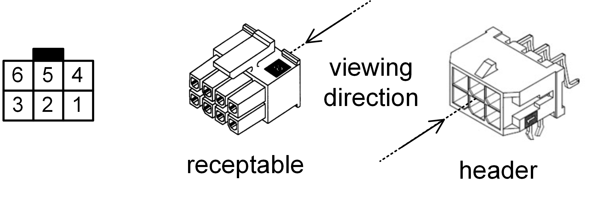
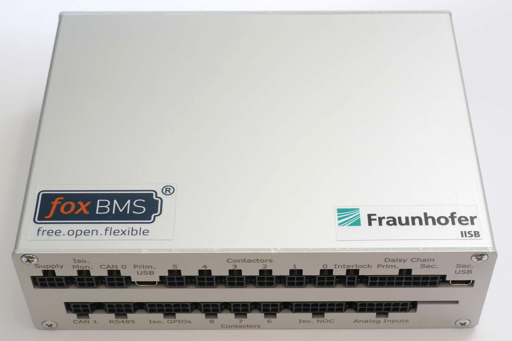
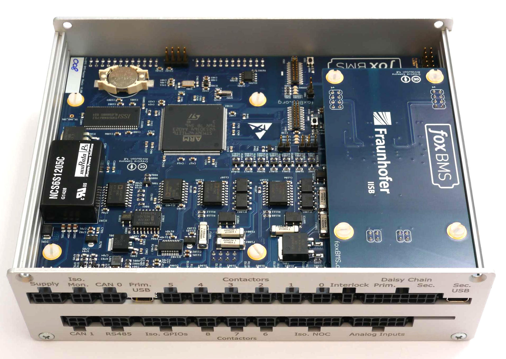
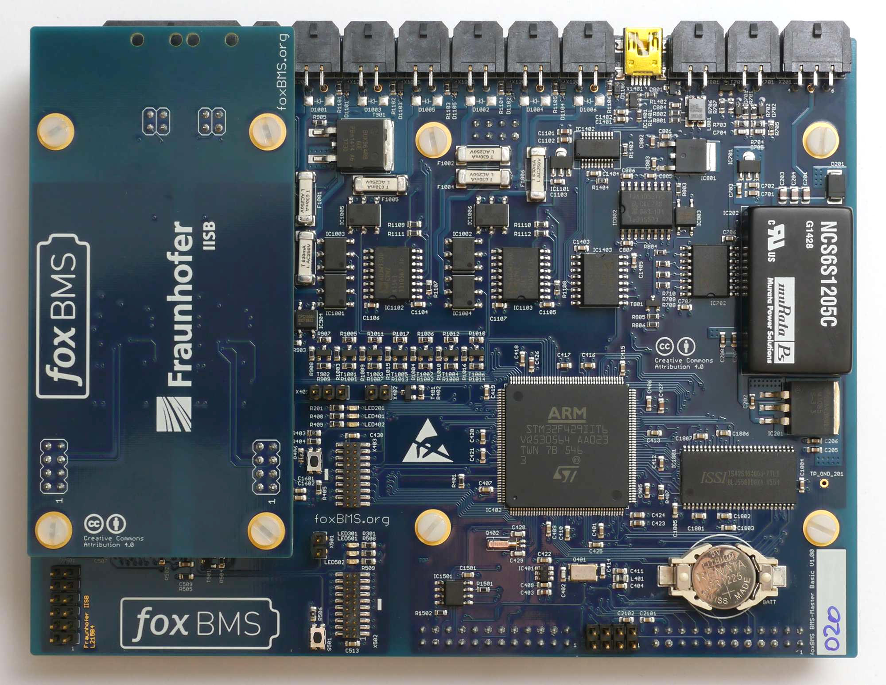
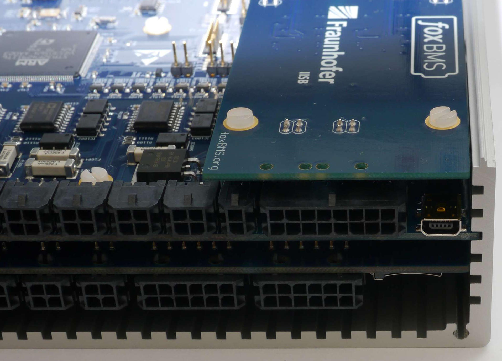
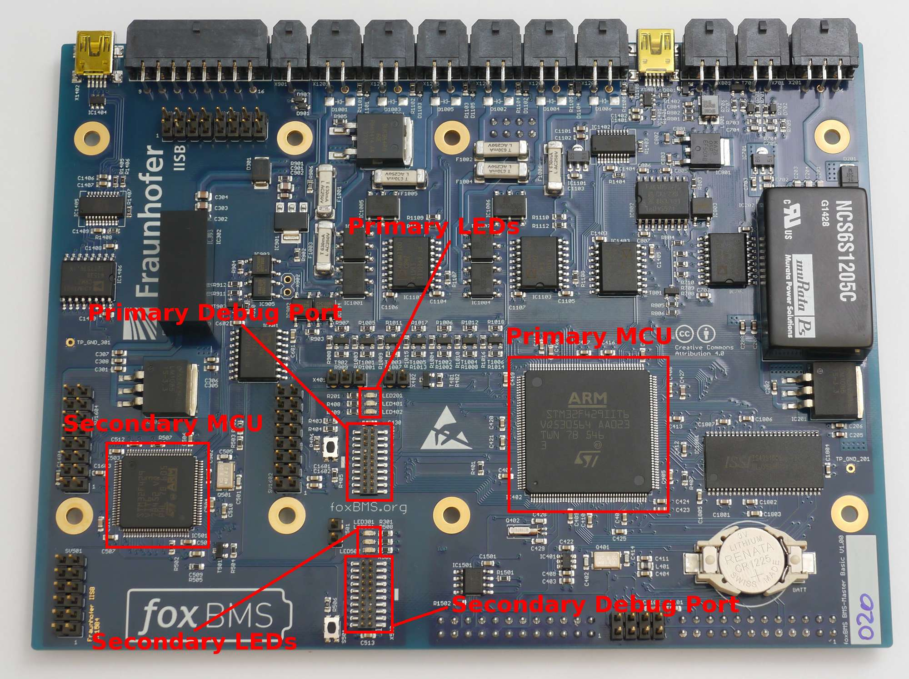
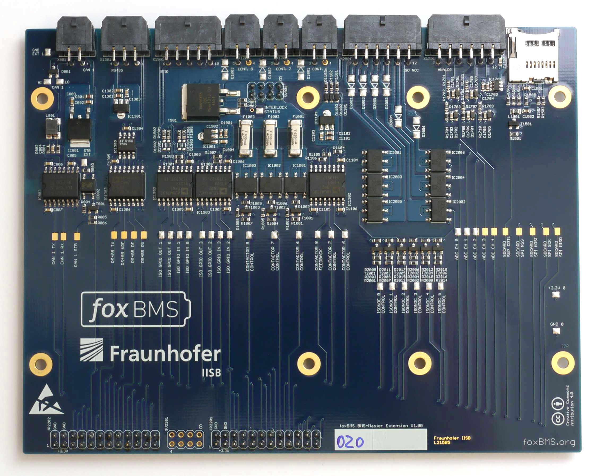
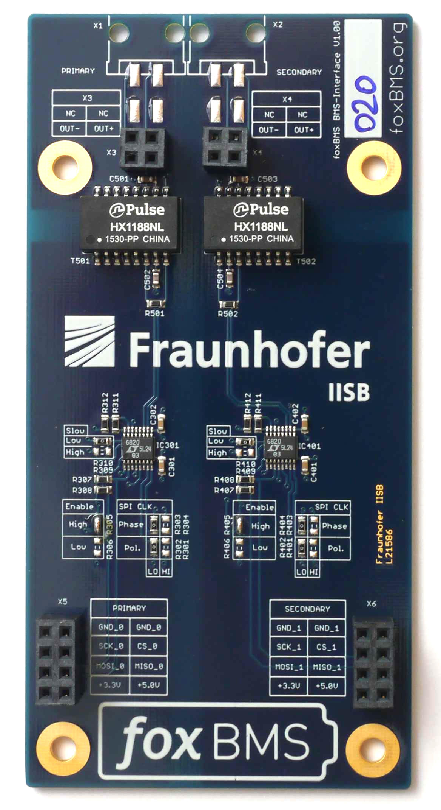
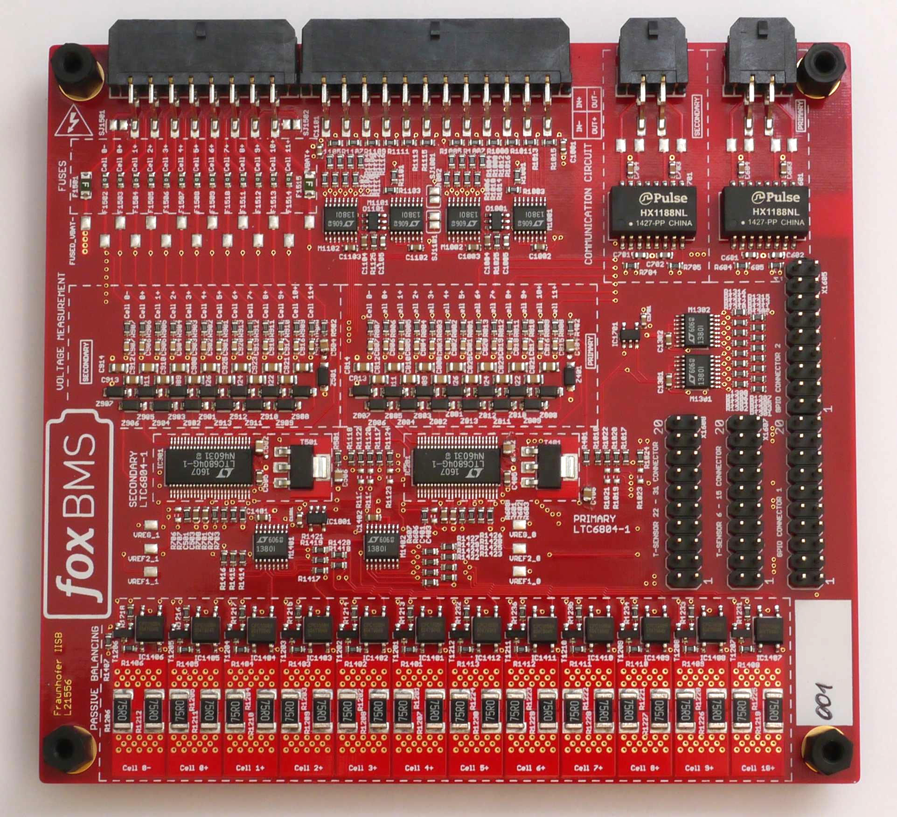

.. include:: ../../macros.rst

.. _getting_started_cabling:

================
Cabling |foxbms|
================

In the preceeding sections, the |master| has been connected to the power supply and the |foxbms| firmware flashed on the |MCU0| and |MCU1|. This section describes the |foxbms| hardware in more details and how to connect the |master| to the |slaves| that perform the cell voltage and temperature measurements. The CAN communication is also described.

.. note::

    When the connection is made between the |master| and the |slaves|, both primary and secondary isoSPI daisy chains have to be connected.

.. _sec-connector-convention:

----------------------------------
Convention for Connector Numbering
----------------------------------

:numref:`Fig. %s <connector_convention>` presents the convention for the connector numbering. It is used throughout
the documentation.

.. _connector_convention:

   Supply connector pin out, receptable - rear view, header - front view (image source: MOLEX)

There are two types of connectors:

 * Header
 * Receptable, plugged into the header

The numbering shown on the left in :numref:`fig. %s <connector_convention>` is always valid when viewing in the direction indicated by the arrow with the indication ``viewing direction``. This must be taken into account when crimping the receptables.

-------------------------------------------
Global Description of the |foxbms| Hardware
-------------------------------------------

The |foxbms| system can be mounted in a metal housing, shown in :numref:`fig. %s <housing>`.

.. _housing:

   |master| housing

In this configuration, the top plate can be removed to have access to the |foxbms| electronic boards. This is done by unscrewing the four screws holding the top plate.

The open housing is shown in :numref:`fig. %s <housing_open>`.

.. _housing_open:

   |master| housing, top plate removed

The boards can be removed from the housing. The boards without housing are shown in :numref:`fig. %s <foxbms_stack>`. To start, it is not necessary to remove the boards from the housing, but it is helpful to be able to look at the LEDs located on the |BMS-Master|.

.. _foxbms_stack:

   |foxbms| board stack removed from the housing (both |BMS-Master| and |BMS-Interface| are shown)

:numref:`Fig. %s <housing_detail>` shows how to put the boards back in the housing.

.. _housing_detail:

   Introduction of the board stack in the |Master| housing

------------------------------------------
Detailed Description of the Hardware Parts
------------------------------------------

The heart of |foxbms| is the |BMS-Master|, shown in :numref:`fig. %s <foxbms_master>`.

.. _foxbms_master:

   |foxbms| |BMS-Master|

As shown in :numref:`fig. %s <foxbms_master>`, the |BMS-Master| has two microcontroller units (MCU):

 - Primary (also called |MCU0|)
 - Secondary (also called |MCU1|)

Primary is the MCU where the |foxbms| software is run. The secondary MCU is present for redundant safety when developing software code on the primary MCU.

Each MCU has a set of LEDs, as shown in :numref:`fig. %s <foxbms_master>`:

 - Power LED
 - Red indicator LED
 - Green indicator LED

The power LED must lit when power is supplied to the |BMS-Master|, and the indicator LEDs should blink, except during flashing of software on the MCU.

If a debugger is used, it must be connected to the debug port (i.e., JTAG-interface) corresponding to the MCU being used.

An extension board named |BMS-Extension| is present under the |BMS-Master| and is shown in :numref:`fig. %s <foxbms_extension>`.

.. _foxbms_extension:

   |foxbms| |BMS-Extension|

It is used to provide more I/O and interfaces than with the |BMS-Master| alone.

The |BMS-Interface| is located on top of the |BMS-Master| (shown in :numref:`fig. %s <foxbms_interface>`).

.. _foxbms_interface:

   |foxbms| |BMS-Interface|

Its purpose is to convert the signals sent by the Serial Peripheral Interface (SPI) of the |BMS-Master| to the first |BMS-Slave| in the daisy by using a proprietary isoSPI interface from Linear Technology.

An example of a |BMS-Slave| is shown in :numref:`fig. %s <foxbms_slave>`.

.. _foxbms_slave:

   |foxbms| |BMS-Slave|

The |BMS-Slave| is based on the |LTC| battery cell monitoring chip. More information on the |LTC| integrated circuit can be found in the datasheet ([ltc_datasheet6804]_ and [ltc_datasheet6811]_). It supervises up to 12 battery cells connected in series. It performs voltage measurements, temperature measurements and passive cell balancing. In the daisy chain, the |BMS-Slaves| are connected via differential pair cables.

The |BMS-Slave| is not designed to be used in a specific housing.

-----------------------------------
Use of |foxbms| in a Battery System
-----------------------------------

:numref:`Fig. %s <hw_description>` present the organization of the hardware. The system consists of :math:`n` battery modules and :math:`m` |BMS-Slaves|. Each |BMS-Slave| is connected to a battery module, where it measures cell voltages and cell temperatures. The |BMS-Slaves| are connected in a daisy chain configuration: when a data package is sent to the daisy chain, it is first received by slave 1, which transmits it to slave 2 and so on until the data package is received by the last |BMS-Slave|.

.. _hw_description:
.. figure:: ./hw_system_overview.png
   :width: 100 %

   |foxbms| in the battery system

The |BMS-Interface| converts the messages sent by the |BMS-Master| so that they can be transmitted to the daisy chain and vice versa.

The |master| communicates with the current sensor (for instance, Isabellenhuette IVT-MOD or IVT-S) via CAN.

Communication with the control unit (for instance, a personal computer), is also made via CAN.

------------------------------------------------------
Hardware Setup of the |BMS-Master| and the |BMS-Slave|
------------------------------------------------------

:numref:`Fig. %s <foxbmsfront_quickstart>` presents all the connectors of the |BMS-Master|.

.. _foxbmsfront_quickstart:
.. figure:: ../../hardware_documentation/casing/foxbms-frontplate-rotated.png
   :width: 100 %

   Front view of the foxBMS Master, indicating the location of each header

The connectors needed for this quickstart guide are indicated in the following parts.

Connecting the |BMS-Slave| to the |BMS-Master|
----------------------------------------------

.. note::

      When the connection is made between the |BMS-Master| and the |BMS-Slave|, two communication lines
      have to be connected: the primary and the secondary daisy chain.

The pin assignments and cabling instructions for all different |BMS-Slaves| are documented in section :ref:`hw_slave`.

CAN Connector
-------------

The connector indicated as ``CAN 0`` in :numref:`fig. %s <foxbmsfront_quickstart>` must be used on the |BMS-Master|. Its layout
is described in :numref:`table %s <master_CAN>`.

.. figure:: ./connector_4pin.png
   :width: 10 %

.. _master_CAN:

.. table:: Master CAN connection

   ====    =========    =============    ============
   Pin     Signal       Direction        Description
   ====    =========    =============    ============
   1       GND_EXT0     Output
   2       NC           --
   3       CAN0_L       Input/Output
   4       CAN0_H       Input/Output
   ====    =========    =============    ============

Ground of |CAN0| is shared with supply ground ``GND_EXT0``. |CAN0| is isolated from the |MCU0| via the isolated CAN transceiver TJA1052. The CAN transceiver may be put into standby mode by |MCU0|.

-----------------------------------
Communication with the |BMS-Master|
-----------------------------------

Once |foxbms| is running, CAN messages should be sent.

.. note::

      **A periodic state request must be made to the system by sending a message with ID 0x152 on the bus CAN periodically.**
      If not, the system will go into an error state. The period must be 100ms. More information on state requests can be found in the section :ref:`getting_started_communicating_CAN`. Typically the request `Standby state` can be made.

If voltages have been applied to the voltage connector, they are sent with the message IDs 0x550, 0x551, 0x552 and 0x553. Details can be found in the section :ref:`getting_started_communicating_CAN`.

If temperature sensors have been connected and the conversion function changed in the software, temperature are sent with the messages with IDs 0x353 and 0x354. Details can be found in the section :ref:`getting_started_communicating_CAN`.

----------------------------
Current Sensor Configuration
----------------------------

Further information on the current sensor tested with |foxbms| can be found in the `datasheet of the current sensor <http://www.isabellenhuette.de/uploads/media/IVT_Modular_datasheet_1.20_02.pdf>`_.
By default, |foxbms| uses the factory defaults of the current sensor, which works in cyclic (non-triggered) mode.
Another possibility tested with |foxbms| is to use the current sensor in triggered mode. For this, the current sensor IVT-MOD from Isabellenhütte has to be reprogrammed. The changes compared to factory default are then:

 * The CAN Message IDs was changed
 * The triggered measurement mode was activated

The two following parts sum up the differences between factory setup and triggered setup tested with |foxbms|.

Factory Default
---------------

* CAN IDs

  * 0x411 (dec: 1041) Command
  * 0x521 (dec: 1313) Current Measurement
  * 0x522 (dec: 1314) Voltage Measurement 1
  * 0x523 (dec: 1315) Voltage Measurement 2
  * 0x524 (dec: 1316) Voltage Measurement 3
  * 0x511 (dec: 1297) Response

* Measurement Mode: Cyclic (Disabled and Triggered are other possible modes)

After Configuration
-------------------

* CAN IDs

  * 0x35B (dec: 859) Command
  * 0x35C (dec: 860) Current Measurement
  * 0x35D (dec: 861) Voltage Measurement 1
  * 0x35E (dec: 862) Voltage Measurement 2
  * 0x35F (dec: 863) Voltage Measurement 3
  * 0x7FF (dec: 2047) Response

* Measurement Mode: Triggered

-------------------------------------------
Hardware Related Frequently Asked Questions
-------------------------------------------

Are the schematic and layout source files available?
----------------------------------------------------

Yes, the complete |foxbms| schematic and layout files are available in EAGLE format on GitHub. Refer to the HTML documentation section :ref:`hardware_design_resources`.

Have both |MCU0| and |MCU1| to be connected?
-------------------------------------------------------

Yes, they should always tbe connected and configured to provide redundant monitoring and improved safety during software development in prototyping applications.

.. [ltc_datasheet6804] LTC6804 Datasheet http://cds.linear.com/docs/en/datasheet/680412fb.pdf
.. [ltc_datasheet6811] LTC6811 Datasheet http://cds.linear.com/docs/en/datasheet/68111f.pdf
