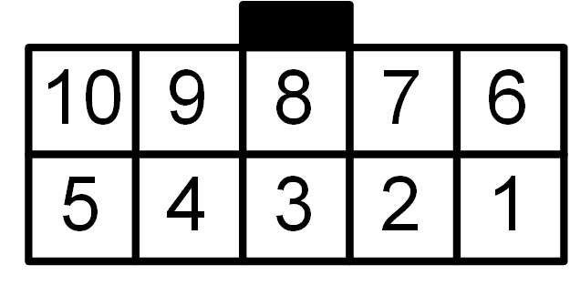
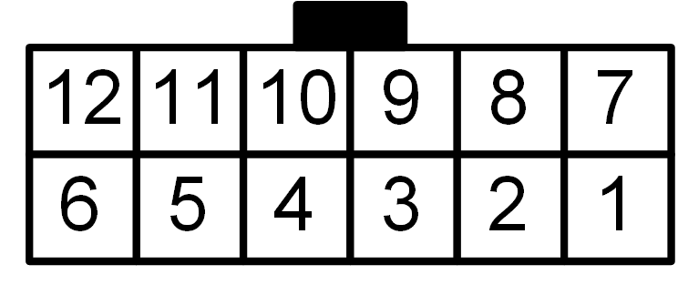

.. include:: ../../macros.rst

.. _getting_started_connectors:

=================
Connectors Pinout
=================

This section describes the pinout of all connectors on the |master|.

------------------------------------------
Overview of the Connectors on the |master|
------------------------------------------

.. _foxbmsfront:
.. figure:: ../../hardware_documentation/casing/foxbms-frontplate-rotated.png
    :width: 100 %

    Front view of the |master| indicating the location of each pin header

|foxbms| uses only Molex Micro-Fit 3.0 type connectors, except for USB. A comprehensive set of connectors and crimps is supplied with |foxbms| to start connecting immediately. In case crimps or housings are missing, they are commonly available at major distributors.

Molex Micro-Fit 3.0 Crimps Part Number: 46235-0001 (Farnell 2284551)

Molex Micro-Fit 3.0 Connectors:

==========   =========================   =====================
Pin Count    Molex Housing Part Number    Farnell Order Number
==========   =========================   =====================
2            43025-0200                  672889
4            43025-0400                  672890
6            43025-0600                  672907
10           43025-1000                  672920
12           43025-1200                  629285
16           43025-1600                  9961321
==========   =========================   =====================

.. figure:: ./connector_viewing_direction.png
    :width: 100 %

    Defined viewing direction for the connector pin out; receptable - rear view; header - front view (image source: MOLEX)

--------------------------------------------
Supply (X201 on |BMS-Master|)
--------------------------------------------

====   =============    ============    ============
Pin    Signal           Direction       Description
====   =============    ============    ============
1      SUPPLY_EXT2      Input           12 - 24V
2      SUPPLY_EXT2      Input           12 - 24V
3      GND_EXT2         Input           GND
4      SUPPLY_EXT0      Input           12 - 24V
5      GND_EXT0         Input           GND
6      GND_EXT2         Input           GND
====   =============    ============    ============

* ``SUPPLY_EXT0`` / ``GND_EXT0``: Microcontroller supply and insulation monitoring devices supply
* ``SUPPLY_EXT2`` / ``GND_EXT2``: Contactor supply and interlock supply

--------------------------------------------
|CAN0|  (X801 on |BMS-Master|)
--------------------------------------------

.. figure:: ./connector_4pin.png
    :scale: 20 %

====    =========    =============    ============
Pin     Signal       Direction        Description
====    =========    =============    ============
1       GND_EXT0     Output
2       NC           --
3       CAN0_L       Input/Output
4       CAN0_H       Input/Output
====    =========    =============    ============

Ground of |CAN0| is shared with supply ground ``GND_EXT0``. |CAN0| is isolated from the |MCU0| via the isolated CAN transceiver TJA1052. The CAN transceiver may be put into standby mode by |MCU0|.

-----------------------------------------------
|CAN1| (X801 on |BMS-Extension|)
-----------------------------------------------

.. figure:: ./connector_4pin.png
    :scale: 20 %

====    ============    =============    ============
Pin     Signal          Direction        Description
====    ============    =============    ============
1       GND_EXT1        Input
2       SUPPLY_EXT1     Input
3       CAN1_L          Input/Output
4       CAN1_H          Input/Output
====    ============    =============    ============

|CAN1| has to be supplied externally (``GND_EXT1`` / ``SUPPLY_EXT1``) with 12 - 24V. |CAN1| is isolated from the |MCU0| via the isolated CAN transceiver TJA1052. The CAN transceiver may be put into standby mode by |MCU0|.

--------------------------------------------------------------------------
Insulation Monitor (Bender ISOMETER) (X701  on |BMS-Master|)
--------------------------------------------------------------------------

.. figure:: ./connector_4pin.png
    :scale: 20 %

====    =======================    ==============    ===================================================
Pin     Signal                     Direction         Description
====    =======================    ==============    ===================================================
1       BENDER_NEGATIVE_SUPPLY     Output            Supply to insulation monitoring device
2       SUPPLY_EXT0                Output            Supply to insulation monitoring device
3       BENDER_OK_EXT              Input             Status signal of insulation monitoring device
4       BENDER_PWM_EXT             Input             Insulation monitoring device diagnostic signal
====    =======================    ==============    ===================================================

This interface is intended to be used with a Bender insulation monitoring device. Bender ISOMETER IR155-3203/-3204/-3210 are supported. The Bender ISOMETER is supplied and may be switched on or off (lowside) by the |master|. By factory, the |master| is configured to operate with the Bender ISOMETER IR155-3204/-3210. In order to operate with the Bender ISOMETER IR155-3203, Jumper R705 must be removed on |BMS-Master|. For more details, check the schematic of the |BMS-Master| in section :ref:`hardware_design_resources`.

--------------------------------------------------------------------------------------------------------------
Contactors (X1201 - X1206 on |BMS-Master| and X1201 - X1203 on |BMS-Extension|)
--------------------------------------------------------------------------------------------------------------

.. figure:: ./connector_4pin.png
    :scale: 20 %

====    ========================    ==============    ============================================
Pin     Signal                      Direction         Description
====    ========================    ==============    ============================================
1       GND_EXT0                    --                Contactor auxiliary contact
2       CONTACTOR_X_FEEDBACK_EXT    --                Contactor auxiliary contact
3       CONTACTOR_X_COIL_POS        Output            Positive contactor coil supply
4       CONTACTORS_COMMON_NEG       Output            Negative contactor coil supply
====    ========================    ==============    ============================================

All contactor connectors share one common ground. This common ground is switched lowside by the interlock circuit. Opening the interlock loop deactivates the contactor supply and opens all contactors. A contactor auxiliary contact may be read by connecting the auxiliary contact to the corresponding pins of the contactor connector.

Freewheeling diodes are not populated on the PCB, since some contactors like the Gigavac GX16 have built-in diodes and should not be used with additional external freewheeling diodes in parallel. If the used contactors do not have built-in freewheeling diodes, freewheeling diodes must be added to protect the contactor control circuitry. The load current is limited by the optically isolated power switch AQV25G2S (6A continuous load). Every contactor connector is fused with an onboard slow blow fuse type Schurter UMT-250 630mA (3403.0164.xx).

-----------------------------------------------
Interlock (X901 on |BMS-Master|)
-----------------------------------------------

.. figure:: ./connector_2pin.png
    :scale: 20 %

====    ========================    ==============        ============================================
Pin     Signal                      Direction             Description
====    ========================    ==============        ============================================
1       INTERLOCK_IN                Input                 --
2       INTERLOCK_OUT               Output                --
====    ========================    ==============        ============================================

The interlock circuit has a built-in current source, adjusted to 10mA constant current. In fault conditions, all contactors are opened by opening the interlock circuit. If the interlock circuit is externally opened, the contactor supply is deactivated immediately. This circuit has no effect on the |foxbms| supply or communication interfaces.

--------------------------------------------------------------------------
Daisy Chain - Primary and Secondary (X1601 on |BMS-Master|)
--------------------------------------------------------------------------

.. figure:: ./connector_16pin.png
    :scale: 20 %

.. hint::

    The pinout for the |BMS-Interface| hardware versions ``1.1.0 and below`` is shown in :numref:`table %s <isoSPI_connector>`. For newer versions ``1.2.0 and above`` see :numref:`table %s <isoSPI_connector_new>`.

.. _isoSPI_connector:
.. table:: Daisy Chain Connector (Interface version ``1.1.0 and below``)

    ====   ======================
    Pin    Signal
    ====   ======================
    1      NC
    2      OUT+ (Secondary |BMS-Slave|)
    3      OUT- (Secondary |BMS-Slave|)
    4      NC
    5      NC
    6      OUT+ (Primary |BMS-Slave|)
    7      OUT- (Primary |BMS-Slave|)
    8      NC
    9      NC
    10     NC
    11     NC
    12     NC
    13     NC
    14     NC
    15     NC
    16     NC
    ====   ======================

.. _isoSPI_connector_new:
.. table:: Daisy Chain Connector (Interface version ``1.2.0 and above``)

    ====   ======================
    Pin    Signal
    ====   ======================
    1      OUT+ (Secondary |BMS-Slave| forward)
    2      NC
    3      OUT+ (Secondary |BMS-Slave| reverse)
    4      NC
    5      NC
    6      OUT+ (Primary |BMS-Slave| forward)
    7      NC
    8      OUT+ (Primary |BMS-Slave| reverse)
    9      OUT- (Secondary |BMS-Slave| forward)
    10     NC
    11     OUT- (Secondary |BMS-Slave| forward)
    12     NC
    13     NC
    14     OUT- (Primary |BMS-Slave| forward)
    15     NC
    16     OUT- (Primary |BMS-Slave| reverse)
    ====   ======================

Please note that this connector pin out is only valid when the |BMS-Interface| uses the LTC6820 interfacing IC.

------------------------------------------------
RS485 (X1301 on |BMS-Extension|)
------------------------------------------------

====   =============    ============    ============
Pin    Signal           Direction       Description
====   =============    ============    ============
1      GND_EXT2         Output
2      RS485_A          Input/Output
3      RS485_B          Input/Output
4      SUPPLY_EXT2      Output
5      SUPPLY_EXT2      Input
6      GND_EXT2         Input
====   =============    ============    ============

The RS485 interface uses the ESD rugged transceiver LT1785. Moreover, the interface is galvanically isolated. An external supply has to be provided (12 - 24V).

--------------------------------------------------------
Isolated GPIO (X1901 on |BMS-Extension|)
--------------------------------------------------------

====   =============    ============    ============
Pin    Signal           Direction       Description
====   =============    ============    ============
1      ISOGPIO_IN0      Input
2      ISOGPIO_IN1      Input
3      ISOGPIO_IN2      Input
4      ISOGPIO_IN3      Input
5      ISOGPIO_OUT0     Output
6      ISOGPIO_OUT1     Output
7      ISOGPIO_OUT2     Output
8      ISOGPIO_OUT3     Output
9      GND_EXT0         Output
10     GND_EXT0         Output
====   =============    ============    ============

The |BMS-Extension| provides 4 isolated general purpose inputs and 4 isolated general purpose outputs. The GPIOs are isolated by an ADUM3402 (i.e., ESD rugged version of the ADUM1402). The inputs are equipped with 10kOhm pull down resistors and are intended for a maximum input voltage of 5V. The output voltage is also 5V. An external supply is not needed.

-----------------------------------------------------------------------------------
Isolated Normally Open Contacts - isoNOC (X2001 on |BMS-Extension|)
-----------------------------------------------------------------------------------

====   ====================    ============    ============
Pin    Signal                  Direction       Description
====   ====================    ============    ============
1      ISONOC0_POSITIVE
2      ISONOC1_POSITIVE
3      ISONOC2_POSITIVE
4      ISONOC3_POSITIVE
5      ISONOC4_POSITIVE
6      ISONOC5_POSITIVE
7      ISONOC0_NEGATIVE
8      ISONOC1_NEGATIVE
9      ISONOC2_NEGATIVE
10     ISONOC3_NEGATIVE
11     ISONOC4_NEGATIVE
12     ISONOC5_NEGATIVE
====   ====================    ============    ============

The |BMS-Extension| features 6 isolated normally open contacts. The load current of each channel is limited by the optically isolated power switch AQV25G2S. The channels are not fused, however freewheeling diodes type GF1B are installed on board.

----------------------------------------------------
Analog Inputs (X1701 on |BMS-Master|)
----------------------------------------------------

====   ====================    ============    ============
Pin    Signal                  Direction       Description
====   ====================    ============    ============
1      V_REF                   Output
2      ANALOG_IN_CH0           Input
3      V_REF                   Output
4      ANALOG_IN_CH1           Input
5      V_REF                   Output
6      ANALOG_IN_CH2           Input
7      V_REF                   Output
8      ANALOG_IN_CH3           Input
9      V_REF                   Output
10     ANALOG_IN_CH4           Input
11     GND0                    Output
12     GND0                    Output
====   ====================    ============    ============

On the |BMS-Extension| 4 nonisolated analog inputs to |MCU0| are available. For applications using NTCs as temperature sensors, also a reference voltage of 2.5V is provided. The maximum input voltage is limited to 3.3V and is Zener protected. For further information on the input circuit, please refer to the |foxbms| :ref:`hardware_documentation_overview` and to the |foxbms| :ref:`hardware_design_resources`.
