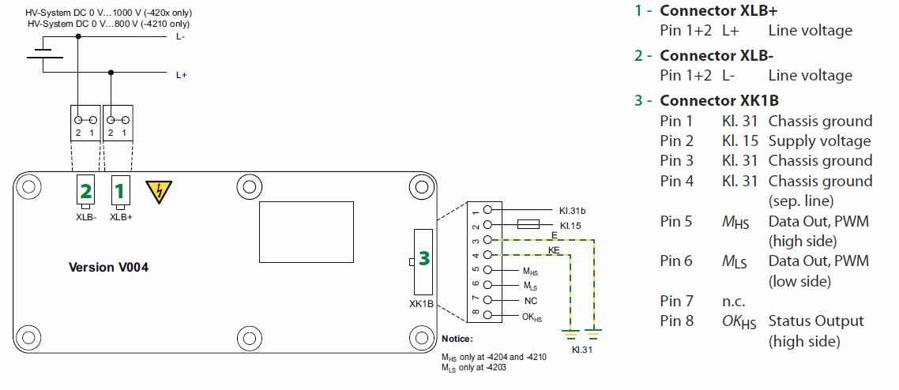

.. include:: ../../macros.rst

.. _hardware_documentation_components:

=================
Safety Components
=================

Before using |master| and the |slaves| with lithium-ion batteries, safety must be considered very carefully. The following parts and components are recommended to be used with the |master| and the |slaves|.

DC Battery Pack Fuse
--------------------

When using |foxBMS| with batteries, a DC fuse in the current path is mandatory. In case of external short circuit of the battery pack, this fuse must be able to break the current at the maximum high-voltage of the complete battery. This DC fuse is a critical safety component and needs to be selected very carefully. The different parameters of the specific battery pack used must be taken into account (e.g., maximum voltage, expected short circuit current, continuous current).

:numref:`Fig. %s <battery_system_block_diagram>` shows how to set up a basic battery system using these components. In the section :ref:`hardware_documentation_bjb`, details can be found on how to use these and other components depending on the used battery system.

.. _battery_system_block_diagram:
.. figure:: ./battery_system_block_diagram.png
    :width: 100 %

    Block diagram showing the typical topology of a battery system

Power Contactors
----------------

To switching high-current capable batteries, mechanical power contactors (power relays) shall be used. For safety reasons, contactors with auxiliary contacts providing true state feedback are strongly recommended. |foxBMS| was developed and tested with the contactors of type Gigavac GX14 (GX14BAB: 12V coil voltage and normally open auxiliary contacts), but will probably work with many other contactors. The most important safety parameters are the maximum break current and the maximum allowed voltage to be broken. This must carefully be checked by the user of the |foxBMS| research and development platform. Further, the pick-up and continuous current of the contactor coil must be checked to be within the |foxBMS| electrical ratings. Nevertheless, contactors matching the used battery pack specification (e.g., continuous current, maximum voltage, short circuit current) are mandatory.

Current Sensor
--------------

To measure the battery pack current, CAN based current sensors can be used. The Isabellenhütte IVT-MOD and IVT-S shunt based current sensors were tested with |foxBMS|. The automotive current sensor IVT-MOD 300 provides a current measurement range of +/-300A and in addition three voltage measurement inputs with a voltage measurement range of +/-600V. Current sensors with higher current measurement ranges are available. Please check the `Isabellenhütte homepage <https://www.isabellenhuette.de/en/home>`_ and contact a `salesperson <https://www.isabellenhuette.de/en/contact>`_ to get more information. If another CAN based current sensor is used, the embedded software on the |BMS-Master| must be adapted.

Insulation Monitor
------------------

|foxBMS| supports an insulation monitoring device (i.e., also called a ground fault detector) to detect faulty insulation of the battery pack against chassis, ground or or battery pack enclosure. Bender insulation monitor IR155-3203/-3204/-3210 are supported and tested, while IR155-3204 is recommended.
The Bender ISOMETER IR155-3203/-3204 monitors the insulation resistance between the insulated and active HV-conductors of an electrical drive system (up to 1000VDC) and the reference ground. The fault messages (insulation fault at the HV-system, connection or device error)  will be provided at the integrated and galvanic isolated interface. The interface consists of a status output (called OKHS output) and a measurement output
(called MHS/MLS output). The status output signalises errors or that the system is error free. The measurement output signalises the actual insulation resistance. Furthermore, it is possible to distinguish between different fault messages and device conditions, which
are base frequency encoded. For details, consult the corresponding device datasheet or manual. The insulation resistance threshold can be factory programmed, as well as an additional undervoltage threshold. Any violation of thresholds causes an error signal on the status pin.

According to ECE R-100 the insulation resistance between the high voltage bus and the electrical chassis shall have a minimum value of 100Ohm/V of the working voltage for DC buses, and a minimum value of 500Ohm/V of the working
voltage for AC buses (e.g., for a 800V system, the insulation resistance threshold should be selected for 400kOhm).

The following section describes how to test the Bender functionality.

Required Hardware
~~~~~~~~~~~~~~~~~

Before starting, following items are needed:

* |BMS-Master|
* Bender insulation monitor IR155-3204/-3210
* Lauterbach debugger
* Resistors (1kOhm, 220kOhm, 470kOhm, 1MOhm)
* Terminal block for simple wire connection
* This documentation

Electrical Connections
~~~~~~~~~~~~~~~~~~~~~~

The follwong figure displays the the connectors of the Bender insulation monitor.

.. _bender_wiring:

   Wiring of the Bender insulation monitor (image source: Bender Datasheet)

Connect the Bender as follwing:

* connect the bender to |foxbms| as described in chapter :ref:`hardware_documentation_specifications`
* connect line voltage L-(connector XLA-) to chassis ground (Pin 3 and 4 of connector XK1A)
* connect one of the resistors between chassis ground/line voltage L-(XLA-) and line voltage L+(XLA+)

Depending on the connected resistor, different insulation values are measured.
