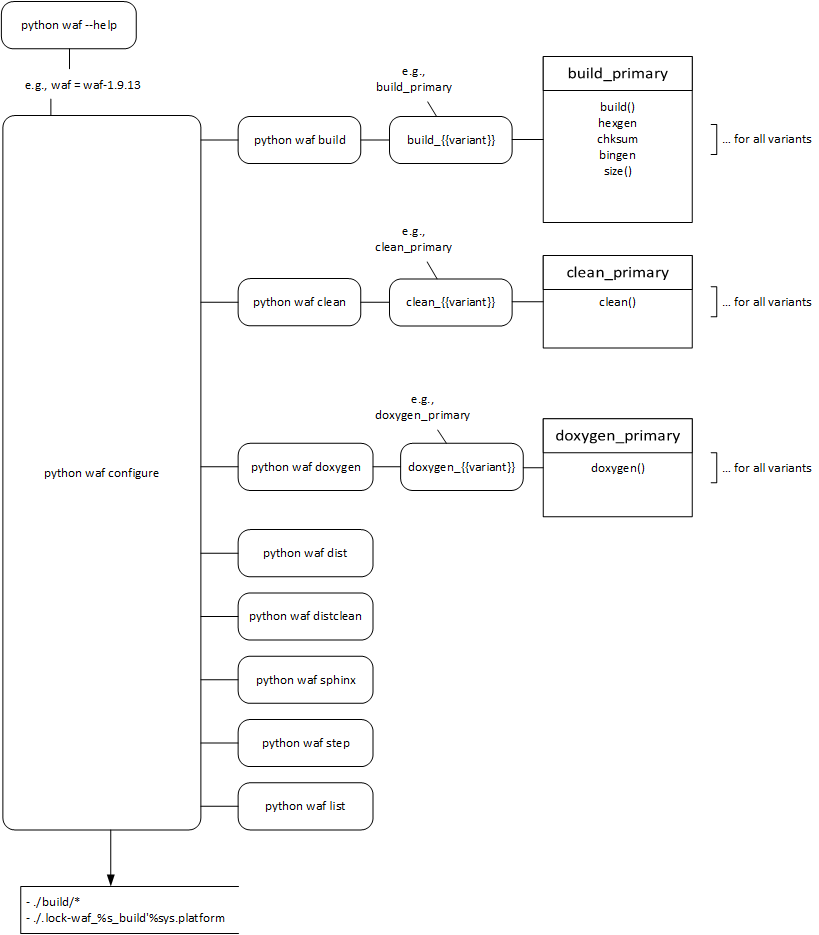

.. include:: ../../macros.rst


.. _software_documentation_build_process:

=============
Build Process
=============

|foxbms| uses ``waf The meta build system`` for building binaries for the
|foxbms| MCUs and the documentation.

For detailed information on |waf| see `waf.io <https://waf.io/>`_. A short
introcution to |waf| is given at
`waf.io/apidocs/tutorial <https://waf.io/apidocs/tutorial.html>`_.
The more detailed version of how to use |waf| is found at
`waf.io/book <https://waf.io/book/>`_.

General
-------

Where to find the toolchain?
++++++++++++++++++++++++++++

The |waf| toolchain is located in directory ``foxbms\tools``, and is
```waf``. This archive is automatically unpacked in a directory named
something like ``waf-{{X}}-{{X}}-{{X}}-{{some-hash-value}}`` containing the waf
library, where ``{{X}}`` is the waf version. It is unpacked into ``foxbms\tools``.
It is assumed that all commands are run from directory ``foxbms``.
Therefore |waf| has to be always called by ``python tools\waf some-command``
where ``some-command`` is an argument defined in the |wscript|.

Additional build tools are located in ``foxbms\tools\waftools``. These are
the tooles needed for building the documentation, i.e., ``doxygen`` and
``sphinx``.

Where are the build steps described?
++++++++++++++++++++++++++++++++++++
The build process is described in files named |wscript|, that can be found
nearly everywhere inside the different directories inside the |foxbms| project.
Later in this documentation this is explained in detail.

General
+++++++

|waf| needs always to be run form the top level of the repository and the path
to waf must be given relative to that directory. This path is ``tools\waf``.

..  code-block::    console
    :name: wafgeneral
    :caption: How to call waf

    cd path\to\foxbms
    python tools\waf {{some command}}


What commands can be used?
++++++++++++++++++++++++++
To get an overview of support commands run ``--help`` on the |waf| library:

..  code-block::    console
    :name: wafhelp
    :caption: How to call help on waf

    python tools\waf --help

.. literalinclude:: help.txt
    :language: console
    :name: outputofwafhelp
    :caption: Waf help in |foxbms|

Before building any binaries or documentation is possible, the project needs to
be configured. A successfull ``configure`` command and its ouput is shown below:

..  code-block::    console
    :name: configureawafproject
    :caption: Configuration of a the project

    python tools\waf configure
    (...)
    'configure' finished successfully (0.340s)

After the project has been configured, a build can be triggered and it is
generally exectued by the ``build`` command, but as |foxbms| requries building
variants, one has to use e.g., ``build_primary`` in order to build binaries
for the primary MCU.

..  code-block::    console
    :name: buildtheproject
    :caption: Example of a wrong and a correct build command.

    python tools\waf build
    Waf: Entering directory `.\foxbms\build'
    A build variant must be specified, run 'python tools\waf --help'
    python tools\waf build_primary
    (...)
    'build_primary' finished successfully (8.800s)

The possible ``build`` commands, the definition of the and corresponding targets
and the targets itself is listet below:

- Primary MCU
    ..  code-block::    console
        :name: buildprimarytar
        :caption: Build primary binaries

        python tools\waf build_primary

    The targets are defined at:

    -   ``foxbms\embedded-software\mcu-primary\src\application\wscript``
    -   ``foxbms\embedded-software\mcu-common\src\engine\wscript``
    -   ``foxbms\embedded-software\mcu-common\src\module\wscript``
    -   ``foxbms\embedded-software\mcu-primary\src\engine\wscript``
    -   ``foxbms\embedded-software\mcu-primary\src\module\wscript``
    -   ``foxbms\embedded-software\mcu-freertos\wscript``
    -   ``foxbms\embedded-software\mcu-hal\STM32F4xx_HAL_Driver\wscript``
    -   ``foxbms\embedded-software\mcu-primary\src\general\wscript``

    .. literalinclude:: list_primary.txt
        :language:  console
        :name: primary
        :caption: Primary targets

- Secondary MCU
    ..  code-block::    console
        :name: buildsecondarytar
        :caption: Build secondary binaries

        python tools\waf build_secondary

    The targets are defined at:

    -   ``foxbms\embedded-software\mcu-secondary\src\application\wscript``
    -   ``foxbms\embedded-software\mcu-common\src\engine\wscript``
    -   ``foxbms\embedded-software\mcu-common\src\module\wscript``
    -   ``foxbms\embedded-software\mcu-secondary\src\engine\wscript``
    -   ``foxbms\embedded-software\mcu-secondary\src\module\wscript``
    -   ``foxbms\embedded-software\mcu-freertos\wscript``
    -   ``foxbms\embedded-software\mcu-hal\STM32F4xx_HAL_Driver\wscript``
    -   ``foxbms\embedded-software\mcu-secondary\src\general\wscript``


    .. literalinclude:: list_secondary.txt
        :language:  console
        :name: secondary
        :caption: Secondary targets

- General documentation
    The general documenation is build by

    ..  code-block::    console
        :name: buildsphinxdocumentation
        :caption: Build the general |foxbms| documentation

        python tools\waf sphinx

- API documentation
    The API documentation is build using the ``doxygen_{{variant}}``, therefore

    ..  code-block::    console
        :name: builddoxydocumentation
        :caption: Build the general |foxbms| documentation

        python tools\waf doxygen_primary
        python tools\waf doxygen_secondary

- Cleaning
    It is also possible to clean the binaries and Doxygen documentation.
    This step is performed by the ``clean`` command.

    As seen from ``--help`` the possible ``clean`` commands are

    -   ``clean_primary``
    -   ``clean_secondary``
    -   ``distclean``

    Cleaning the general sphinx documentation alone is currently not supported.
    However it is possible to make a complete clean by ``distclean``. After
    distclean the entire build direcory and all lock files etc. are deleted and
    the project needs to be configured again.

Targets
-------

As stated above thetargets and subtargets of the build process are shown by
``list_x`` where ``x`` is the specified target. The main target is the ``*.elf``
file. However some targets are build afterwards. After successfully linking the
map file is generated.

These logging files are found in ``build`` and ``build\{{target}}``.
Addiotional to the ``*.elf`` file a ``*.hex`` of the binary is generated.

The ``*.hex`` is needed, as it is used to calculate the checksum of the binary.
Afterwards the calculted checksum is written back into the ``*.elf`` and
``*.hex`` files. Based on this binary the ``flash`` and ``flashheader`` are
generated by gcc's ``objcopy``. The implementation of this can be found in

-   ``foxbms\tools\chksum\*``: All files in are neeed
-   ``foxbms\wscript``: See implementation of ``def add_chksum_task(self)``
    and ``class chksum(Task.Task)``.

In a post build step the ``size`` is run on all binaries and generates a
logfile.


Build Process
-------------

..  note::
    For testing the following explanations it is assumed that
    ``python tools\waf configure`` has been run.

This sections gives an overview how the build process is defined. All features
are generally defined in the top |wscript| located at
|mainwscript|.

The minimum of functions that need to be defined to build are in |waf|

- ``configure`` and
- ``build``.

As the toolchain needs more targets the following functions need to be
implemented: ``options``, ``size``, ``dist``, ``doxygen``, ``sphinx``.
Furthermore functions and classes for calculataing the checksum (``chksum``,
``add_chksum_task``), stripping debug symbols in release mode (``strip``,
``add_strip_task``), creating a ``hex`` file from the ``elf`` file (``hexgen``,
``add_hexgen_task``), generating ``bin`` files from ``elf`` files
(``binflashheadergen``, ``binflashgen``, ``add_bingen_task``) and compiling
assembler files (``Sasm``, ``asm_hook``).

For implemenation details see the |wscript| itself.

Some of these functionalities require scripts from ``foxbms\tools``.



General Documentation
+++++++++++++++++++++
This build target uses the function ``def sphinx(bld)``. Since this
definition of a function called ``sphinx``, it is accepted as command to waf.

This general documentation is generated by running

..  code-block::    console
    :name: sphinx_function
    :caption: Generate general |foxbms| documentation

    python tools\waf sphinx

The implementation details of the ``sphinx`` command can be found in
``foxbms\tools\waftools\sphinx_build.py``.

Primary and Secondary Binaries and Doxygen Documentation
++++++++++++++++++++++++++++++++++++++++++++++++++++++++

In order to have different build *variants*, these variants have to be defined.
This is done at the top of the main |wscript| at |mainwscript|. The
variants have to be defined for the binary build and Doxygen documentation.

.. literalinclude:: variants.txt
    :language: python
    :name: variantimplementation
    :caption: Implementation of the variant build

In the function build and doxygen the build variant is checked, the the correct
sources are selected. If no build variant is specified, an error message is
displayed, telling to specify a variant. This is generally implemented something
like this:

.. code-block:: python
    :name: ensurevariantonbuild
    :caption: Implementation to ensure a variant build

    def build(bld):
        import sys
        import logging
        from waflib import Logs
        if not bld.variant:
            bld.fatal('A {} variant must be specified, run \'{} {} --help\'\
    '.format(bld.cmd, sys.executable, sys.argv[0]))

        bld.env.__sw_dir = os.path.normpath('embedded-software')

        src_dir = os.path.normpath('mcu-{}'.format(bld.variant))
        ldscript = os.path.join(bld.env.__sw_dir, src_dir, 'src', bld.env.ldscript_filename)

For doxygen it is implemented very similar:

.. code-block:: python
    :name: ensurevariantondoxygen
    :caption: Implementation to ensure a variant doxgen API documentation

    def doxygen(bld):
        import sys
        import logging
        from waflib import Logs

        if not bld.variant:
            bld.fatal('A build variant must be specified, run \'{} {} --help\'\
    '.format(sys.executable, sys.argv[0]))

        if not bld.env.DOXYGEN:
            bld.fatal('Doxygen was not configured. Run \'{} {} --help\'\
    '.format(sys.executable, sys.argv[0]))

        _docbuilddir = os.path.normpath(bld.bldnode.abspath())
        doxygen_conf_dir = os.path.join('documentation', 'doxygen')
        os.makedirs(_docbuilddir, exist_ok=True)
        conf_file = 'doxygen-{}.conf'.format(bld.variant)
        doxygenconf = os.path.join(doxygen_conf_dir, conf_file)

wscripts
--------

As mentioned above, the build process is described in |wscript|\ s, which are
itself valid python scripts.
The top is |mainwscript| which defines the functions needed for the
build, e.g., ``configure``, ``build`` etc.

From the top |wscript| the other |wscript| s are called recursive by
``bld.recurse(..)``.

To get a detailed view on the single build steps, see these files.

.. |wscript|        replace:: ``wscript``
.. |mainwscript|    replace:: ``foxbms\wscript``


Building and Linking with a Library
-----------------------------------

The toolchain enables to build a library and then links against the library.

The ``wscript`` in ``embedded-software\libs`` lists the libraries to be build.
Libraries that should be build have to be listed here. Based on the example
library ``testlib`` it is shown how to include a library in |foxbms|.

.. literalinclude:: ./../../../../embedded-software/libs/wscript
   :language: python
   :linenos:
   :lines: 44-

**General Setup**

The actual build of the library is in ``embedded-software\libs\testlib``.
All source and header files have to be in the library directory, for this example
these are are ``testlib.c`` and ``testlib.h``.
The library is then build by the ``wscript`` in ``embedded-software\libs\testlib``.

- All source files that should be build have to be listed in the ``srcs`` list (see line 4).
- The name of the library is ``foxbms-user-lib`` (see line 11).
- All header files get copied to the output directory (see line 14).

.. literalinclude:: ./../../../../embedded-software/libs/testlib/wscript
   :caption: wscript
   :language: python
   :linenos:
   :lines: 43-
   :emphasize-lines: 4-6,11,14-

- The library ouput (the ``*.o``\ -files of the library build are stored in ``build\lib``.
  For this example it is ``build\lib\testlib\libfoxbms-user-lib.o``. The *lib*-prefix is
  generated automatically.
- The headers are copied to ``build\include``.

**The library**

The library declaration of ``super_function(uint8_t a, uint8_t b)`` is in ``testlib.h``:

.. literalinclude:: ./../../../../embedded-software/libs/testlib/testlib.h
   :caption: testlib.h
   :language: c
   :linenos:
   :lines: 53-
   :emphasize-lines: 13

The library defines a function ``super_function(uint8_t a, uint8_t b)`` in ``testlib.c``:

.. literalinclude:: ./../../../../embedded-software/libs/testlib/testlib.c
   :caption: testlib.c
   :language: c
   :linenos:
   :lines: 65-67

**Building**

#.  Configure the |foxbms| project to work with a library, here it is ``foxbms-user-lib``

    ..  code-block::    console
        :name: configwithlib
        :caption: Configuration with library useage

        python tools\waf configure --libs=foxbms-user-lib

#.  Build the library or libraries

    ..  code-block::    console
        :name: builthelibs
        :caption: Build the libraries

        python tools\waf build_libs

#.  Include the headers needed for the functions in the sources and use the functions
    as needed.

    ..  code-block::    c
        :name: includecfunctionfromlibrary
        :caption: Include header and use a function from the library
        :linenos:
        :emphasize-lines: 3,11

        /*================== Includes =============================================*/
        /* some other includes  */
        #include "testlib.h"

        /*================== Function Prototypes ==================================*/

        /*================== Function Implementations =============================*/
        int main(void) {
            uint16_t a = 0;
            /* Use the function super_function from the library */
            a = super_function(2,2);
            /* other code */
        }

#.  Build the |foxbms| binary as usally.

    ..  code-block::    console
        :name: builthebinarywithlib
        :caption: Build the |foxbms| binary

        python tools\waf build_primary
