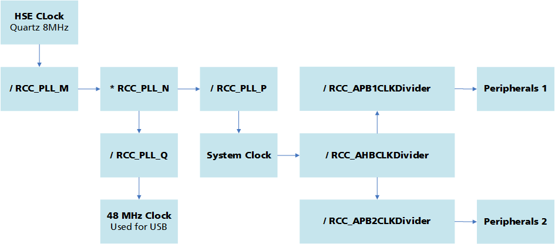

.. include:: ../../macros.rst

.. _software_documentation_faq:

=======================
Software FAQ and HOWTOs
=======================

.. highlight:: C

This sections shows different kind of actions related to the software.

.. contents::
    :local:

.. _faq_current_sensor:

How to start |foxBMS| if no messages are sent by CAN?
-----------------------------------------------------

If no current sensor is connected to |foxBMS|, it will not start. This default behavior can be changed by setting the switch

.. code-block:: C

    #define CURRENT_SENSOR_PRESENT               TRUE

to ``FALSE`` as explaned in :ref:`software_documentation_defines`.

How to create a task and change its priority and period?
--------------------------------------------------------

First, declare a new task configuration in the ``appltask_cfg.h`` file:

.. code-block:: C

    /**
    * Task configuration of the 10ms application task
    */
    extern BMS_Task_Definition_s appl_tskdef_10ms;

The task configuration is a struct of type ``BMS_Task_Definition_s`` and defined as follows:

.. code-block:: C

    /**
    * struct for FreeRTOS task definition
    */
    typedef struct {
        uint32_t Phase;          /*!< (ms)                                 */
        uint32_t CycleTime;      /*!< (ms)                                 */
        OS_PRIORITY_e Priority;  /*!<                                      */
        uint32_t Stacksize;      /*!<  Defines the size, in words, of the
                                       stack allocated to the idle task.   */
    } BMS_Task_Definition_s;

- Phase:     phase offset of the task in ms
- CycleTime: cycle time of the task in ms
- Stacksize: stack size allocated to the task
- Priority: task priority for scheduling

The task priorities are defined by CMSIS and consist of seven priorities:

.. code-block:: C

    typedef enum  {
      osPriorityIdle          = -3,          // /< priority: idle (lowest)
      osPriorityLow           = -2,          // /< priority: low
      osPriorityBelowNormal   = -1,          // /< priority: below normal
      osPriorityNormal        =  0,          // /< priority: normal (default)
      osPriorityAboveNormal   = +1,          // /< priority: above normal
      osPriorityHigh          = +2,          // /< priority: high
      osPriorityRealtime      = +3,          // /< priority: realtime (highest)
      osPriorityError         =  0x84        // /< system cannot determine priority
                                             //    or thread has illegal priority
    } osPriority;

The priorities ``osPriorityRealtime``, ``osPriorityHigh``, ``osPriorityAboveNormal`` and ``osPriorityNormal`` are already used by the |foxbms| engine and therefore should not be used. In conlusion the priorities ``osPriorityBelowNormal`` and ``osPriorityLow`` shall be used.

Second, add the task configuration in the ``appltask_cfg.c`` file:

.. code-block:: C

    /**
     * predefined 10ms task for user code
     */
    BMS_Task_Definition_s appl_tskdef_10ms = { 0,   10, osPriorityBelowNormal, 512/4 };

Third, declare a task handle and a task function in the ´´appltask.c/h´´ file:

.. code-block:: C

    /**
     *  Definition of task handle 10ms task
     */
    xTaskHandle appl_handle_tsk_10ms;

   /**
     * @brief   10ms engine application task
     */
    extern void APPL_TSK_Cyclic_100ms(void);

The task initialization and creation is done in the function ``APPL_CreateTask()`` in the ``appltask.c`` file. Before assigning the task handle to the newly created task, a new thread needs to be defined for the operating system. This is done by a call of the function ``osThreadDef(name, thread, priority, instances, stacksz)``. The function parameters are:

  - name: name of the function that represents the task
  - thread: os_pthread-pointer to the function that represents the task
  - priority: initial priority of the thread function
  - instances: number of possible thread instances (0 -> only one instance)
  - stacksize

The task handle is now, with a call of ``osThreadCreate``, assigned to the task.

.. code-block:: C

    // Cyclic Task 10ms
    osThreadDef(APPL_TSK_Cyclic_10ms, (os_pthread )APPL_TSK_Cyclic_10ms,
            appl_tskdef_10ms.Priority, 0, appl_tskdef_10ms.Stacksize);
    appl_handle_tsk_10ms = osThreadCreate(osThread(APPL_TSK_Cyclic_10ms), NULL);

The implementation of the task should be done like shown in the following example:

.. code-block:: C

    void APPL_TSK_Cyclic_10ms(void) {
        while (os_boot != OS_SYSTEM_RUNNING)
        {
            ;
        }

        osDelayUntil(os_schedulerstarttime, appl_tskdef_10ms.Phase);

        while(1)
       {
            uint32_t currentTime = osKernelSysTick();

            APPL_Cyclic_10ms();

            osDelayUntil(currentTime, appl_tskdef_10ms.CycleTime);
        }
    }

.. note::

    - Every task should have the while loop ``while(os_boot != OS_SYSTEM_RUNNING)`` at the beginning of the funtion. This prevents the task from being executed before |foxbms| is completely initialized.
    - ``osDelayUntil(os_schedulerstarttime, appl_tskdef_10ms.Phase)`` sets the wished phase offset of the task
    - Tasks in FreeRTOS should never finish. Therefore, the actual task implementation is done in a ``while(1)``-loop
    - ``APPL_TSK_Cyclic_10ms`` serves as wrapper function for task implementation in ``APPL_Cyclic_10ms()``
    - The call of ``osDelayUntil(currentTime, appl_tskdef_10ms.CycleTime)`` sets the task in blocked state until the cycle time until the next period arrives
    - Every task should be secured by the system monitoring module (``DIAG_SysMonNotify()``)
    - |foxbms| provides two default tasks for user applications with a periods of 10ms and 100ms

    .. code-block:: C

        void APPL_Cyclic_10ms(void) {
            DIAG_SysMonNotify(DIAG_SYSMON_APPL_CYCLIC_10ms, 0);        // task is running, state = ok

            /* User specific implementations:   */
            /*   ...                            */
            /*   ...                            */
        }

How to add a software module and take it into account with WAF?
---------------------------------------------------------------

The steps to follow are:

 - Creation of a new subfolder (for example ``mymodule``) in one of the existing source folders ``application``, ``engine``, ``general``, ``module``, ``module/utils``)
 - Copy of all source files to the newly created subfolder
 - Modification of the wscript file located in the chosen existing source folder, to add the new module. For example, to add a software module in the ``application`` folder, in the ``includes`` section of the wscript, the following new line has to be added:

.. code-block:: python

    os.path.join(bld.srcnode.abspath(), 'src', 'application', 'mymodule'),

In case the new software module has to be used in another existing module, the same line has to be added in the wscript file corresponding to the existing module where it is imported.

How to change the multiplexer measurement sequence for the LTC driver?
----------------------------------------------------------------------

The sequence is defined in ``module/config/ltc_cfg.c``, via the array ``LTC_MUX_CH_CFG_t ltc_mux_seq_main_ch1[]``, which contains a concatenation of elements like:

.. code-block:: C

   {
       .muxID    = 1,
       .muxCh    = 0xFF,
   },
   {
      .muxID    = 2,
      .muxCh    = 0,
   },
   {
      .muxID    = 2,
      .muxCh    = 1,
   },

There are 4 multiplexers with IDs from 0 to 3 on the |slaves|. The multiplexer is chosen with the variable ``muxID``. Each multiplexer has 8 channels, chosen with the variable ``muxCh`` (between 0 and 7). Channel 0xFF means that the multiplexer is disabled (i.e., high-impedance mode: none of the 8 inputs is connected to the output). With the code sequence shown above, multiplexer is first disabled, then channel 0 of multiplexer 2 is read, then channel 1 of multiplexer 2 is read.

Typically, multiplexer 0 and 1 are used for temperature measurement, and multiplexer 2 and 3 are used for balancing feedback (i.e., monitor if a cell is being balanced or not). As a consequence, by default, measurements of multiplexer 0 and 1 are stored in a database structure of type ``DATA_BLOCK_CELLTEMPERATURE_s`` and measurement of multiplexer 2 and 3 are stored in a database structure of type ``DATA_BLOCK_BALANCING_FEEDBACK_s``.

For temperature measurements, the variable ``uint8_t ltc_muxsensortemperatur_cfg[6]`` contains the look-up table between temperature sensors and cells: the first entry defines the temperature sensor number assigned to the first cell, the second entry defines the temperature sensor number assigned to the second cell, and so on. If no look-up table is needed, this array should simply be filled with integers increasing from 0 to number of temperature sensors minus 1. In this example, ``muxsensortemperaturmain_cfg[6]`` has a size of 6 because it is the default number of temperature sensors supported by the |slaves|. This must be adapted at two places:

 - In ``module/config/ltc_cfg.c``, where the variable is defined
 - In ``module/config/ltc_cfg.h``, in the declaration ``extern uint8_t ltc_muxsensortemperatur_cfg[6]``

.. _sw_faq_temperature_sensors:

How to change the relation between voltages read by multiplexer via |LTC| and temperatures?
-------------------------------------------------------------------------------------------

The function ``float LTC_Convert_MuxVoltages_to_Temperatures(float v_adc)`` is defined in ``ltc_cfg.c``. It gets a voltage in V as input and returns a temperature. It can simply be changed to meet the application needs.

To get the function converting the measured voltage to temperature, the following procedure can be followed if a Negative Temperature Coefficient resistor (NTC) is used :

 #. Create a spreadsheet (e.g., in Microsoft Excel)
 #. In the datasheet of the NTC, take the table giving the resistance versus the temperature
 #. In the spreadsheet, define three columns:

    - Temperature value (read from the NTC datasheet)
    - Corresponding resistance value (read from the NTC datasheet)
    - Voltage value provided by the voltage divider calculated with the NTC
      resistance for each temperature value. On the latest |slave|, the voltage divider
      is formed by a 10kOhm resistor in series with the NTC, with a 3V power supply,
      as shown in :ref:`slave_voltage_divider`
    - Different slave versions may have different voltage dividers. Have a look a
      the :ref:`hw_slave` documentation to select correct voltage divider for your slave.

 #. Plot the temperature versus the corresponding measured voltage value (i.e., first column versus third column in the spreadsheet)
 #. Fit a polynomial function to the plotted curve (e.g., by using Microsoft Excel)
 #. Implement the polynom in ``float LTC_Convert_MuxVoltages_to_Temperatures(float Vout)``

The function ``float LTC_Convert_MuxVoltages_to_Temperatures(float Vout)`` gets a voltage as input and outputs the corresponding temperature.

How to configure the MCU clock?
-------------------------------

The configuration is defined in ``module/config/rcc_cfg.c`` via two structures:

.. code-block:: C

   RCC_OscInitTypeDef RCC_OscInitStruct = {
       .OscillatorType = RCC_OSCILLATORTYPE_HSE,
       .HSEState = RCC_HSE_ON,
       .PLL.PLLState = RCC_PLL_ON,
       .PLL.PLLSource = RCC_PLLSOURCE_HSE,
       .PLL.PLLM = RCC_PLL_M,    // Oscillator Clock: 8MHz -> (8Mhz / 8) * 336 / 2 -> 168MHz
       .PLL.PLLN = RCC_PLL_N,
       .PLL.PLLP = RCC_PLL_P,
       .PLL.PLLQ = RCC_PLL_Q     // Oscillator Clock: 8MHz -> (8Mhz / 8) * 336 / 7   -> 48MHz
   };

   RCC_ClkInitTypeDef RCC_ClkInitStruct = {
       .ClockType = RCC_CLOCKTYPE_SYSCLK|RCC_CLOCKTYPE_HCLK|RCC_CLOCKTYPE_PCLK1|RCC_CLOCKTYPE_PCLK2,
       .SYSCLKSource = RCC_SYSCLKSOURCE_PLLCLK,    // System Clock Source: PLL-Clock
                                                   // (Cortex-Core, AHB-Bus, DMA, memory)
       .AHBCLKDivider = RCC_AHBCLKDivider,         // Div=1 , AHB  CLOCK: 168MHz
       .APB1CLKDivider = RCC_APB1CLKDivider,       // Div=4 , APB1 CLOCK:  42MHz
       .APB2CLKDivider = RCC_APB2CLKDivider        // Div=2 , APB2 CLOCK:  84MHz
   };

:numref:`Fig. %s <systemclocks>` shows a summary of the system clocks, with the variables defined via the structures and their effect (either as divider or multiplier).

.. _systemclocks:

   Clock system of the microcontroller used in |foxbms|

On the |BMS-Master|, a 8MHz oscillator is used as clock source. It should be noted that some of the multipliers/dividers can take all integers values in a certain range, while others can only take a specific set of values. The values must be defined so that the clock values are within the allowed ranges. These are defined in the microcontroller datasheet.

How to configure the |LTC| and SPI clocks?
------------------------------------------

In ``module/config/ltc_cfg.h``, the macro ``#define SPI_HANDLE_LTC &spi_devices[0]`` is defined. It points to a SPI handle: this SPI device will be used for the communication with the |LTC|. SPI handles are defined in ``module/config/spi_cfg.c``. Depending on the SPI device chosen, the clock used will be peripheral clock 1 or 2 (this information is found in the STM32F4 datasheet). The clock used by the SPI device is obtained after division of the peripheral clock frequency. In the SPI handle, the value for the divider is defined via ``.Init.BaudRatePrescaler = SPI_BAUDRATEPRESCALER_128``. In the |LTC| driver, the SPI frequency is read directly via a HAL function and all timings are adapted automatically. The user must only ensure that the SPI frequency used for the |LTC| is not higher than 1MHz. This is the maximal frequency allowed for the |LTC| communication (as defined in the |LTC| datasheet).

How to configure the CAN clock?
-------------------------------

If the APB1 (Peripheral) clock changes, the CAN timing has to be adapted according to the following formula:

.. math::

   \text{clock}_\text{CAN} = \frac{\text{APB1}}{(\text{prescaler} + \text{timequantums})}

   \text{timequantums} = 1 + \text{timequantumsBS1} + \text{timequantumsBS2}

The timequantums (TQ) are constrained to specific discrete values by the STM32 microcontroller.

**Sample Configurations**

=============  ============   ============== =========== ===========
CAN clock      APB1           Prescaler      BS1         BS2
-------------  ------------   -------------- ----------- -----------
1.0 MHz        42 MHz         3              6 TQ        7 TQ
1.0 MHz        32 MHz         4              5 TQ        2 TQ
0.5 MHz        42 MHz         6              6 TQ        7 TQ
0.5 MHz        32 MHz         8              5 TQ        2 TQ
=============  ============   ============== =========== ===========

**Example:**

change the relevant low level driver handle in file /modules/config/can_cfg.c

``CAN_HandleTypeDef hcan1`` or ``CAN_HandleTypeDef hcan2``

.. code-block:: C

   .Init.Prescaler = 3,        // CAN_CLOCK = APB1 = 42 MHz
                               // resulting CAN speed: APB1/prescaler/sumOfTimequants
                               // sum: 1tq for sync + BS1 + BS2
   .Init.BS1 = CAN_BS1_6TQ,    // --> CAN = 42 MHz/(3*14) = 1.0 MHz
   .Init.BS2 = CAN_BS2_7TQ,

.. math::

   \text{timequantums} = 1 + 6 + 7 = 14

   \text{clock}_{CAN} = \frac{42.0\text{\MHz}}{(3 \cdot  14)} = 1.0 \text{\MHz}

Further details can be found in STM32F4 datasheet.

How to configure and drive I/O ports?
-------------------------------------

The pin configuration of the hardware is is defined in ``const IO_PIN_CFG_s io_cfg[]`` in the file ``module/config/io_cfg.c`` with entries like:

.. code-block:: C

   {PIN_MCU_0_BMS_INTERFACE_SPI_MISO, IO_MODE_AF_PP, IO_PIN_NOPULL,
    IO_SPEED_HIGH, IO_ALTERNATE_AF5_SPI1, IO_PIN_LOCK_ENABLE}

The parameters are:

 - Pin: Defines the pin name (defined in ``module/config/io_mcu0_cfg.h``).
 - Mode: The possibilities of the mode are defined in ``module/config io_cfg.c`` via the enum type ``IO_PIN_MODES_e``. Often used modes are ``IO_MODE_AF_PP`` for use of one alternate function of the pin, ``IO_MODE_INPUT`` to use the pin as an input, ``IO_MODE_OUTPUT_PP`` to use the pin as an output with push-pull functionality.
 - Pinpull: Defines wether the pin is used without pull-up or pull-down (``IO_PIN_NOPULL``), to use the pin with pull-up (``IO_PIN_PULLUP``) or to use the pin with pull-down (``IO_PIN_PULLDOWN``).
 - Speed: Defines the speed of the pin (``IO_SPEED_LOW``, ``IO_SPEED_MEDIUM``, ``IO_SPEED_FAST`` or ``IO_SPEED_HIGH``).
 - Alternate: Defines if the signal/pin uses an alternate function or not. If no alternate function is used this is set to ``IO_ALTERNATE_NO_ALTERNATE``. If the signal/pin uses a alternate function one can choose from the possibilities from the enumeration ``IO_PIN_ALTERNATE_e`` in ``module/config/io_cfg.h``.
 - Pinlock: ``IO_PIN_LOCK_DISABLE`` or ``IO_PIN_LOCK_ENABLE`` to disable or enable pin locking.
 - Initvalue: Sets the initial state of the pin in case of an output pin; The pin is set to ``IO_PIN_RESET`` for 0/low and to ``IO_PIN_SET`` for 1/high. If no value is given for a output pin it is set to low.

As explained above, the signal names are to be defined in ``module/config/io_mcu0_cfg.h`` with macros like:

.. code-block:: C

   #define PIN_MCU_0_BMS_INTERFACE_SPI_MISO IO_PA_6

where ``IO_Px_y`` corresponds to the physical pin on the MCU, with ``x`` the port (e.g., A,B,C) and ``y`` the pin number on the port (e.g., 0,1,2).

This configuration is initialized in ``main.c`` with the function call ``IO_Init(&io_cfg[0])``.

Pins configured as output are driven with the function with ``IO_PIN_RESET`` or ``IO_PIN_SET`` to set the pin to low or high. Example (The signal/pin name corresponds to the one defined in ``module/config/io_mcu0_cfg.h``).:

.. code-block:: C

   IO_WritePin(PIN_MCU_0_BMS_INTERFACE_SPI_MISO, IO_PIN_RESET);     // set pin low
   IO_WritePin(PIN_MCU_0_TO_MCU_1_INTERFACE_SPI_MISO, IO_PIN_SET);  // set pin high

The states of pins configured as input are read with the ``IO_ReadPin(<Signalname>)`` function. The function returns ``IO_PIN_RESET`` or ``IO_PIN_SET`` (0 or 1). Example with the signal/pin name corresponding to the one defined in ``module/config/io_mcu0_cfg.h``:

.. code-block:: C

   IO_PIN_STATE_e pinstate = IO_PIN_RESET;
   pinstate = IO_ReadPin(PIN_MCU_0_BMS_INTERFACE_SPI_NSS);

How to add and configure interrupts?
------------------------------------

The interrupt configuration can be found in ``general/config/nvic_cfg.c`` via the variable ``NVIC_InitStruct_s nvic_interrupts[]``, which contains entries of the form:
``{ DMA2_Stream2_IRQn, 2, NVIC_IRQ_LOCK_ENABLE, NVIC_IRQ_ENABLE }``

The configuration parameters are:

 - Symbolic name of interrupt source (as defined in the system file stm32f429xx.h)
 - Interrupt priority: number between 0 and 15, a lower number means a higher priority
 - Parameter irqlock: if set to ``NVIC_IRQ_LOCK_ENABLE``, the interrupt is locked according to the initial state and cannot be modified by the interface functions ``NVIC_EnableInterrupts()`` or ``NVIC_DisableInterrupts()``
 - Initial state of interrupt source: set to ``NVIC_IRQ_ENABLE`` to get the interrupt enabled by the initialization function. In case of ``NVIC_IRQ_DISABLE``, the interrupt must be activated by calling ``NVIC_EnableInterrupts()`` after the initialization

In ``general/config/stm32f4xx_it.c``, a corresponding callback function must be defined (for example ``void DMA2_Stream2_IRQHandler(void)`` for DMA stream 2 of DMA device 2). It will be called when the interrupt is triggered.

For a proper operation, the interrupt handling (callback function) has to execute the following steps:

 - Clear the pending interrupt with for example ``HAL_NVIC_ClearPendingIRQ(DMA2_Stream2_IRQn)``
 - Call the HAL IRQ handler (or a custom handler) with for example: ``HAL_DMA_IRQHandler(&dma_devices[0])``

.. note::

   Interrupt routines with interrupt priority above the maximum FreeRTOS configuration level (``configLIBRARY_MAX_SYSCALL_INTERRUPT_PRIORITY``) must not call FreeRTOS API functions. These interrupts are real-time interrupts, which are bypassing the operating system. Interrupt routines with interrupt priority equal or lower than this maximum level must call the corresponding FreeRTOS API functions with ending ``...._FROM_ISR()``.

Check the documentation (datasheet, reference manual) of the interrupt source for additional steps.

.. _database_entry:

How to add a database entry and to read/write it?
-------------------------------------------------

The example of the entry for cell voltages is taken. In
``engine\config\database_cfg.h``, the definition of a block must be added
``#define DATA_BLOCK_ID_CELLVOLTAGE DATA_BLOCK_1`` with one available block.
The blocks are defined via the following enumeration:

.. code-block:: C

   typedef enum {
       DATA_BLOCK00        = 0,
       DATA_BLOCK01        = 1,
       DATA_BLOCK02        = 2,
       DATA_BLOCK03        = 3,
       DATA_BLOCK04        = 4,
       DATA_BLOCK05        = 5,
       DATA_BLOCK06        = 6,
       DATA_BLOCK07        = 7,
       DATA_BLOCK08        = 8,
       DATA_BLOCK09        = 9,
       DATA_BLOCK10        = 10,
       DATA_BLOCK_MAX      = DATA_MAX_BLOCK_NR,
   } DATA_BLOCK_ID_TYPE_e;

If more than ``DATA_BLOCK_MAX`` blocks are needed, it must be changed in the defines:

.. code-block:: C

   #define DATA_MAX_BLOCK_NR                11

A structure must then be declared for the block ID created:

.. code-block:: C

   /*  data structure declaration of DATA_BLOCK_ID_CELLVOLTAGE */
   typedef struct {
    /* Timestamp info needs to be at the beginning. Automatically written on DB_WriteBlock      */
       uint32_t timestamp;                       /*!< timestamp of database entry               */
       uint32_t previous_timestamp;              /*!< timestamp of last database entry          */
       /* data block entries                                                                    */
       uint16_t      voltage[NR_OF_BAT_CELLS];   //unit: mV
       uint8_t       state;
   } DATA_BLOCK_CELLVOLTAGE_s;

This structure needs to contain a variable timestamp and previous_timestamp at the
beginning of the struct. These timestamp are automatically updated each time new
values are stored in the database. The reamaing struct consists of all the data
needed for the entry. In ``mcu-primary\engine\config\database_cfg.c``, a variable with the
structure type must be declared
``DATA_BLOCK_CELLVOLTAGE_s data_block_cellvoltage[DOUBLE_BUFFERING]``. The user
can choose ``SINGLE_BUFFERING`` or ``DOUBLE_BUFFERING``. The last step is to
add an entry in the structure ``DATA_BASE_HEADER_s  data_base_header[]``:

.. code-block:: C

   {
   (void*)(&data_block_cellvoltage[0]),
   sizeof(DATA_BLOCK_CELLVOLTAGE_s),
   DOUBLE_BUFFERING,
   },

With either ``SINGLE_BUFFERING`` or ``DOUBLE_BUFFERING`` (the same as in the structure declaration).
When access to the created database entry is needed, a local variable with the corresponding type must be created in the module where it is needed:
``DATA_BLOCK_CELLVOLTAGE_s cellvoltage;``

Access to a data field is made with the usual C-syntax:

.. code-block:: C

   cellvoltage.voltage[i]

Getting the data from the database in the local variable is made via:

.. code-block:: C

   DB_ReadBlock(&cellvoltage ,DATA_BLOCK_ID_CELLVOLTAGE)

Storing data from the local variable to the database is made via:

.. code-block:: C

   DB_WriteBlock(&cellvoltage, DATA_BLOCK_ID_CELLVOLTAGE)

During each call of ``DB_WriteBlock()`` the timestamps will automatically be
updated.

How to store data in the backup SRAM of the MCU?
------------------------------------------------

The STM32F4 has 4kB Backup SRAM. Variables can be stored there with the keywork ``MEM_BKP_SRAM`` which is defined in ``src/general/config/global.h``.

Example:

.. code-block:: C

   #define DIAG_FAIL_ENTRY_LENGTH (50)
   DIAG_ERROR_ENTRY_s MEM_BKP_SRAM diag_memory[DIAG_FAIL_ENTRY_LENGTH];

.. _faq_can_manually_add:

How to manually add CAN entries (transmit and receive) and to change the transmit time period?
----------------------------------------------------------------------------------------------

Several steps have to be done to add a transmit message and signal (message and signal in receive direction in parentheses):

File: ``module/config/cansignal_cfg.h``

1. The message name must be added. For TX, i.e., transmit data, a message entry must be added in the enumeration ``CANS_messagesTx_e``: (RX, i.e., receive, ``CANS_messagesRx_e``)

2. Then one or more signal names must be added in the enumeration ``CANS_signalsTx_e`` (``CANS_signalsRx_e``)

File: ``module/config/can_cfg.c``

3. The CAN message must be defined

3.1. In case a TX message should be defined - add the message for CAN0 or CAN1 in the respective array (const CAN_MSG_TX_TYPE_s can_CANx_messages_tx). The message looks
like ``{ 0x123, 8, 100, 20, NULL_PTR }``

   The parameters are:

   - Message ID (11bit standard identifier used in |foxbms|)
   - Data Length Code (i.e., number of bytes), usually 8
   - Transmit period in ms: must be multiple of ``CANS_TICK_MS``
   - Delay in ms for sending the message the first time: must be multiple of ``CANS_TICK_MS``
   - A function pointer to be called after transmission, ``NULL_PTR`` if nothing needs to be done

3.2 If a RX message needs to be configured, the message for CAN0 or CAN1 must be added in the respective array (CAN_MSG_RX_TYPE_s can0_RxMsgs[]). The message looks like ``{ 0x123, 0xFFFF, 8, 0, CAN_FIFO0, NULL }``

    The parameters are:

    - Message ID (11bit standard identifier used in |foxbms|)
    - Mask for the CAN hardware filter (Select mask or use 0x0000 to select list mode)
    - Data Length Code (i.e., number of bytes), usually 8
    - Hardware receive FIFO (CAN_FIFO0 or CAN_FIFO1)
    - function pointer to be called after reception, usually NULL_PTR to do nothing because signals with respective function pointers are used

File: ``module/config/cansignal_cfg.c``

4. Then the signals added in the header must be added in the .c file and in ``const CANS_signal_s cans_CANx_signals_tx[]`` (``const CANS_signal_s cans_CANx_signals_rx[NR_SIGNALS_RX]``).

  A signal looks like:

  .. code-block:: C

    {CANS_MSG_Name}, 0, 8, 0, 255, 1, 0, NULL_PTR, &cans_getsignaldata

  The parameters are:

   - Symbolic name of the message containing the signal (defined in ``CANS_messagesTx_e``, in the header file)
   - Start bit of signal
   - Signal length in bits
   - Minimum value (float)
   - Maximum value (float)
   - Scaling factor (float)
   - Scaling offset (float)
   - Callback function for setter (when CAN msg is received) (``NULL_PTR`` if no function needed, e.g., for transmit)
   - Callback function gor getter (when CAN msg is transmitted) (``NULL_PTR`` if no function needed, e.g., for receive only)

5. The callback functions must be declared and implemented in ``cansignal_cfg.c``.

.. _faq_can_lessthan12cells:

How to adapt the CAN module when less than 12 battery cells/temperature sensors per module are used?
----------------------------------------------------------------------------------------------------

Five adaptions are necessary when removing unused battery cell voltages or temperatures This procedure is executed exemplarily
for 9 cell voltages and 5 temperature sensors:

1. Adapt struct ``const CAN_MSG_TX_TYPE_s can_CAN0_messages_tx[]`` in file ``module/config/can_cfg.c``:

.. code-block:: C

    { 0x200, 8, 200, 20, NULL_PTR },  //!< Cell voltages module 0 cells 0 1 2
    { 0x201, 8, 200, 20, NULL_PTR },  //!< Cell voltages module 0 cells 3 4 5
    { 0x202, 8, 200, 20, NULL_PTR },  //!< Cell voltages module 0 cells 6 7 8
    { 0x203, 8, 200, 20, NULL_PTR },  //!< Cell voltages module 0 cells 9 10 11

    { 0x210, 8, 200, 30, NULL_PTR },  //!< Cell temperatures module 0 cells 0 1 2
    { 0x211, 8, 200, 30, NULL_PTR },  //!< Cell temperatures module 0 cells 3 4 5
    { 0x212, 8, 200, 30, NULL_PTR },  //!< Cell temperatures module 0 cells 6 7 8
    { 0x213, 8, 200, 30, NULL_PTR },  //!< Cell temperatures module 0 cells 9 10 11

Remove all unused CAN message depending on the number of used cells/sensors. In the example case remove cell voltage message 0x203
because we transmit only cell voltages 0-8. Additionally remove cell temperature message 0x212 and 0x213 because we only use
temperatures 0-4. Repeat this process for all modules.

2. Adapt enum ``CANS_messagesTx_e`` in file ``module/config/cansignal_cfg.h``:

.. code-block:: C

    CAN0_MSG_Mod0_Cellvolt_0,  //!< Module 0 Cell voltages 0-2
    CAN0_MSG_Mod0_Cellvolt_1,  //!< Module 0 Cell voltages 3-5
    CAN0_MSG_Mod0_Cellvolt_2,  //!< Module 0 Cell voltages 6-8
    CAN0_MSG_Mod0_Cellvolt_3,  //!< Module 0 Cell voltages 9-11

    CAN0_MSG_Mod0_Celltemp_0,  //!< Module 0 Cell temperatures 0-2
    CAN0_MSG_Mod0_Celltemp_1,  //!< Module 0 Cell temperatures 3-5
    CAN0_MSG_Mod0_Celltemp_2,  //!< Module 0 Cell temperatures 6-8
    CAN0_MSG_Mod0_Celltemp_3,  //!< Module 0 Cell temperatures 9-11

Remove all unused enmus depending on the number of used cells/sensors. In the example case remove enum ``CAN0_MSG_Mod0_Cellvolt_3``
because we transmit only cell voltages 0-8. Additionally remove cell temperature enum ``CAN0_MSG_Mod0_Celltemp_2`` and
``CAN0_MSG_Mod0_Celltemp_3`` because we only use temperatures 0-4. Repeat this process for all modules.

3. Adapt enum ``CANS_CAN0_signalsTx_e`` in file ``module/config/cansignal_cfg.h``:

.. code-block:: C

    CAN0_SIG_Mod0_volt_valid_0_2,
    CAN0_SIG_Mod0_volt_0,
    CAN0_SIG_Mod0_volt_1,
    CAN0_SIG_Mod0_volt_2,
    CAN0_SIG_Mod0_volt_valid_3_5,
    CAN0_SIG_Mod0_volt_3,
    CAN0_SIG_Mod0_volt_4,
    CAN0_SIG_Mod0_volt_5,
    CAN0_SIG_Mod0_volt_valid_6_8,
    CAN0_SIG_Mod0_volt_6,
    CAN0_SIG_Mod0_volt_7,
    CAN0_SIG_Mod0_volt_8,
    CAN0_SIG_Mod0_volt_valid_9_11,
    CAN0_SIG_Mod0_volt_9,
    CAN0_SIG_Mod0_volt_10,
    CAN0_SIG_Mod0_volt_11,

    CAN0_SIG_Mod0_temp_valid_0_2,
    CAN0_SIG_Mod0_temp_0,
    CAN0_SIG_Mod0_temp_1,
    CAN0_SIG_Mod0_temp_2,
    CAN0_SIG_Mod0_temp_valid_3_5,
    CAN0_SIG_Mod0_temp_3,
    CAN0_SIG_Mod0_temp_4,
    CAN0_SIG_Mod0_temp_5,
    CAN0_SIG_Mod0_temp_valid_6_8,
    CAN0_SIG_Mod0_temp_6,
    CAN0_SIG_Mod0_temp_7,
    CAN0_SIG_Mod0_temp_8,
    CAN0_SIG_Mod0_temp_valid_9_11,
    CAN0_SIG_Mod0_temp_9,
    CAN0_SIG_Mod0_temp_10,
    CAN0_SIG_Mod0_temp_11,

Remove all unused enmus depending on the number of used cells/sensors. In the example case remove enums ``CAN0_SIG_Mod0_volt_valid_9_11``
to ``CAN0_SIG_Mod0_volt_11`` because we transmit only cell voltages 0-8. Additionally remove cell temperature enums ``CAN0_SIG_Mod0_temp_5``
to CAN0_SIG_Mod0_temp_11 because we only use temperatures 0-4. Repeat this process for all modules.

4. Adapt struct ``const CANS_signal_s cans_CAN0_signals_tx[]`` in file ``module/config/cansignal_cfg.c``:

.. code-block:: C

        // Module 0 cell voltages
        { {CAN0_MSG_Mod0_Cellvolt_0}, 0, 8, 0, 0xFF, 1, 0, NULL_PTR, &cans_getvolt },  //!< CAN0_SIG_Mod0_volt_valid_0_2
        { {CAN0_MSG_Mod0_Cellvolt_0}, 8, 16, 0, 0xFFFF, 1, 0, NULL_PTR, &cans_getvolt },  //!< CAN0_SIG_Mod0_volt_0
        { {CAN0_MSG_Mod0_Cellvolt_0}, 24, 16, 0, 0xFFFF, 1, 0, NULL_PTR, &cans_getvolt },  //!< CAN0_SIG_Mod0_volt_1
        { {CAN0_MSG_Mod0_Cellvolt_0}, 40, 16, 0, 0xFFFF, 1, 0, NULL_PTR, &cans_getvolt },  //!< CAN0_SIG_Mod0_volt_2
        { {CAN0_MSG_Mod0_Cellvolt_1}, 0, 8, 0, 0xFF, 1, 0, NULL_PTR, &cans_getvolt },  //!< CAN0_SIG_Mod0_volt_valid_3_5
        { {CAN0_MSG_Mod0_Cellvolt_1}, 8, 16, 0, 0xFFFF, 1, 0, NULL_PTR, &cans_getvolt },  //!< CAN0_SIG_Mod0_volt_3
        { {CAN0_MSG_Mod0_Cellvolt_1}, 24, 16, 0, 0xFFFF, 1, 0, NULL_PTR, &cans_getvolt },  //!< CAN0_SIG_Mod0_volt_4
        { {CAN0_MSG_Mod0_Cellvolt_1}, 40, 16, 0, 0xFFFF, 1, 0, NULL_PTR, &cans_getvolt },  //!< CAN0_SIG_Mod0_volt_5
        { {CAN0_MSG_Mod0_Cellvolt_2}, 0, 8, 0, 0xFF, 1, 0, NULL_PTR, &cans_getvolt },  //!< CAN0_SIG_Mod0_volt_valid_6_8
        { {CAN0_MSG_Mod0_Cellvolt_2}, 8, 16, 0, 0xFFFF, 1, 0, NULL_PTR, &cans_getvolt },  //!< CAN0_SIG_Mod0_volt_6
        { {CAN0_MSG_Mod0_Cellvolt_2}, 24, 16, 0, 0xFFFF, 1, 0, NULL_PTR, &cans_getvolt },  //!< CAN0_SIG_Mod0_volt_7
        { {CAN0_MSG_Mod0_Cellvolt_2}, 40, 16, 0, 0xFFFF, 1, 0, NULL_PTR, &cans_getvolt },  //!< CAN0_SIG_Mod0_volt_8
        { {CAN0_MSG_Mod0_Cellvolt_3}, 0, 8, 0, 0xFF, 1, 0, NULL_PTR, &cans_getvolt },  //!< CAN0_SIG_Mod0_volt_valid_9_11
        { {CAN0_MSG_Mod0_Cellvolt_3}, 8, 16, 0, 0xFFFF, 1, 0, NULL_PTR, &cans_getvolt },  //!< CAN0_SIG_Mod0_volt_9
        { {CAN0_MSG_Mod0_Cellvolt_3}, 24, 16, 0, 0xFFFF, 1, 0, NULL_PTR, &cans_getvolt },  //!< CAN0_SIG_Mod0_volt_10
        { {CAN0_MSG_Mod0_Cellvolt_3}, 40, 16, 0, 0xFFFF, 1, 0, NULL_PTR, &cans_getvolt },  //!< CAN0_SIG_Mod0_volt_11

        // Module 0 cell temperatures
        { {CAN0_MSG_Mod0_Celltemp_0}, 0, 8, 0, 0xFF, 1, 0, NULL_PTR, &cans_gettemp },  //!< CAN0_SIG_Mod0_volt_valid_0_2
        { {CAN0_MSG_Mod0_Celltemp_0}, 8, 16, -128, 527.35, 100, 128, NULL_PTR, &cans_gettemp },  //!< CAN0_SIG_Mod0_temp_0
        { {CAN0_MSG_Mod0_Celltemp_0}, 24, 16, -128, 527.35, 100, 128, NULL_PTR, &cans_gettemp },  //!< CAN0_SIG_Mod0_temp_1
        { {CAN0_MSG_Mod0_Celltemp_0}, 40, 16, -128, 527.35, 100, 128, NULL_PTR, &cans_gettemp },  //!< CAN0_SIG_Mod0_temp_2
        { {CAN0_MSG_Mod0_Celltemp_1}, 0, 8, 0, 0xFF, 1, 0, NULL_PTR, &cans_gettemp },  //!< CAN0_SIG_Mod0_volt_valid_3_5
        { {CAN0_MSG_Mod0_Celltemp_1}, 8, 16, -128, 527.35, 100, 128, NULL_PTR, &cans_gettemp },  //!< CAN0_SIG_Mod0_temp_3
        { {CAN0_MSG_Mod0_Celltemp_1}, 24, 16, -128, 527.35, 100, 128, NULL_PTR, &cans_gettemp },  //!< CAN0_SIG_Mod0_temp_4
        { {CAN0_MSG_Mod0_Celltemp_1}, 40, 16, -128, 527.35, 100, 128, NULL_PTR, &cans_gettemp },  //!< CAN0_SIG_Mod0_temp_5
        { {CAN0_MSG_Mod0_Celltemp_2}, 0, 8, 0, 0xFF, 1, 0, &cans_gettemp },  //!< CAN0_SIG_Mod0_volt_valid_6_8
        { {CAN0_MSG_Mod0_Celltemp_2}, 8, 16, -128, 527.35, 100, 128, NULL_PTR, &cans_gettemp },  //!< CAN0_SIG_Mod0_temp_6
        { {CAN0_MSG_Mod0_Celltemp_2}, 24, 16, -128, 527.35, 100, 128, NULL_PTR, &cans_gettemp },  //!< CAN0_SIG_Mod0_temp_7
        { {CAN0_MSG_Mod0_Celltemp_2}, 40, 16, -128, 527.35, 100, 128, NULL_PTR, &cans_gettemp },  //!< CAN0_SIG_Mod0_temp_8
        { {CAN0_MSG_Mod0_Celltemp_3}, 0, 8, 0, 0xFF, 1, 0, NULL_PTR, &cans_gettemp },  //!< CAN0_SIG_Mod0_volt_valid_9_11
        { {CAN0_MSG_Mod0_Celltemp_3}, 8, 16, -128, 527.35, 100, 128, NULL_PTR, &cans_gettemp },  //!< CAN0_SIG_Mod0_temp_9
        { {CAN0_MSG_Mod0_Celltemp_3}, 24, 16, -128, 527.35, 100, 128, NULL_PTR, &cans_gettemp },  //!< CAN0_SIG_Mod0_temp_10
        { {CAN0_MSG_Mod0_Celltemp_3}, 40, 16, -128, 527.35, 100, 128, NULL_PTR, &cans_gettemp },  //!< CAN0_SIG_Mod0_temp_11

Remove all unused struct entries depending on the number of used cells/sensors. Repeat this process for all modules.

5. Adapt functions ``cans_getvolt`` and ``cans_gettemp`` in file ``module/config/cansignal_cfg.c``:

Remove all case-statements for which the signals have been deleted in the previous steps.

.. _faq_can_lessthan8modules:

How to adapt the CAN module when less or more than 8 battery modules are used?
------------------------------------------------------------------------------

When less than 8 modules are used, the same procedure as described in :ref:`faq_can_lessthan8modules` must be used but only the unused
modules instead of unused cell voltages/temperatures must be deleted. If additional modules should be added also follow these instructions
but instead of deleting these signals and CAN messages add the wished number of new messages.

Morover an adaption of the functions  ``cans_getvolt`` and ``cans_gettemp`` in file ``module/config/cansignal_cfg.c`` is necessary:

.. code-block:: C

    // Determine module and cell number
    if (sigIdx - CAN0_SIG_Mod0_volt_valid_0_2 < CANS_MODULSIGNALS_VOLT) {
        modIdx = 0;
        cellIdx = sigIdx - CAN0_SIG_Mod0_volt_valid_0_2;
    } else if (sigIdx - CAN0_SIG_Mod1_volt_valid_0_2 < CANS_MODULSIGNALS_VOLT) {
        modIdx = 1;
        cellIdx = sigIdx - CAN0_SIG_Mod1_volt_valid_0_2;
    } else if (sigIdx - CAN0_SIG_Mod2_volt_valid_0_2 < CANS_MODULSIGNALS_VOLT) {
        modIdx = 2;
        cellIdx = sigIdx - CAN0_SIG_Mod2_volt_valid_0_2;
    } else if (sigIdx - CAN0_SIG_Mod3_volt_valid_0_2 < CANS_MODULSIGNALS_VOLT) {
        modIdx = 3;
        cellIdx = sigIdx - CAN0_SIG_Mod3_volt_valid_0_2;
    } else if (sigIdx - CAN0_SIG_Mod4_volt_valid_0_2 < CANS_MODULSIGNALS_VOLT) {
        modIdx = 4;
        cellIdx = sigIdx - CAN0_SIG_Mod4_volt_valid_0_2;
    } else if (sigIdx - CAN0_SIG_Mod5_volt_valid_0_2 < CANS_MODULSIGNALS_VOLT) {
        modIdx = 5;
        cellIdx = sigIdx - CAN0_SIG_Mod5_volt_valid_0_2;
    } else if (sigIdx - CAN0_SIG_Mod6_volt_valid_0_2 < CANS_MODULSIGNALS_VOLT) {
        modIdx = 6;
        cellIdx = sigIdx - CAN0_SIG_Mod6_volt_valid_0_2;
    } else if (sigIdx - CAN0_SIG_Mod7_volt_valid_0_2 < CANS_MODULSIGNALS_VOLT) {
        modIdx = 7;
        cellIdx = sigIdx - CAN0_SIG_Mod7_volt_valid_0_2;
    }

This if statement performs a module detection to allocate the correct cell voltage to the respective CAN message. This statement
needs to be shortened/extended depending on the number of used modules. The same method is used to allocate the cell temperatures
and thus needs to be adapted as well.

.. note::

    The define CANS_MODULSIGNALS_TEMP is calculated as followed:

    .. code-block:: C

        #define CANS_MODULSIGNALS_TEMP  (CAN0_SIG_Mod1_volt_valid_0_2 - CAN0_SIG_Mod0_temp_valid_0_2)

    When only one module is used this define needs to be redefined on the next signal used after the last temperature signal of
    module 0. If no signal is defined after the module 0 temperature signals use the last defined temperature signal. For the
    default configuration of foxBMS this could look like this:

    .. code-block:: C

        #define CANS_MODULSIGNALS_TEMP  ((CAN0_SIG_Mod0_temp_11 - CAN0_SIG_Mod0_temp_valid_0_2) + 1)

How to change the blink period of the indicator LEDs?
-----------------------------------------------------

It is defined via the three variables in ``module/utils/led.c``:

 - ``led_0_nbr_of_blink``
 - ``led_1_nbr_of_blink``
 - ``led_blink_time``

Currently the three variables are set directly in the function ``LED_Ctrl()``. If desired or needed, the three values can be read from the database and so set elsewhere in the code.

The time is set in ms via ``led_blink_time``. The LED cycle is divided in two periods, T0 and T1. Each of both periods lasts ``led_blink_time`` ms. During T0, LED0 is on or blinks and LED1 is off. During T1, LED0 is off and LED1 is on or blinks. The behavior described as ''is on or blinks'' is defined via ``led_0_nbr_of_blink`` for LED0 and via ``led_1_nbr_of_blink`` for LED1. If ``led_0_nbr_of_blink`` is set to 1, LED0 is on during T0. If ``led_0_nbr_of_blink`` is set to n greater than 1, LED0 will blink n times during T1. For example, if the period is set to 3000ms and ``led_0_nbr_of_blink`` set to 3, LED0 will have the following behavior during T0:

 - On for 500ms
 - Off for 500ms
 - On for 500ms
 - Off for 500ms
 - On for 500ms
 - Off for 500ms

The behavior is the same for LED1 with ``led_1_nbr_of_blink``. With this functionality, each LED can blink independently n times. If each LED can blink up to 4 times, the LEDs can visually give 16 different messages.

The adjustment of the blink period is provided to make reading by the user easier: for higher number of blinks, the blink period can be made longer: for example, it is easier to count 4 blinks in 3s than 4 blinks in 1s).

How to add an entry for the diag module?
----------------------------------------

Adding a new sensitivity level is done in ``src/engine/config/diag_cfg.h`` by adding a new ``#define`` in:

.. code-block:: C

   #define DIAG_ERROR_SENSITIVITY_HIGH        (0)   // logging at first event
   #define DIAG_ERROR_SENSITIVITY_MID         (5)   // logging at fifth event
   #define DIAG_ERROR_SENSITIVITY_LOW         (10)  // logging at tenth event
   #define DIAG_ERROR_SENSITIVITY_CUSTOM      (100) // logging at 100th event

and errors can be defined:

.. code-block:: C

   #define     DIAG_CH_CUSTOM_FAILURE             DIAG_ID_XX

and the error is then added in ``DIAG_CH_CFG_s  diag_ch_cfg[]`` in file ``src/engine/config/diag_cfg.c``:

.. code-block:: C

   DIAG_CH_CFG_s  diag_ch_cfg[] = {
    {DIAG_CH_CUSTOM_FAILURE,        DIAG_GENERAL_TYPE, DIAG_ERROR_SENSITIVITY_HIGH,
     DIAG_RECORDING_ENABLED, DIAG_ENABLED, dummyfu},

The number of logged error events can be changed by modifying the value of the macro:

.. code-block:: C

   #define DIAG_FAIL_ENTRY_LENGTH               (50)    // Number of errors that can be logged

.. note::
    The diag module is a powerfull module for general error handling. The user has to be aware of timings when using custom diag entries. As example how to use this module correct syscontrol is choosen.
    - The function ``SYSCTRL_Trigger()`` is called in the 10ms task (``ENG_TSK_Cyclic_10ms()``), meaning every 10ms this function must be executed.
    - In the diagnosis-module header ``diag_cfg.h`` there is the enum ``DIAG_SYSMON_MODULE_ID_e`` for the different error types that are handeled by the diagnosismodule. For syscontrol errors there is ``DIAG_SYSMON_SYSCTRL_ID``.
    - In the diagnosis-module source ``diag_cfg.c`` there is the ``diag_sysmon_ch_cfg[]`` array assigning timings to this error, in this case 20ms.

    .. code-block:: C

        {DIAG_SYSMON_SYSCTRL_ID, DIAG_SYSMON_CYCLICTASK, 20,
        DIAG_RECORDING_ENABLED, DIAG_ENABLED, dummyfu2},

    This means every time ``SYSCTRL_Trigger()`` is called, the function indicating `syscontrol is running` has to be exectued. If this is not done, the diagnosis module will set the syscontrol to the error state. Therefore, the user must set up functions, which are wanted to be supervised by the diagnosis module, and that they are still running, in this way:

    .. code-block:: C

        void SYSCTRL_Trigger(SYSCTRL_TRIG_EVENT_e event) {
            DIAG_SysMonNotify(DIAG_SYSMON_SYSCTRL_ID, 0);    // task is running, therefore
                                    // reset state to 0
            /* user code */
        }

How to configure contactors without feedback?
---------------------------------------------

In the file ``src/module/config/contactor_cfg.c``, the contactors are defined with:

.. code-block:: C

   CONT_CFG_s cont_contactors_cfg[NR_OF_CONTACTORS] = {
           {CONT_MAIN_PLUS_CONTROL,        CONT_MAIN_PLUS_FEEDBACK,        CONT_FEEDBACK_NORMALLY_OPEN},
           {CONT_PRECHARGE_PLUS_CONTROL,   CONT_PRECHARGE_PLUS_FEEDBACK,   CONT_FEEDBACK_NORMALLY_OPEN},
           {CONT_MAIN_MINUS_CONTROL,       CONT_MAIN_MINUS_FEEDBACK,       CONT_FEEDBACK_NORMALLY_OPEN}
   };

The following change must be made to configure a contactor without feedback. In this case, the precharge contactor is taken as example:

.. code-block:: C

   {CONT_PRECHARGE_PLUS_CONTROL,   CONT_PRECHARGE_PLUS_FEEDBACK,   CONT_HAS_NO_FEEDBACK}

With this configuration, the feedback pin (``CONT_PRECHARGE_PLUS_FEEDBACK``) is ignored and the feedback value will always be equal to the expected value for the precharge contactor. This configuration should not be used without precautions since the safety level will be reduced.

.. _can_debug_message:

How to simply trigger events via CAN?
-------------------------------------

The CAN message with ID 0x100 is considered as a `debug message`. If received, the function ``cans_setdebug()`` defined in ``cansignal_cfc.c`` is called. There, a switch case is used on the first byte (byte0) of the message to define what to do. This means that 256 actions are possible, and that 7 bytes remain to transfer data in the debug message.

How to start/stop balancing the battery cells?
----------------------------------------------

When the ``#define BALANCING_DEFAULT_INACTIVE`` is set to ``FALSE``, |foxBMS| starts the balancing process automatically if the balancing requirements are met. The balancing behavior is described in details in the documentation of the :ref:`BALANCING` module.

This behavior can be influenced via a debug message sent per CAN (:ref:`can_debug_message`).

When the data ``0E 01 00 00 00 00 00 00`` is sent, the balancing state machine goes to the ``BAL_STATEMACH_INACTIVE_OVERRIDE`` state. No balancing takes place.

When the data ``0E 03 00 00 00 00 00 00`` is sent, the balancing state machine goes to the ``BAL_STATEMACH_ACTIVE_OVERRIDE`` state. Balancing takes place without taking into account the state of the |mod_bms|, the current flowing through the battery and the minimum cell voltage in the battery pack.

When the data ``0E 02 00 00 00 00 00 00`` is sent, the balancing state machine goes out of the override state. Balancing takes place taking into account the state of the |mod_bms|, the current flowing through the battery and the minimum cell voltage in the battery pack.

How to set the initial SOC value via CAN?
-----------------------------------------

This is done via the debug message with the first byte (byte0) equal to 11 (0x0B). The SOC is defined via the next two bytes (i.e., on 16bit: byte1 byte2). The SOC is given in 0.01% unit, which means that the 16bit number should be comprised between 0 and 10000. If a smaller value is given, the SOC will be set to 0%. If a greater value is given, SOC will be set to 100%.

.. _faq_voltage_input_configuration:

How to configure the voltage inputs?
------------------------------------

This number is changed in ``batterysystem_cfg.h`` with the define ``BS_NR_OF_BAT_CELLS_PER_MODULE``. In addition, the variable

.. code-block:: C

    const uint8_t ltc_voltage_input_used[BS_MAX_SUPPORTED_CELLS]

must be adapted, too, in ``ltc_cfg.c``.

It has the size of ``BS_MAX_SUPPORTED_CELLS``. If a cell voltage is connected to the LTC IC input, ``1`` must be written in the table. Otherwise, ``0`` must be written.

For instance, if 5 cells are connected to inputs ``0``, ``2``, ``5``, ``7``, ``11``,

.. code-block:: C

    #define BS_NR_OF_BAT_CELLS_PER_MODULE               5

must be used and

.. code-block:: C

    const uint8_t ltc_voltage_input_used[BS_MAX_SUPPORTED_CELLS] = {
        1 ,
        0 ,
        1 ,
        0 ,
        0 ,
        1 ,
        0 ,
        1 ,
        0 ,
        0 ,
        0 ,
        1 ,
    };

must be defined. The number of ``1`` in the table must be equal to ``BS_NR_OF_BAT_CELLS_PER_MODULE``.

.. _faq_temperature_sensor_configuration:

How to add/remove temperature sensors?
--------------------------------------

To add one temperature sensor, the first step is to change:

.. code-block:: C

    #define BS_NR_OF_TEMP_SENSORS_PER_MODULE           6

to:

.. code-block:: C

    #define BS_NR_OF_TEMP_SENSORS_PER_MODULE           7

in ``batterysystem_cfg.h``.

However, this obvious step is not sufficient.

In ``ltc_cfg.c``, the variable ``LTC_MUX_CH_CFG_s ltc_mux_seq_main_ch1[]`` which indicates the channel sequence to read on the multiplexer has to be modified. One sensor channel on one multiplexer has to be added. In this example, on the multiplexer with the ID 0 and channel 6 is read additionally.

Concretely:

.. code-block:: C

    {
        .muxID    = 1,
        .muxCh    = 0xFF,
    },
    {
        .muxID    = 2,
        .muxCh    = 0xFF,
    },
    {
        .muxID    = 3,
        .muxCh    = 0xFF,
    },
    {
        .muxID    = 0,
        .muxCh    = 0,
    },
    {
        .muxID    = 0,
        .muxCh    = 1,
    },
    {
        .muxID    = 0,
        .muxCh    = 2,
    },
    {
        .muxID    = 0,
        .muxCh    = 3,
    },
    {
        .muxID    = 0,
        .muxCh    = 4,
    },
    {
        .muxID    = 0,
        .muxCh    = 5,
    },
    {
        .muxID    = 0,      //configure the multiplexer to be used
        .muxCh    = 6,      //configure input to ne used on the selected multiplexer
    },

must be used instead of:

.. code-block:: C

    {
        .muxID    = 1,
        .muxCh    = 0xFF,
    },
    {
        .muxID    = 2,
        .muxCh    = 0xFF,
    },
    {
        .muxID    = 3,
        .muxCh    = 0xFF,
    },
    {
        .muxID    = 0,
        .muxCh    = 0,
    },
    {
        .muxID    = 0,
        .muxCh    = 1,
    },
    {
        .muxID    = 0,
        .muxCh    = 2,
    },
    {
        .muxID    = 0,
        .muxCh    = 3,
    },
    {
        .muxID    = 0,
        .muxCh    = 4,
    },
    {
        .muxID    = 0,
        .muxCh    = 5,
    },

Then the look-up table must be modified: it allows defining the correspondence between multiplexer channel and sensor order in the temperature array. By default, the mapping keeps the same order. In the previous example:

.. code-block:: C

    const uint8_t ltc_muxsensortemperatur_cfg[6] = {
        1-1 ,       /*!< index 0 = mux 0, ch 0 */
        2-1 ,       /*!< index 1 = mux 0, ch 1 */
        3-1 ,       /*!< index 2 = mux 0, ch 2 */
        4-1 ,       /*!< index 3 = mux 0, ch 3 */
        5-1 ,       /*!< index 4 = mux 0, ch 4 */
        6-1 ,       /*!< index 5 = mux 0, ch 5 */
        //7-1 ,     /*!< index 6 = mux 0, ch 6 */
        //8-1 ,     /*!< index 7 = mux 0, ch 7 */
        //9-1 ,     /*!< index 8 = mux 1, ch 0 */
        //10-1 ,    /*!< index 9 = mux 1, ch 1 */
        //11-1 ,    /*!< index 10 = mux 1, ch 2 */
        //12-1 ,    /*!< index 11 = mux 1, ch 3 */
        //13-1 ,    /*!< index 12 = mux 1, ch 4 */
        //14-1 ,    /*!< index 13 = mux 1, ch 5 */
        //15-1 ,    /*!< index 14 = mux 1, ch 6 */
        //16-1      /*!< index 15 = mux 1, ch 7 */
    };

must be changed to:

.. code-block:: C

    const uint8_t ltc_muxsensortemperatur_cfg[7] = {
        1-1 ,       /*!< index 0 = mux 0, ch 0 */
        2-1 ,       /*!< index 1 = mux 0, ch 1 */
        3-1 ,       /*!< index 2 = mux 0, ch 2 */
        4-1 ,       /*!< index 3 = mux 0, ch 3 */
        5-1 ,       /*!< index 4 = mux 0, ch 4 */
        6-1 ,       /*!< index 5 = mux 0, ch 5 */
        7-1 ,     /*!< index 6 = mux 0, ch 6 */
        //8-1 ,     /*!< index 7 = mux 0, ch 7 */
        //9-1 ,     /*!< index 8 = mux 1, ch 0 */
        //10-1 ,    /*!< index 9 = mux 1, ch 1 */
        //11-1 ,    /*!< index 10 = mux 1, ch 2 */
        //12-1 ,    /*!< index 11 = mux 1, ch 3 */
        //13-1 ,    /*!< index 12 = mux 1, ch 4 */
        //14-1 ,    /*!< index 13 = mux 1, ch 5 */
        //15-1 ,    /*!< index 14 = mux 1, ch 6 */
        //16-1      /*!< index 15 = mux 1, ch 7 */
    };

A last step has to be done in ``ltc_cfg.h``: adjust the size of the array, by changing:

.. code-block:: C

    extern const uint8_t ltc_muxsensortemperatur_cfg[6];

into:

.. code-block:: C

    extern const uint8_t ltc_muxsensortemperatur_cfg[7];

The same procedure must be used to remove a temperature sensor.

How to change the resolution of the temperature values stored?
--------------------------------------------------------------

The scaling of the raw values read from the |LTC| is made in ``ltc.c``, in the function ``static void LTC_SaveTemperatures_SaveBalancingFeedback(void)``. First, the raw data are read from the SPI buffer with:

.. code-block:: C

    val_ui=*((uint16_t *)(&LTC_MultiplexerVoltages[2*((LTC_NUMBER_OF_LTC_PER_MODULE*i*LTC_N_MUX_CHANNELS_PER_LTC)+muxseqptr->muxID*LTC_N_MUX_CHANNELS_PER_MUX+muxseqptr->muxCh)]));

Then the raw data are scaled and are available in Volt:

.. code-block:: C

    val_fl = ((float)(val_ui))*100e-6;

Then the read voltage is converted into a temperature with a look-up table:

.. code-block:: C

    val_si = (int16_t)(LTC_Convert_MuxVoltages_to_Temperatures(val_fl));

The last step is to store the temperature into a ``sint16`` variable:

.. code-block:: C

    ltc_celltemperature.temperature[i*(NR_OF_TEMP_SENSORS_PER_MODULE)+sensor_idx]=val_si;

At this step, the resolution can be changed. For instance, m°C could be stored instead of °C.

.. _faq_checksum:

How to enable and disable the checksum?
---------------------------------------

The checksum mechanism is enabled via the following define in the file ``general.h``:

.. code-block:: C

    #define BUILD_MODULE_ENABLE_FLASHCHECKSUM 1

How to call a user function to implement a specific algorithm?
--------------------------------------------------------------

In ``embedded-software\mcu-primary\src\application\config\appltask_cfg.c``, the user function must simply be called in one of the periodic user function:

.. code-block:: C

    void APPL_Cyclic_1ms(void)
    void APPL_Cyclic_10ms(void)
    void APPL_Cyclic_100ms(void)

depending on the periodicity needed. The user function can access system data via the database.

For instance, to access the voltages, a structure must be declared with

.. code-block:: C

    DATA_BLOCK_CELLVOLTAGE_s voltages;

The data is retrieved from the database with

.. code-block:: C

    DB_ReadBlock(&voltages, DATA_BLOCK_ID_CELLVOLTAGE);
    myvoltage = voltages.voltage[i];

The field ``voltages.timestamp`` is updated with the system timestamp (in ms) everytime new voltages are written in the database. This timestamp can be used to check if the voltages have been updated.

To store the results, an entry must be created in the database, as explained in :ref:`database_entry`.

Once the results are stored in the database, they can for instance be sent by CAN.
