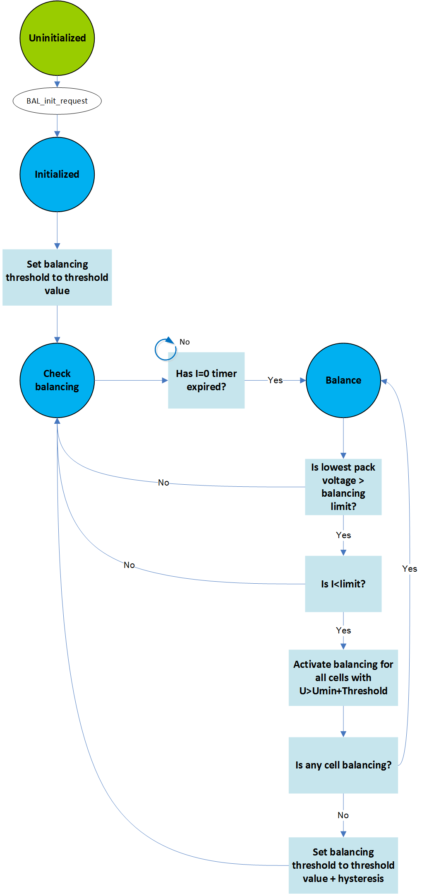

.. include:: ../../../macros.rst

.. _BALANCING:

=========
Balancing
=========

.. highlight:: C

The |mod_bal| is part of the ``Application`` layer.

Module Files
~~~~~~~~~~~~

Driver:
 - ``embedded-software\mcu-primary\src\application\bal\bal.c`` (:ref:`balc`)
 - ``embedded-software\mcu-primary\src\application\bal\bal.h`` (:ref:`balh`)

Driver Configuration:
 - ``embedded-software\mcu-primary\src\application\config\bal_cfg.c`` (:ref:`balcfgc`)
 - ``embedded-software\mcu-primary\src\application\config\bal_cfg.h`` (:ref:`balcfgh`)

Structure
~~~~~~~~~

The |mod_bal| takes care of the voltage or charge equalization of the battery
cells. Balancing is deactivated by default by the switch
``BALANCING_DEFAULT_INACTIVE`` in
``embedded-software\mcu-primary\src\general\config\batterysystem_cfg.h``,
which is set to ``TRUE``, to prevent automatic start of the balancing when
|foxBMS| is used in a laboratory environment for example. The switch must be
manually set to ``FALSE`` to allow the automatic balancing and charge
equalization process.

The default balancing method is voltage-based balancing. This is set by the switch ``BALANCING_VOLTAGE_BASED`` in ``embedded-software\mcu-primary\src\general\config\batterysystem_cfg.h``, which is then set to ``TRUE``. A more advanced balancing method implemented in |foxbms| is based on the SOC history balancing. As this method needs a look-up table of the used battery cell behavior, it is not the default method. It can be used by setting the switch ``BALANCING_VOLTAGE_BASED`` to ``TRUE``.

When the current flowing through the battery is below the limit defined by ``BS_REST_CURRENT_mA`` in ``embedded-software\mcu-primary\src\general\config\batterysystem_cfg.h``, the |mod_bal| waits ``BAL_TIME_BEFORE_BALANCING_S`` seconds before starting to perform balancing. The waiting time is re-initialized every time the current exceeds ``BS_REST_CURRENT_mA``.

No balancing takes place if the voltage of the cells in the battery pack goes below ``BAL_LOWER_VOLTAGE_LIMIT_MV`` or the maximum temperature of the cells in the pack goes above ``BAL_UPPER_TEMPERATURE_LIMIT_DEG``.

Voltage-based balancing
~~~~~~~~~~~~~~~~~~~~~~~

In voltage-based balancing, the |mod_bal| takes the minimum battery cell voltage of the complete battery pack and activates balancing for all the cells whose voltage is above the minimum + ``BAL_THRESHOLD_MV``. Once all cells have been balanced, the threshold is set to ``BAL_THRESHOLD_MV`` + ``BAL_HYSTERESIS_MV`` to avoid an oscillating behavior between balancing and not balancing.

In the |mod_bms|, when entering the ``STANDBY`` state, voltage-based balancing is allowed. When entering ``PRECHARGE`` or ``ERROR``, voltage-based balancing is not allowed.

:numref:`Fig. %s <balancing_figure2>` shows the state machine managing voltage-based balancing in |foxBMS|.

.. _balancing_figure2:

   Balancing state machine for voltage-based balancing

SOC history-based balancing
~~~~~~~~~~~~~~~~~~~~~~~~~~~

The SOC history-based balancing works as follows: at one point in time, when no current is flowing and the cell voltages have fully relaxed (e.g., after 3 hours rest time), the voltages of all cells are measured. With a suitable SOC versus voltage look-up table, the voltages are converted to their respective SOCs. The SOCs are then translated to Depth-of-Discharge (DOD) using the nominal capacity, with:

``DOD = Capacity * (1-SOC)``

The cell with the highest DOD is taken as a reference, since it is the most discharged cell in the battery pack. Its charge difference is set to 0. For all other cells, the charge difference is computed via:

``Charge difference(considered cell) =  DOD(reference cell) - DOD(considered cell)``

Balancing is then  switched on for all cells. Every second, for each cell, the voltage is taken and the balancing current computed with:

``current = cell voltage / balancing resistance``

The balancing quantity:

``current * 1s``

is subtracted from the charge difference. Balancing is stays turned on until the charge difference reaches 0.

In SOC history-based balancing, ``BS_BALANCING_RESISTANCE_OHM`` must be defined identically to the balancing resistances soldered on the |BMS-Slave|. When the imbalances are computed, they are set to a non-zero value to balance each specific cell only if its cell voltage is above the minimum cell voltage of the battery pack plus a threshold. The threshold is set in this case to ``BAL_THRESHOLD_MV`` + ``BAL_HYSTERESIS_MV``. It is not simply set to ``BAL_THRESHOLD_MV`` for compatibility reasons with the code shared with the voltage-based balancing.

The correspondence between cell voltage and SOC must be defined by the user depending on the specific battery cells used. Currently, it is done in the function ``SOC_GetFromVoltage()`` in ``sox.c``. This function gets a voltage in V and return an SOC between 0 and 1.

.. note::
    The SOC to voltage correspondence is specific to the cell used. The user must define the look-up table, or the SOC history-based balancing will not perform as expected.

:numref:`Fig. %s <balancing_figure1>` shows the state machine managing the SOC history-based balancing in |foxBMS|.

.. _balancing_figure1:
.. figure:: balancing_soc_history_based.png
   :width: 100 %

   Balancing state machine for SOC history-based balancing
