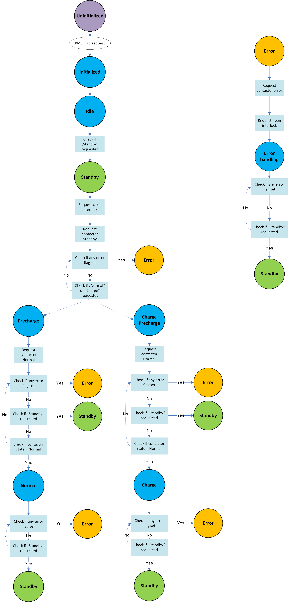

.. include:: ../../../macros.rst

.. _BMS:

===
BMS
===

.. highlight:: C

The |mod_bms| is part of the ``Application`` layer.

The |mod_bms| contains the application running on the |BMS-Master|. It handles
requests of superior control units via CAN messages and checks the system
state via error flags read from the database.

Module Files
~~~~~~~~~~~~

Driver:
 - ``embedded-software\mcu-primary\src\application\bms\bms.c`` (:ref:`bmsprimaryc`)
 - ``embedded-software\mcu-primary\src\application\bms\bms.h`` (:ref:`bmsprimaryh`)
 - ``embedded-software\mcu-secondary\src\application\bms\bms.c`` (:ref:`bmssecondaryc`)
 - ``embedded-software\mcu-secondary\src\application\bms\bms.h`` (:ref:`bmssecondaryh`)

Driver Configuration:
 - ``embedded-software\mcu-primary\src\application\config\bms_cfg.c`` (:ref:`bmscfgprimaryc`)
 - ``embedded-software\mcu-primary\src\application\config\bms_cfg.h`` (:ref:`bmscfgprimaryh`)
 - ``embedded-software\mcu-secondary\src\application\config\bms_cfg.c`` (:ref:`bmscfgsecondaryc`)
 - ``embedded-software\mcu-secondary\src\application\config\bms_cfg.h`` (:ref:`bmscfgsecondaryh`)

Structure
~~~~~~~~~

:numref:`Fig. %s <bms_figure1>` shows the statemachine corresponding to the default application implemented in |foxBMS|.

.. _bms_figure1:

   BMS state machine

In the default application, the requests made by CAN and the error flags are read from the database. If no error is detected, the |mod_bms| makes request to the |mod_contactor| and |mod_interlock| to drive the contactors. In case one or more errors are detected, a request is made to the |mod_contactor| to open the contactors.

Three states are implemented:

- ``STANBDY``
- ``NORMAL``
- ``CHARGE``

``STANDBY`` corresponds to the state where all the contactors are open. ``NORMAL`` and ``CHARGE`` correspond to a state where the contactors of one of the powerlines are closed to allow current flowing.

The ``CHARGE`` state is available only if the switch ``BS_SEPARATE_POWERLINES`` in ``embedded-software\mcu-primary\src\general\config\batterysystem_cfg.h`` is set to 1. It corresponds to the use of a separate powerline compared to the powerline used in the normal state.

The transition between the states is made in response to CAN request read fron the database. From ``STANDBY``, the state machine can transition to ``NORMAL`` or ``CHARGE``, or the opposite. No transition is possible directly between ``NORMAL`` and ``CHARGE``.

Any more complex application (e.g., that does not open the contactors immediately in case of aerospace applications) can be implemented here.

Module Files
~~~~~~~~~~~~

Driver:
 - ``embedded-software\mcu-primary\src\application\bms\bms.c``
 - ``embedded-software\mcu-primary\src\application\bms\bms.h``

Driver Configuration:
 - ``embedded-software\mcu-primary\src\application\config\bms_cfg.c``
 - ``embedded-software\mcu-primary\src\application\config\bms_cfg.h``

.. _BMS_CONFIG:

Configuration of BMS
~~~~~~~~~~~~~~~~~~~~

The Safe Operating Area (SOA) comprising the cell voltage and temperature limits are not defined in the |mod_bms|. They can be found in the file ``embedded-software\mcu-primary\src\general\config\batterycell_cfg.h``.

The following switches are defined:

============================  =========   =========================================  ===============
NAME                          LEVEL       DESCRIPTION                                default value
============================  =========   =========================================  ===============
BMS_CAN_TIMING_TEST           user        CAN timing test enable                     TRUE
BMS_TEST_CELL_SOF_LIMITS      user        SOF limits test enable                     FALSE
============================  =========   =========================================  ===============

The IDs of the requests receivable via CAN signal are configured with:

============================  =========   =========================================  ===============
NAME                          LEVEL       DESCRIPTION                                default value
============================  =========   =========================================  ===============
BMS_REQ_ID_NORMAL             user        ID to request for NORMAL state             3
BMS_REQ_ID_CHARGE             user        ID to request for CHARGE state             4
BMS_REQ_ID_STANDBY            user        ID to request for STANDBY state            8
============================  =========   =========================================  ===============
