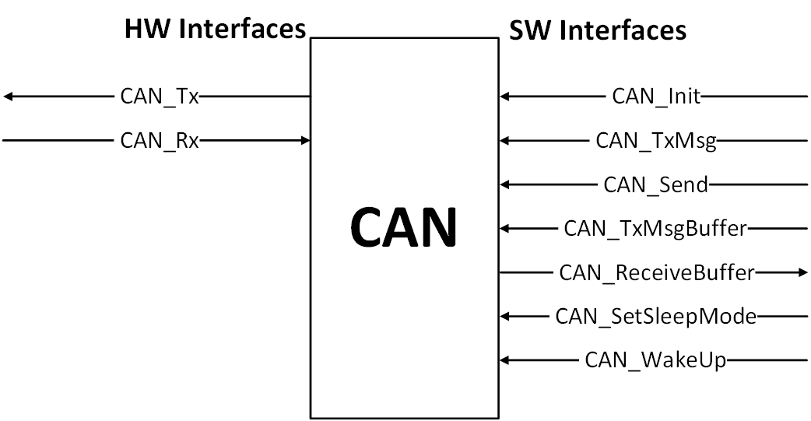
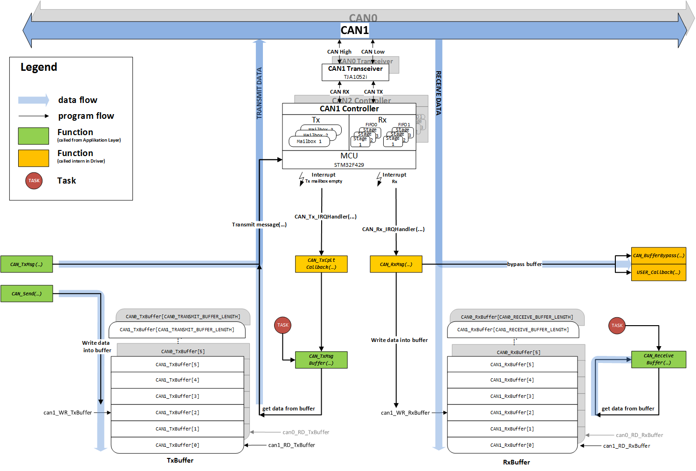
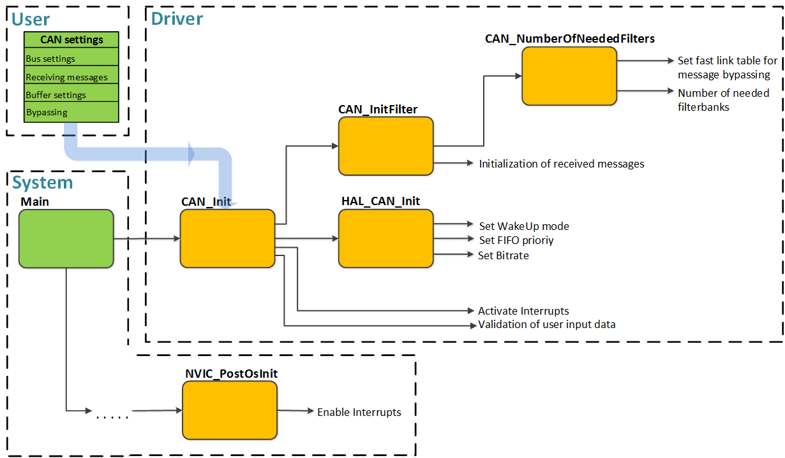
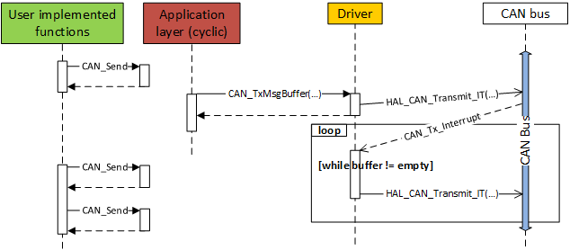
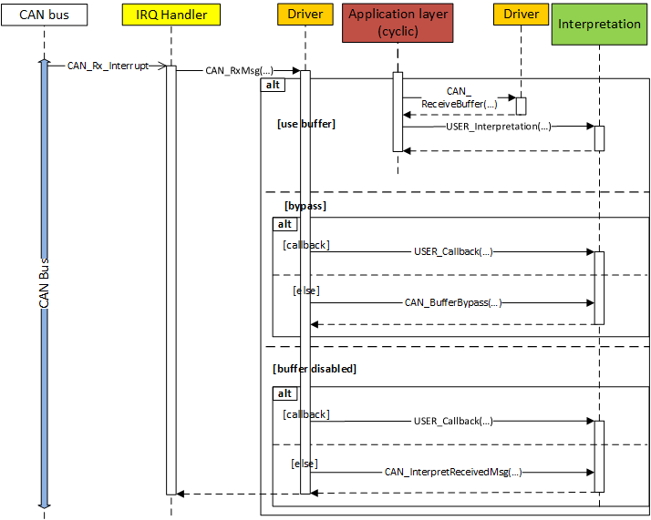

.. include:: ../../../macros.rst

.. _CAN:

===
CAN
===

.. highlight:: C

The |mod_can| is part of the ``Driver`` layer.

The driver interfaces the CAN networks and supports the CAN protocols version
2.0A and B. It has been designed to manage incoming messages and transmit
messages with the help of message buffers. It is highly customizable and works
efficiently with a high number of messages and minimum CPU load.

Module Files
~~~~~~~~~~~~

Driver:
 - ``embedded-software\mcu-common\src\module\can\can.h``
 - ``embedded-software\mcu-common\src\module\can\can.c``

Driver Configuration:
 - ``embedded-software\mcu-primary\src\module\config\can_cfg.h``
 - ``embedded-software\mcu-primary\src\module\config\can_cfg.c``

Detailed Description
~~~~~~~~~~~~~~~~~~~~

Main Features
-------------

 - Two CAN nodes (|CAN0| and |CAN1|)
 - CAN protocol version 2.0A, B active
 - Bit rates up to 1Mbit/s

Transmission:

 - Configurable transmit priority
 - Configurable transmit message buffer
 - Possible bypassing of transmit message buffer
 - Periodic message transmitting

Reception:

 - Identifier list and mask mode featured
 - Configurable software receive message buffer
 - Possible bypassing of receive message buffer

For a detailed overview of the CAN peripheral see source [1]_.

File Structure and Interfaces
-----------------------------
The |mod_can| is a one-file module with one-file configuration:
The module itself consists of one ``can.c`` and its associated ``can.h`` file.
The configuration is given in ``can_cfg.c`` and its related ``can_cfg.h`` file.

The external interface to the can module is easy and consists of seven functions and is viewable in :numref:`fig. %s <can_figure1>`.

.. _can_figure1:

   External CAN Driver interface

``CAN_Init(void)``
   Initializes CAN settings and message filtering
``CAN_TxMsg(CAN_NodeTypeDef_e canNode, uint32_t msgID, uint8_t* ptrMsgData, ... )``
   Transmits message directly on the CAN bus
``CAN_Send(CAN_NodeTypeDef_e canNode, uint32_t msgID, uint8_t* ptrMsgData, ... )``
   Adds message to transmit buffer
``CAN_TxMsgBuffer(CAN_NodeTypeDef_e canNode)``
   Transmits a CAN message from transmit buffer
``CAN_ReceiveBuffer(CAN_NodeTypeDef_e canNode, Can_PduType* msg)``
   Reads a CAN message from RxBuffer
``CAN_SetSleepMode(CAN_NodeTypeDef_e canNode)``
   Set CAN node to sleep mode
``CAN_WakeUp(CAN_NodeTypeDef_e canNode)``
   Wake CAN node up from sleep mode

Data/Control Flow
-----------------

Transmission
   There are two different possibilities to transmit a message on the CAN bus. Both possibilities are equally correct and transmit the messages via interrupts. The first possibility is to transmit the message directly through the ``CAN_TxMsg`` function. The second possibility is to add the message first with a call of ``CAN_Send`` to the message transmit buffer and then later transmit it with the ``CAN_TxMsgBuffer`` function from the buffer on the CAN bus.

Reception
   After a successful reception a messages is either stored in the transmit message buffer or it bypasses the buffer and is directly interpreted during the ISR via callback functions. The buffered messages can be accessed through the ``CAN_ReceiveBuffer`` function.

A detailed overview over how the CAN driver software interacts with the hardware is shown in the following flow chart in :numref:`fig. %s <can_figure2>`.

.. _can_figure2:

   CAN flow chart of the interaction between hardware and software

Configuration
~~~~~~~~~~~~~

The activation of |CAN0| and |CAN1| is set in the ``can_cfg.h`` file. Additionally are in this file the message buffer options and the message reception options to be configured.

The ``can_cfg.c`` file is responsible for the general CAN options (CAN bit-rate, sending behavior). The received messages are to be defined here.

The interrupt priority of the CAN interrupts is set in the ``nvic_cfg.c`` file.

can_cfg.h
---------

The configurable options are

.. code-block:: C

   /* CAN bus baudrate */
   //#define CAN_BAUDRATE 1000000
   #define CAN_BAUDRATE 500000
   //#define CAN_BAUDRATE 250000
   //#define CAN_BAUDRATE 125000

   /* CAN options */
   #define CAN_USE_CAN_NODE0                1

   /* transmit buffer */
   #define CAN0_USE_TRANSMIT_BUFFER         1
   #define CAN0_TRANSMIT_BUFFER_LENGTH      16

   /* receive buffer */
   #define CAN0_USE_RECEIVE_BUFFER          1
   #define CAN0_RECEIVE_BUFFER_LENGTH       16

  /* Number of messages that will bypass the receive buffer and will be interpreted right
   * on reception. Set the respective IDs and implement the wished functionality either in
   * an individual callback function or in the default STD_RETURN_TYPE_e CAN_BufferBypass(...)
   * function in the can.c file. Use bypassing only for important messages because of handling
   * during ISR */
  #define CAN0_BUFFER_BYPASS_NUMBER_OF_IDs 1

There are four predefined values for the CAN bus baud-rate and only one define must be enabled at the same time. If another baud-rate is wished, the time quants need to be calculated and then this option can be added in the configuration. If the define ``CAN_USE_CAN_NODE1`` is disabled (i.e., set to zero), all other options of the chosen CAN bus (i.e., |CAN0| or |CAN1|) have no influence on the program execution.

.. warning::
    The bypass possibility should be used carefully because the message interpreting is then done in the context of the corresponding ISR-Handler and can lead to a violation of the timing constraints. The recommended setting is to use both buffers and to bypass as little messages as possible.

can_cfg.c
---------

The ``CAN_HandleTypeDef hcan`` configures the CAN bus transfer settings. The default setting is a bit rate of 0.5MHz, automatic bus-off management, automatic wake-up mode, automatic retransition mode, locked receive FIFOs against overrun and an identifier driven transmission of messages. The bitrate is set through the prescaler and two bit segments (BS) and is calculated with the following formula:

.. math::

   bitrate = \frac{\frac{CAN\_CLK}{Prescaler}}{SyncSeg+BS1+BS1}

With the STM32F429 this calculates to a default bitrate of:

.. math::

   bitrate = \frac{\frac{42MHz}{6}}{1+6+7} = 0.5MHz

The periodic transmit messages are defined in the ``const CAN_MSG_TX_TYPE_s can_CAN1_messages_tx[]`` array structs:

.. code-block:: C

    typedef struct  {
        uint32_t ID;                    //!< CAN message id
        uint8_t DLC;                    //!< CAN message data length code
        uint32_t repetition_time;       //!< CAN message cycle time
        uint32_t repetition_phase;      //!< CAN message startup (first send) offset
        can_callback_funcPtr cbk_func; //!< CAN message callback after message is sent or received
    } CAN_MSG_TX_TYPE_s;

Messages that are transmitted asynchronous don't need to be declared in this struct. Moreover the settings for message reception need to be set in the source file. The received messages are defined in the ``CAN_MSG_RX_TYPE_s can_RxMsgs[CAN_NUMBER_OF_RX_IDs]`` array structs:

.. code-block:: C

   typedef struct CAN_MSG_RX_TYPE {
       uint32_t ID;    // message ID
       uint32_t mask;  // mask or 0x0000 to select list mode
       uint8_t DLC;    // data length
       uint8_t RTR;    // RTR bit
       uint8_t fifo;   // selected CAN hardware (CAN_FIFO0 or CAN_FIFO1)
       STD_RETURN_TYPE_e (*func)(uint32_t ID, uint8_t*, uint8_t, uint8_t);    // callback function
   } CAN_MSG_RX_TYPE_s;

Each message can get an individual callback function assigned to. If a message shall bypass the reception buffer and be interpreted right on reception, the message identifier needs to be additionally defined in the ``can_bufferBypass_RxMsgs[]`` array. The callback function of the bypassed message is then automatically called on reception of the message. If no callback function is defined (``NULL`` in the callback parameter), then the default function ``STD_RETURN_TYPE_e CAN_BufferBypass(...)`` in the ``can.c`` file is called and the interpretation needs to be implemented there.

More detailed information is provided in the comments in the source code and the STM32F429 microcontroller reference manual [1]_.

Usage
~~~~~

The following sections describe the usage of the CAN driver.

Initialization
--------------

The calling hierarchy and the control/data flow of the initialization process is visible in :numref:`fig. %s <can_figure3>`. The user data input is made in the ``can_cfg.c/h`` files.

.. _can_figure3:

   CAN driver initialization calling hierarchy

Send Messages
-------------

There are two different possibilities to transmit a message on the CAN bus. Both possibilities are equally correct and transmit the message via interrupt. The first possibility is to transmit the message directly with the ``CAN_TxMsg(...)`` function. The second possibility is to add the message first, with ``CAN_Send(...)``, to the transmit buffer and then later transmit it buffer with the ``CAN_TxMsgBuffer(...)`` function on the CAN bus.

The recommended transmission possibility via message buffer is visible in the following sequence diagram in :numref:`fig. %s <can_figure4>`:

.. _can_figure4:

   CAN driver transmission sequence diagram with buffer usage

Receive Messages
----------------

CAN messages are received after configuring the hardware filter banks. As mentioned above, the reception initialization is based on the receiving messages and generated automatically. After a successful reception the messages are either stored in the receive message buffer or corresponding to the configuration, they bypass the buffer and are directly interpreted. The bypassing is executed during the ISR and therefore, to avoid a violation of timing constraints, as little messages as possible should be bypassed. The buffered messages are interpreted asynchronous to their reception by the function ``CAN_ReceiveBuffer(...)`` from the application layer. If the receive buffer is disabled, then all messages are interpreted right on reception during the ISR.

The interpreting mechanism is shown in the sequence diagram in :numref:`fig. %s <can_figure5>`.

.. _can_figure5:

   CAN driver reception sequence diagram

References
~~~~~~~~~~

.. [1] Datasheet RM0090 [PDF] http://www.st.com/web/en/resource/technical/document/reference_manual/DM00031020.pdf
