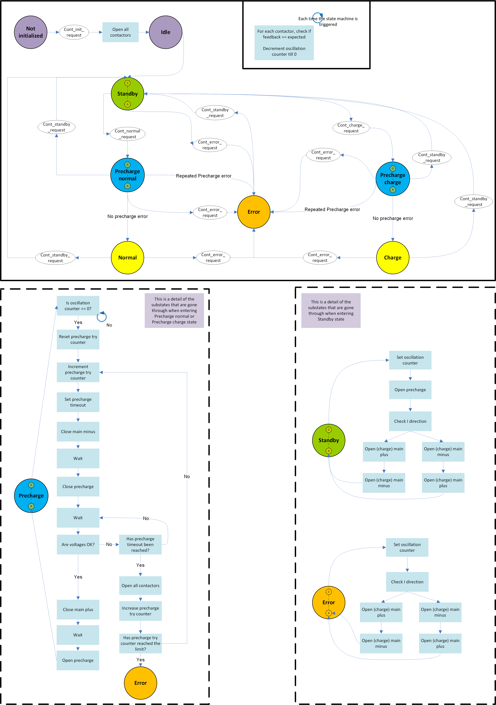
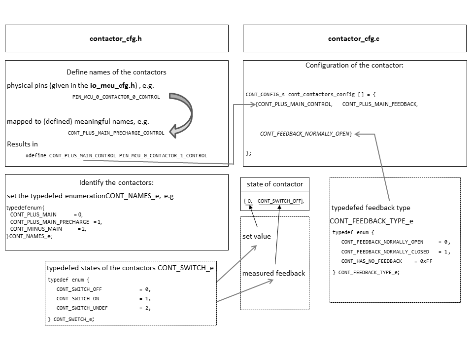

.. include:: ../../../macros.rst

.. _CONTACTOR:

=========
Contactor
=========

.. highlight:: C

The |mod_contactor| is part of the ``foxBMS-Modules`` layer.

The |mod_contactor| switches the contactors according to the requests that are
made to it. It checks the feedback line of each contactors periodically.

Module Files
~~~~~~~~~~~~

Driver:
 - ``embedded-software\mcu-primary\src\module\contactor\contactor.c``
 - ``embedded-software\mcu-primary\src\module\contactor\contactor.h``

Driver Configuration:
 - ``embedded-software\mcu-primary\src\module\config\contactor_cfg.c``
 - ``embedded-software\mcu-primary\src\module\config\contactor_cfg.h``

Structure
~~~~~~~~~

:numref:`Fig. %s <contactor_figure1>` shows the statemachine managing the contactors in |foxBMS|.

.. _contactor_figure1:

   Contactor state machine

Three states are implemented:

- ``STANBDY``
- ``NORMAL``
- ``CHARGE``

``STANDBY`` corresponds to the state where all the contactors are open. ``NORMAL`` and ``CHARGE`` correspond to a state where the contactors of one of the powerlines are closed to allow current flowing.

The ``CHARGE`` state is available only if the switch ``BS_SEPARATE_POWERLINES`` in ``embedded-software\mcu-primary\src\general\config\batterysystem_cfg.h`` is set to 1. It corresponds to the use of a separate powerline compared to the powerline used in the normal state.

The ``PRECHARGE`` state performs the transition between ``STANDBY`` and ``NORMAL``/``CHARGE``: the |ppc| is closed before the |pmc|, to avoid shorting the battery when closing the contactors.

The transition between the states is made through state request. These are made by the |mod_bms|. From ``STANDBY``, the state machine can transition to ``NORMAL`` or ``CHARGE``, or the opposite. No transition is possible directly between ``NORMAL`` and ``CHARGE``.

Switching Counter
~~~~~~~~~~~~~~~~~

Contactors have a specified number of switching cycles. The number of switching
cycles varies depending if the contactor has been opened under load or not.
The values have to be taken from the manufacturers manual.

|foxbms| uses the following strategy to allow it the user to store the number of
switching cycles each contactor has done and track their usage.

The counters for **closing**, **opening** and **opening under load** are stored
in the variable ``bkpsram_contactors_count``. The counters are backup into the
the second non-volatile memory (EEPROM), when the |master| is power cycled. This
ensures, that even if the RTC battery is at some point completely discharged,
the second last counter number of all contactors is still safely stored and
available for diagnostic purposes.

..  warning::
    **Limitations of the contactor swichting counter**

    If the RTC battery is removed or empty AND the mcu is power cycled, all
    countings since the last saving (therefore a valid power cycle with charged
    RTC battery) on the EEPROM are lost.

For details of the counter implementation see the modules ``diag`` and the
``bkpsram``.

Module Files
~~~~~~~~~~~~

Driver:
 - ``embedded-software\mcu-primary\src\module\contactor\contactor.h``
 - ``embedded-software\mcu-primary\src\module\contactor\contactor.c``

Driver Configuration:
 - ``embedded-software\mcu-primary\src\module\config\contactor_cfg.h``
 - ``embedded-software\mcu-primary\src\module\config\contactor_cfg.c``

Configuration of the Contactors
~~~~~~~~~~~~~~~~~~~~~~~~~~~~~~~

A contactor physically consists of an control pin, an optional feedback pin, which can be configured as normally open or normally closed. This hardware condition is mapped in the software in the contactor set-up files in ``contactor_cfg.c`` and ``contactor_cfg.h``.

The entry point to change the contactor configuration is the configuration header file ``contactor_cfg.h``. At first the general naming of the contactors the ``io`` configuration
(``PIN_MCU_0_CONTACTOR_0_CONTROL``, etc.) is mapped in the contactors to something  meaningful names for the contactors have to be defined (e.g., the ``contactor0`` should be the precharge contactor and provides a feedback pin):

.. code-block:: C

   #define CONT_PRECHARGE_PLUS_CONTROL        PIN_MCU_0_CONTACTOR_0_CONTROL
   #define CONT_PRECHARGE_PLUS_FEEDBACK       PIN_MCU_0_CONTACTOR_0_FEEDBACK

Note: if the contactor had no feedback one would define

.. code-block:: C

   #define CONT_PRECHARGE_PLUS_CONTROL        PIN_MCU_0_CONTACTOR_0_CONTROL
   #define CONT_PRECHARGE_PLUS_FEEDBACK       CONT_HAS_NO_FEEDBACK

At next the contactors are identified by setting up the typedefed enumeration ``CONT_NAMES_e``. If there are three contactors, two in the positive path (one for precharge and a main contactor) and a main contactor in the negative path, the configuration of the ``CONT_NAMES_e`` looks like this (the names are free of choice):

.. code-block:: C

   typedef enum {
       CONT_MAIN_PLUS              = 0,
       CONT_PRECHARGE_PLUS         = 1,
       CONT_MAIN_MINUS             = 2,
   } CONT_NAMES_e;

At this point the configuration of the header is done and the configuration is finished in ``contactor_cfg.c``.

The pins where the contactors are connected to the MCU and the hardware configuration are now composed to a contactor object/struct. By using the example above, the contactors must now be configured accordingly. It is assumed that the contactors have a feedback and are of type normally open. The setup summed up would look like this:

=============================    ====================================   =====================================   ===============================
Contactor                        Control pin                            Feedback pin                            Hardware feedback configuration
=============================    ====================================   =====================================   ===============================
 ``CONT_MAIN_PLUS``              ``CONT_MAIN_PLUS_CONTROL``             ``CONT_MAIN_PLUS_FEEDBACK``             ``CONT_FEEDBACK_NORMALLY_OPEN``
 ``CONT_PRECHARGE_PLUS``         ``CONT_PRECHARGE_PLUS_CONTROL``        ``CONT_PRECHARGE_PLUS_FEEDBACK``        ``CONT_FEEDBACK_NORMALLY_OPEN``
 ``CONT_MAIN_MINUS``             ``CONT_MAIN_MINUS_CONTROL``            ``CONT_MAIN_MINUS_FEEDBACK``            ``CONT_FEEDBACK_NORMALLY_OPEN``
=============================    ====================================   =====================================   ===============================

This would result in the following configuration in the source code for the hardware configuration:

.. code-block:: C

   CONT_CONFIG_s cont_contactors_config[BS_NR_OF_CONTACTORS] = {
        {CONT_MAIN_PLUS_CONTROL,        CONT_MAIN_PLUS_FEEDBACK,        CONT_FEEDBACK_NORMALLY_OPEN},
        {CONT_PRECHARGE_PLUS_CONTROL,   CONT_PRECHARGE_PLUS_FEEDBACK,   CONT_FEEDBACK_NORMALLY_OPEN},
        {CONT_MAIN_MINUS_CONTROL,       CONT_MAIN_MINUS_FEEDBACK,       CONT_FEEDBACK_NORMALLY_OPEN}
   };

The corresponding feedback state configuration would look like this:

.. code-block:: C

    CONT_ELECTRICAL_STATE_s cont_contactor_states[BS_NR_OF_CONTACTORS] = {
        {0,    CONT_SWITCH_OFF},
        {0,    CONT_SWITCH_OFF},
        {0,    CONT_SWITCH_OFF},
   };

.. note::
    The configuration in ``cont_contactors_config[]`` must have the same order as defined in ``CONT_NAMES_e``.

The parameters after the feedback type parameter display the state in which the contactor is. The initial state of the contactor is always switched off. The state variables store the set value (``TRUE`` or ``FALSE``), the expected feedback (``CONT_SWITCH_OFF`` or ``CONT_SWITCH_ON``), the measured feedback (``CONT_SWITCH_OFF`` or ``CONT_SWITCH_ON``) and the according timestamp to each (``os_timer``).

At this point the setup of the contactors is finished.

:numref:`Fig. %s <contactor_figure2>` gives a visualization of the configuration.

.. _contactor_figure2:

   Contactor configuration

Interaction
~~~~~~~~~~~

The |mod_bms| uses the |mod_contactor| APIs.
