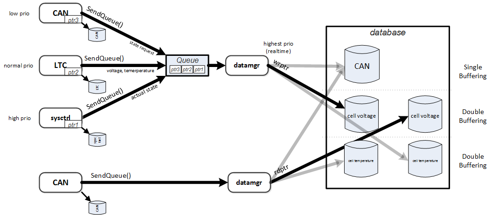
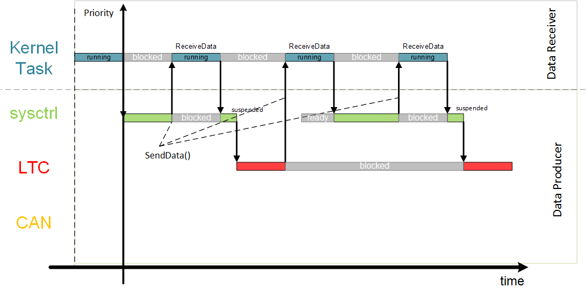

.. include:: ../../../macros.rst

.. _software_documentation_modules_database:

========
Database
========

.. highlight:: C

The |mod_database| is part of the ``Engine`` layer.

The |mod_database| allows the user to store and retrieve data.
The database along with the |mod_diag| runs in the highest priority. This
**must** not be changed.

A quick introduction on how to add additional information to the database is
found :ref:`here <database_entry>`.

Module Files
------------

Driver:
 - ``embedded-software\mcu-common\src\engine\database\database.c`` (:ref:`databasec`)
 - ``embedded-software\mcu-common\src\engine\database\database.h`` (:ref:`databaseh`)

Driver Configuration:
 - ``embedded-software\mcu-primary\src\engine\config\database_cfg.c`` (:ref:`databasecfgprimaryc`)
 - ``embedded-software\mcu-primary\src\engine\config\database_cfg.h`` (:ref:`databasecfgprimaryh`)
 - ``embedded-software\mcu-secondary\src\engine\config\database_cfg.c`` (:ref:`databasecfgsecondaryc`)
 - ``embedded-software\mcu-secondary\src\engine\config\database_cfg.h`` (:ref:`databasecfgsecondaryh`)

Detailed Description
--------------------

The ``DATA_Task()`` task is running with the highest priority inside the
``ENG_TSK_Engine``.

To store and read data the database introduces two functions:

- ``DB_WriteBlock(..)`` and
- ``DB_ReadBlock(..)``.

Block Diagram
~~~~~~~~~~~~~

    SendQueue

    Timing

Configuration
-------------

The configuration of the database consists of the following parts:

``database_cfg.h``
~~~~~~~~~~~~~~~~~~

- Number of **data blocks** in ``DATA_BLOCK_ID_TYPE_e``
- Human understandable alias for the datablocks (e.g.,
  ``DATA_BLOCK_ID_ALLGPIOVOLTAGE`` for ``DATA_BLOCK_22``).
- Typedefed struct of the actual data. This always consists of a timestamp,
  the previous timestamp and then the arbitrary data.

``database_cfg.c``
~~~~~~~~~~~~~~~~~~

- A variable for the database block
  ``DATA_BLOCK_ALLGPIOVOLTAGE_s data_block_ltc_allgpiovoltages[DOUBLE_BUFFERING];``
- The variable must be introduced to the database header variable
  ``DATA_BASE_HEADER_s  data_base_header[] = {..}``.

Usage/Examples
--------------

For examples of usage and adaptions see:

- function ``BAL_Activate_Balancing_Voltage()`` in
  ``embedded-software\mcu-primary\src\application\bal\bal.c``
- :ref:`Add/read/write a database entry <database_entry>`.
