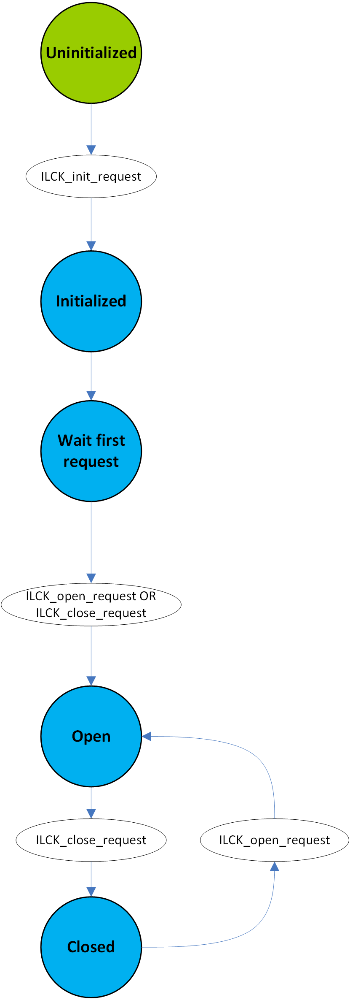

.. include:: ../../../macros.rst

.. _MODULES_INTERLOCK:

=========
Interlock
=========

.. highlight:: C

The |mod_interlock| switches the interlock according to the requests that are
made to it. It checks the feedback line of the interlock periodically.

Module Files
~~~~~~~~~~~~

Driver:
 - ``embedded-software\mcu-common\src\module\interlock\interlock.h``
 - ``embedded-software\mcu-common\src\module\interlock\interlock.c``

Driver Configuration:
 - ``embedded-software\mcu-primary\src\module\config\interlock_cfg.h``
 - ``embedded-software\mcu-primary\src\module\config\interlock_cfg.c``
 - ``embedded-software\mcu-secondary\src\module\config\interlock_cfg.h``
 - ``embedded-software\mcu-secondary\src\module\config\interlock_cfg.c``

Structure
~~~~~~~~~

:numref:`Fig. %s <interlock_figure1>` shows the statemachine managing the interlock in |foxBMS|.

.. _interlock_figure1:

   Interlock state machine

Two states are implemented:

- ``CLOSED``
- ``OPEN``

Requests are made to the interlock statemachine by ``BMS``. ``BMS`` closes the interlock when entering ``STANDBY`` and opens the interlock when entering the ``ERROR`` state.

The interlock feedback is checked periodically. If the set value dose not match the measured feedback (e.g., the interlock was opened outside of |foxBMS|), the corresponding error flag will be set. The application implemented in ``BMS`` will then get the information and react accordingly.

Interaction
~~~~~~~~~~~

The |mod_bms| uses the |mod_contactor| APIs.
