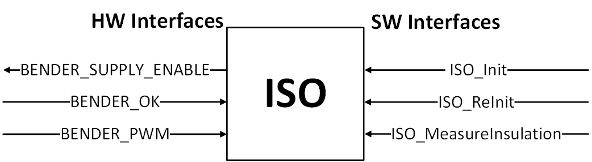
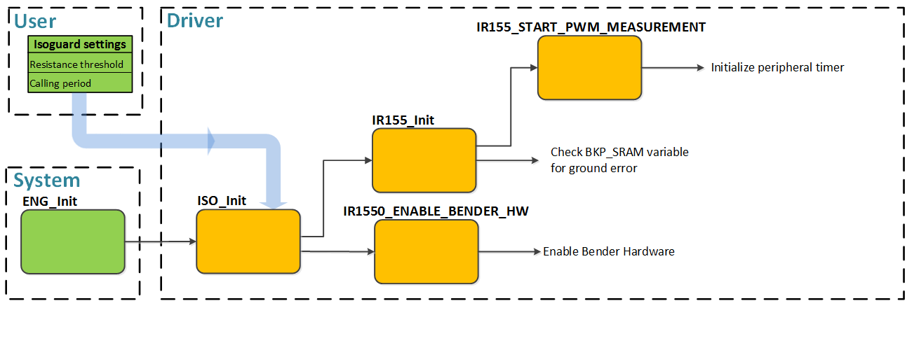

.. include:: ../../../macros.rst

.. _ISOGUARD:

========
Isoguard
========

.. highlight:: C

The |mod_isoguard| is part of the ``foxBMS-Module`` layer.

The |mod_isoguard| measures the insulation resistance between the insulated
and the active high-voltage conductors of the battery and the reference earth
(e.g., chassis ground/Kl.31 in automotive applications).

Module Files
~~~~~~~~~~~~

Driver:
 - ``embedded-software\mcu-primary\src\module\isoguard\isoguard.h``
 - ``embedded-software\mcu-primary\src\module\isoguard\isoguard.c``
 - ``embedded-software\mcu-primary\src\module\isoguard\ir155.h``
 - ``embedded-software\mcu-primary\src\module\isoguard\ir155.c``

Driver Configuration:
 - ``embedded-software\mcu-primary\src\module\config\isoguard_cfg.h``
 - ``embedded-software\mcu-primary\src\module\config\isoguard_cfg.c``

Detailed Description
~~~~~~~~~~~~~~~~~~~~

File Structure and Interfaces
-----------------------------

The |mod_isoguard| is separated into two different layers, a bottom and a top
layer. The top layer consists of the ``isoguard.c`` and its associated
``isoguard.h`` file. It provides an easy interface to initialize the
|mod_isoguard| and to access the measurement data. The insulation threshold to
differentiate between a good and bad insulation can be set in the
``isoguard_cfg.h`` file. The bottom layer contains the ``ir155.c`` and
``ir155.h`` files. They are both dedicated to the Bender IR155-3204 [1]_ hardware
(IR155-3203/-3204/-3210 are supported) and handle the connection of the Bender
to the MCU, as well as the evaluation and interpretation of the measurement
data.

The external interface to the |mod_isoguard| is simple and consists of three
functions and is viewable in :numref:`fig. %s <isoguard_figure1>`:

.. _isoguard_figure1:

   External isoguard driver interface

``ISO_Init(void)``
   Initializes software |mod_isoguard| and enables the hardware Bender module
``ISO_ReInit(void)``
   Resets software |mod_isoguard| and hardware Bender module
``ISO_MeasureInsulation(void)``
   Measures and evaluates the insulation

Configuration
-------------
The configuration is done in the ``isoguard_cfg.h`` file and consists of two defines:

.. code-block:: C

   #define ISO_CYCLE_TIME                    200

``ISO_CYCLE_TIME`` is the periodic calling time of the ``ISO_MeasureInsulation(void)`` function and must not be chosen lower than 150ms due to the lowest possible frequency of the Bender of 10Hz. The default value is 200ms.

.. code-block:: C

   #define ISO_RESISTANCE_THRESHOLD          400

``ISO_RESISTANCE_THRESHOLD`` specifies the resistance threshold to differentiate between good and bad insulation. This value has no impact if
the threshold is set lower than the intern resistance threshold of the Bender insulation monitor. The default value is 400kOhm.

Initialization
--------------
The initialization is done via the interface function ``ISO_Init(void)``, which is forwarded to the Bender insulation monitor specific initialization functions, as shown in :numref:`fig. %s <isoguard_figure2>`.

.. _isoguard_figure2:

   Initialization of the |mod_isoguard|

The most important steps in the initialization process are:

 - Enabling of PWM input measurement
 - Reading of ``BKP_SRAM`` variable for previous Ground Error
 - Set start-up time before measurement results are trustworthy (dependent on the previous state)
 - Enabling of Bender hardware module

The function ``ISO_ReInit(void)`` resets the whole |mod_isoguard| and the initialization process is done again, including the waiting time until the measurement values are declared as trustworthy.

Usage
~~~~~

After initializing the |mod_isoguard|, the ``ISO_MeasureInsulation(void)`` function needs to be called periodically according to the set cycle time. The Bender insulation monitor measurement values are evaluated and then written into the database where further modules can operate on this data. Following measurement values are saved:

.. code-block:: C

   typedef struct {
       uint8_t valid;         // 0 -> valid, 1 -> resistance unreliable
       uint8_t state;         // 0 -> resistance/measurement OK , 1 -> resistance too low or error
       uint8_t resistance;
       uint32_t timestamp;
       uint32_t previous_timestamp;
   }DATA_BLOCK_ISOMETER_s;

The measured insulation is split into intervals according to the array ``uint16 const static ir155_ResistanceInterval[7]``. For more detailed information see source code.

Observable SW-Behavior
~~~~~~~~~~~~~~~~~~~~~~~

The ``data_block_isometer.timestamp``-variable must be always running, otherwise the measured values are not written into the database (Check if the define ``ISO_ISOGUARD_ENABLE`` is defined, otherwise the |mod_isoguard| is not activated). Depending on the used resistor, the following behavior can be observed:

==============================     ==========================================================================================
Variable                           Behavior
==============================     ==========================================================================================
ir155_DC.resistance                Should equal the resistance value
ir155_DC.dutycycle                 Depending on the resistance, see table below for more information
ir155_DC.OKHS_state                0 if measured resistance below factory set resistance threshold, otherwise 1
ir155_DC.mode                      IR155_NORMAL_MODE
ir155_DC.state                     IR155_RESIST_MEAS_GOOD if resistance greater than factory set resistance threshold, otherwise IR155_RESIST_MEAS_BAD
data_block_isometer.valid          0; can be 1 if grounderror occurred before reset. Should be 0 again after 25s
data_block_isometer.state          0 if measured resistance > ``ISO_RESISTANCE_THRESHOLD`` and no error, otherwise 1
data_block_isometer.resistance     value between 0 and 7, see table below for more information
==============================     ==========================================================================================

References
~~~~~~~~~~

.. [1] Datasheet ISOMETER IR155-3204 [PDF] https://www.bender-de.com/fileadmin/products/doc/IR155-42xx-V004_DB_en.pdf
