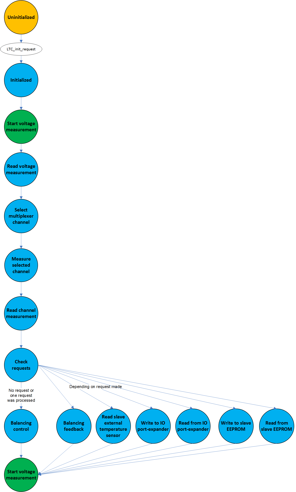

.. include:: ../../../macros.rst

.. _LTC:

===
LTC
===

.. highlight:: C

The driver communicates with the |LTC| monitoring ICs in daisy-chain
configuration. The ICs are used to:

 - measure the battery cell voltages
 - measure the voltages directly on the GPIOs
 - measure the voltage of up to 32 inputs via I2C-driven multiplexer
 - enable passive balancing of the connected battery cells

The slave version is configured in ``src\module\config\ltc_cfg.h`` by the define ``SLAVE_BOARD_VERSION``.

 - ``SLAVE_BOARD_VERSION`` must be set to ``1`` if version 1.xx of the foxBMS Slaves is used.
 - ``SLAVE_BOARD_VERSION`` must be set to ``2`` if version 2.xx of the foxBMS Slaves is used. Version 2.xx is the default configuration.

Module Files
~~~~~~~~~~~~

Driver:
 - ``embedded-software\mcu-common\src\module\ltc\ltc_defs.h``
 - ``embedded-software\mcu-common\src\module\ltc\ltc_pec.c``
 - ``embedded-software\mcu-common\src\module\ltc\ltc_pec.h``
 - ``embedded-software\mcu-common\src\module\ltc\ltc.c``
 - ``embedded-software\mcu-common\src\module\ltc\ltc.h``

Driver Configuration:
 - ``embedded-software\mcu-primary\src\module\config\ltc_cfg.c``
 - ``embedded-software\mcu-primary\src\module\config\ltc_cfg.h``
 - ``embedded-software\mcu-secondary\src\module\config\ltc_cfg.c``
 - ``embedded-software\mcu-secondary\src\module\config\ltc_cfg.h``

Detailed Description
~~~~~~~~~~~~~~~~~~~~

State Machine
-------------

The |mod_ltc| is implemented as a state machine. The operation of the state machine is described in :numref:`fig. %s <ltc_figure1>`.

.. _ltc_figure1:

   |LTC| internal state machine

After initialization, the state machine goes in a measurement loop:

 - measure voltages
 - read measured voltages
 - select multiplexer input
 - measure selected input
 - read multiplexer input
 - check state requests
 - balance cells

The function ``LTC_SetStateRequest()`` is used to make these state requests to the |LTC| state machine.

If more than one multiplexer input is configured, only one is measured per measurement cycle. The next one is measured during the next cycle. When the last configured multiplexer input is reached, the sequence starts over.

Results Retrieval and Balancing Orders
--------------------------------------

The results of the measurements are written in the database. The balancing is made according to the control variable set in the database.
The corresponding variables are:

.. code-block:: C

   DATA_BLOCK_CELLVOLTAGE_s         ltc_cellvoltage; //cell voltages
   DATA_BLOCK_CELLTEMPERATURE_s     ltc_celltemperature; //cell temperature
   DATA_BLOCK_MINMAX_s              ltc_minmax; //minimum and maximum values at battery pack
                                                //level for voltages and temperatures
   DATA_BLOCK_BALANCING_FEEDBACK_s  ltc_balancing_feedback; //result from balancing feedback
                                                            //(is at least one cell being balanced)
   DATA_BLOCK_BALANCING_CONTROL_s   ltc_balancing_control; //balancing orders read from database
   DATA_BLOCK_SLAVE_CONTROL_s       ltc_slave_control;    //features on slave controlled by I2C

Possible state requests
-----------------------

Following actions can be requested:

 - write to IO port-expander
 - read from IO port-expander
 - read external temperature sensor on slave
 - read global balancing feedback
 - read from external slave EEPROM
 - write to external slave EEPROM

The corresponding requests are made with the following functions from the |mod_meas|.

.. code-block:: C

    uint8_t MEAS_Request_IO_Write(void);
    uint8_t MEAS_Request_IO_Read(void);
    uint8_t MEAS_Request_Temperature_Read(void);
    uint8_t MEAS_Request_BalancingFeedback_Read(void);
    uint8_t MEAS_Request_EEPROM_Read(void);
    uint8_t MEAS_Request_EEPROM_Write(void);

Before reading from the EEPROM, the address must be written to ``eeprom_read_address_to_use`` in the database block ``DATA_BLOCK_SLAVE_CONTROL_s``. The result is stored in ``eeprom_value_read`` in the database block ``DATA_BLOCK_SLAVE_CONTROL_s``. Once the read operation has been performed, the value ``0xFFFFFFFF`` is stored in ``eeprom_read_address_to_use``.

Before writing to the EEPROM, the address must be written to ``eeprom_write_address_to_use`` in the block ``DATA_BLOCK_SLAVE_CONTROL_s``.  The data to be written must be stored in ``eeprom_value_write`` in the database block ``DATA_BLOCK_SLAVE_CONTROL_s`` before issuing the write request. Once the write operation has been performed, the value ``0xFFFFFFFF`` is stored in ``eeprom_write_address_to_use``.

Measurement frequency
---------------------

When no requests are made, with 8 |LTC| monitoring ICs in the daisy-chain and 12 cell voltages, in normal measurement mode, a measurement cycle takes no more than 20ms. As a consequence, a measurement frequency of 50Hz can be achieved for the voltages.

If requests are made, the measurement cycle can last longer (e.g., access to the EEPROM on the slaves needs more time).

Configuration
~~~~~~~~~~~~~

SPI Interface
-------------

In ``ltc_cfg.h``, the SPI devices used by the |LTC| is defined by the macro ``SPI_HANDLE_LTC``. The SPI handle must be chosen from the list ``SPI_HandleTypeDef spi_devices[]`` in ``spi_cfg.c``. The frequency of the used SPI must be adjusted with the configuration in ``spi_cfg.c``, so that the frequency is not higher than 1MHz. This is the maximum allowed frequency for the |LTC| IC. The function ``LTC_SetTransferTimes()`` sets the waiting times used for the |mod_ltc| automatically at startup. It uses ``LTC_GetSPIClock()`` to get the SPI clock frequency automatically.

Measurement Mode and Channel Selection
--------------------------------------

Three measurement modes are available for the voltage measurements:

 - Normal
 - Filtered
 - Fast

These modes are defined in the |LTC| datasheet [ltc_datasheet]_. For cell voltage measurements, the macro ``VOLTAGE_MEASUREMENT_MODE`` is defined in ``ltc_cfg.h``. For multiplexers measurement, the macro ``GPIO_MEASUREMENT_MODE`` is defined in ``ltc_cfg.h``.

Changing the number of cell voltages
------------------------------------

This number is changed in ``batterysystem_cfg.h`` with the define ``BS_NR_OF_BAT_CELLS_PER_MODULE``.

In addition, the variable

.. code-block:: C

    const uint8_t ltc_voltage_input_used[BS_MAX_SUPPORTED_CELLS]

must be adapted, too, in ``ltc_cfg.c``.

It has the size of ``BS_MAX_SUPPORTED_CELLS``. If a cell voltage is connected to the LTC IC input, ``1`` must be written in the table. Otherwise, ``0`` must be written. More details can be found in the software FAQ: :ref:`faq_voltage_input_configuration`.

Multiplexer Sequence
--------------------

In case of single GPIO measurements, the multiplexer sequence to be read is defined in ``ltc_cfg.c`` with the variable ``LTC_MUX_CH_CFG_t ltc_mux_seq_main_ch1[]``. It is a list of elements of the following form:

.. code-block:: C

   {
       .muxID    = 1,
       .muxCh    = 3,
   }

where the multiplexer to select (muxID, can be 0, 1, 2 or 3) and the channel to select (muxCh, from 0 to 7) are defined. Channel 0xFF means that the multiplexer is turned off. This is used to avoid two or more multiplexers to have their outputs in a low-impedance state at the same time.

Temperature Sensor Assignment
-----------------------------

For temperature sensors, the following variable is used to give the correspondence between the channel measured and the index used:

.. code-block:: C

   uint8 ltc_muxsensortemperaturmain_cfg[8] =
   {    8-1 ,  //channel 0
       7-1 ,  //channel 1
       6-1 ,  //channel 2
       5-1 ,  //channel 3
       4-1 ,  //channel 4
       3-1 ,  //channel 5
       2-1 ,  //channel 6
       1-1   //channel 7
   }

In the above example, channel 0 of the multiplexer corresponds to temperature sensor 8. If muxseqptr is the multiplexer sequence of type ``LTC_MUX_CH_CFG_t`` as defined above, the sensor index is retrieved in the variable ``sensor_idx`` via:

.. code-block:: C

   sensor_idx = ltc_muxsensortemperaturmain_cfg[muxseqptr->muxCh];

Further information on the configuration of the temperature sensors can be found in the software FAQ: :ref:`faq_temperature_sensor_configuration`.

References
~~~~~~~~~~

.. [ltc_datasheet] LTC6804 Datasheet http://www.linear.com/product/LTC6804-1
