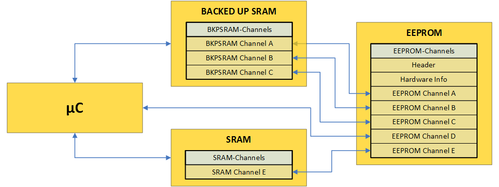
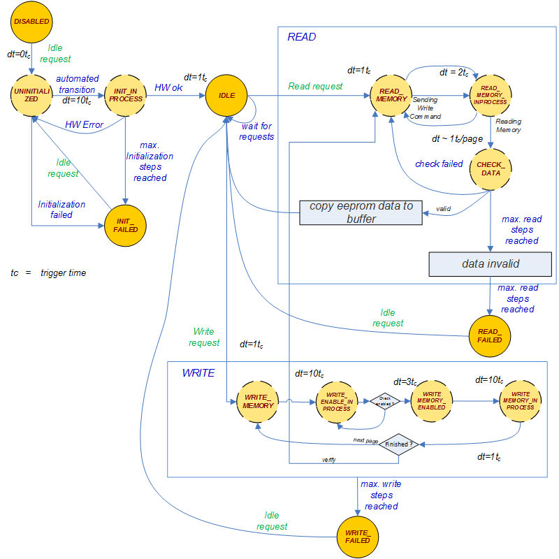
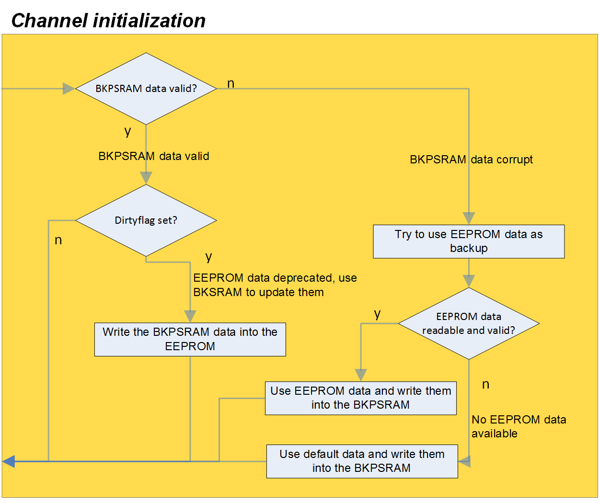
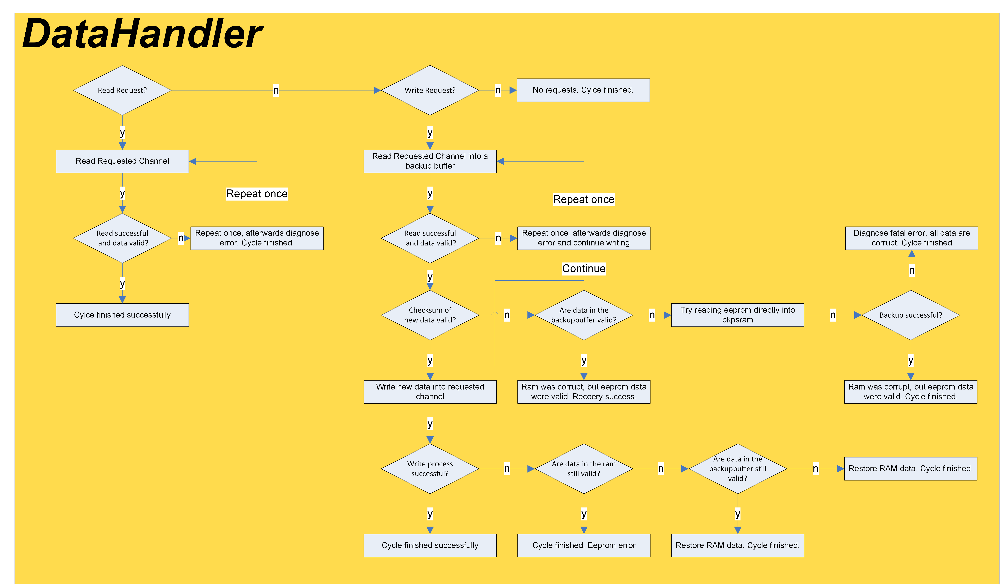

.. include:: ../../../macros.rst

.. _NVM:

===
NVM
===

.. highlight:: C

The |mod_nvm| provides a non-volatile memory for the data by using an external
EEPROM with integrated transparent hardware error correcting code (ECC). It
handles the backup and recovery features between the participating submodules
and depends on the implementation (EEPROM, BKSSRAM or SRAM). The user has to
group the data in channels which are taped with a checksum and handled as one
entity. Usually, the data are first written into the SRAM (or BKPSRAM if
available) and then backed up into the EEPROM. Alternatively, the data can be
written directly into the EEPROM without a buffer. When a buffer is used, it
can be located in SRAM or in BKPSRAM (Backup SRAM) with following different
reset characteristics:

* BKPSRAM:
   no data loss in case of any kind of reset (button cell buffered SRAM)
* SRAM (cleared memory section):
   data loss in case of any kind of reset
* SRAM (non-cleared memory section):
   data loss only in case of power down, no data loss in case of software reset or warm startup

Module Files
~~~~~~~~~~~~

Driver:
 - ``src\module\nvram\eepr.h``
 - ``src\module\nvram\eepr.c``
 - ``src\module\rtc\bkpsram.h``
 - ``src\module\rtc\bkpsram.c``

Driver Configuration:
 - ``src\module\config\eepr_cfg.h``
 - ``src\module\config\eepr_cfg.c``
 - ``src\module\config\bkpsram_cfg.h``
 - ``src\module\config\bkpsram_cfg.c``

Data Management
~~~~~~~~~~~~~~~

Data Structure
--------------

The data storage of the EEPROM is organized in coherent data entities called channels. Each channel has its own storage area reserved in the EEPROM. EEPROM channels can be used as a non-volatile backup for corresponding BKPSRAM channels. Furthermore, every channel has a checksum, an ID, and optionally a software write protection and a pointer to the location of the corresponding channel in the SRAM or BKPSRAM. Additionally, every channel has a dirty flag, which is set to indicate a modification of data to initiate a backup process to the EEPROM. EEPROM channels can be configured to be updated automatically during startup, if data is not up-to-date or in case it is corrupted.

Example: EEPROM-channels A, B and C have coherent BKPSRAM channels. E has a coherent SRAM channel. D does not have a coherent channel: the data are written directly into this channel.

.. _nvm_datastructure:

    Data organisation of the NV-Memory

Statemachine of the EEPROM Driver
---------------------------------

The statemachine is capable of handling the requests to write, read or to go into an idle mode. The states of the statemachine are:

+-----------------------------------+-----------------------------------------------------------------------------------------------+
| State                             | Description                                                                                   |
+===================================+===============================================================================================+
| ``DISABLED``                      | Initial state at startup                                                                      |
+-----------------------------------+-----------------------------------------------------------------------------------------------+
| ``UNINITIALIZED``                 | First state which will be entered after startup: the initialization sequence is started here  |
+-----------------------------------+-----------------------------------------------------------------------------------------------+
| ``INIT_IN_PROCESS``               | Checking of EEPROM availability and actual initialization                                     |
+-----------------------------------+-----------------------------------------------------------------------------------------------+
| ``IDLE``                          | Idle mode, ready to receive commands                                                          |
+-----------------------------------+-----------------------------------------------------------------------------------------------+
| ``WRITE_MEMORY``                  | Start of write process                                                                        |
+-----------------------------------+-----------------------------------------------------------------------------------------------+
| ``WRITE_ENABLE_INPROCESS``        | Activation and verification of the write mode of the EEPROM                                   |
+-----------------------------------+-----------------------------------------------------------------------------------------------+
| ``WRITE_MEMORY_ENABLED``          | Page length and timers are set, actual write command is being sent                            |
+-----------------------------------+-----------------------------------------------------------------------------------------------+
| ``WRITE_MEMORY_INPROCESS``        | Verification of the write process                                                             |
+-----------------------------------+-----------------------------------------------------------------------------------------------+
| ``READ_MEMORY``                   | Page length and timers are set, read command is being sent                                    |
+-----------------------------------+-----------------------------------------------------------------------------------------------+
| ``READ_MEMORY_INPROCESS``         | Verification of the write process                                                             |
+-----------------------------------+-----------------------------------------------------------------------------------------------+
| ``CHECK_DATA``                    | Checksum verification of the written/read data                                                |
+-----------------------------------+-----------------------------------------------------------------------------------------------+
| ``EEPR_INITFAILED``               | Handling of an initialization error                                                           |
|                                   |                                                                                               |
| ``EEPR_READFAILED``               | Handling of read errors                                                                       |
|                                   |                                                                                               |
| ``EEPR_WRITEFAILED``              | Handling of write errors                                                                      |
+-----------------------------------+-----------------------------------------------------------------------------------------------+

.. _nvm_statemachine:

    Statemachine of the EEPROM

Startup
-------

Before any data can be written or read, the EEPROM is being initialized by sending the request to go to idle. If the initialization was successful, the version number of the software and the EEPROM Header Information is checked, to ensure an equal memory layout software and NVM. Afterwards the data channels will be initialized.

Channel Initialization
----------------------

During the initialization, the driver will check and update the data of the selected channels as shown in :numref:`Fig. %s <nvm_channelinit>`. The specific control mechanisms to identify corrupt data are:

(1) Hardware-Check of Brownout Reset (BOR)
(2) Software-Check of BKPSRAM checksum
(3) Software-Check of EEPROM checksum

.. _nvm_channelinit:

    Initialization of the NVM channels

NVM Configuration
~~~~~~~~~~~~~~~~~

Channel Configuration
---------------------

Users can create new channels by declaring them in the array ``eepr_ch_cfg[]``.

When creating channels, attention should be paid to the following aspects:

(1) It is advisable to create a structure to work with the correct data format.
(2) When creating the structure, users have to pay attention to the correct data alignment. Data should be stored in blocks of 4 byte (32 bit) to avoid errors when reading or writing data.
    Example: Do not store a 32 bit number directly behind a 16 bit number. Instead, insert a 16 bit dummy in between.
(3) Make sure channels do not overlap.
(4) The checksum must always be stored in the last 4 bytes of the channel.
(5) Make sure that the channel ID matches the position in the array.
(6) Setting the write protection is optional and should only be set if the channel data in the EEPROM does not have to be changed during the runtime.
(7) Setting the pointer to the location of the corresponding channel (BKPSRAM or SRAM) is also optional, but necessary if an automatic update of the data should be done during the initialization.
(8) To support the automatic update function, the user has to make two function calls in the function ``EEPR_InitChannelData()``, just like the other channels that are handled there.
(9) In the function ``EEPR_SetDefaultValue(EEPR_CHANNEL_ID_TYPE_e eepr_channel)`` the default values of the new channel must be set.
(10) It is advisable to implement a GET and SET function for the new channel in the ``bkpsram_cfg.c``, similar to the implemented examples, to ensure data consistency.

Write and Read during Runtime
-----------------------------

To write or read an EEPROM channel during runtime, the user should use the functions ``EEPR_SetChannelData(EEPR_CHANNEL_ID_TYPE_e eepr_channel, uint8_t *dest_ptr)`` or ``EEPR_GetChannelData(EEPR_CHANNEL_ID_TYPE_e eepr_channel, uint8_t *dest_ptr)`` and trigger the state machine until it is either in the idle mode again or in an error state. To use the BKPSRAM pointer defined in the channel config, the source/destination pointer can be declared to be a NULL-pointer. To write or read the data of a BKPSRAM channel, the implemented GET and SET functions can be used.

Usage
~~~~~

Initialization
---------------------------

The EEPROM can be initialized manually, by setting the request to go to IDLE and triggering the state machine until the desired state is reached. Alternatively, the EEPROM can be initialized automatically by calling the function ``EEPR_ERRORTYPES_e EEPR_Init(void)``, which will initialize the EEPROM first and the channels afterwards. The BKPSRAM module can be initialized by calling ``void BKP_SRAM_Init(void)``.

Usage during runtime
---------------------------
During runtime a datahandler will manage the write and read process of the channels. It continuously checks if there is a read request or a write request for every channel.
The read/write requests can be set with ``void EEPR_SetChReadReqFlag(EEPR_CHANNEL_ID_TYPE_e eepr_channel)`` for read requests and ``void EEPR_SetChDirtyFlag(EEPR_CHANNEL_ID_TYPE_e eepr_channel)`` for write requests.
Afterwards the datahandler will take care of the write-process itself. How the write/read-process works can be seen in :numref:`Fig. %s <nvm_datahandler>`.

.. _nvm_datahandler:

After the write/read process is complete, the datahandler will diagnose the errors in ``EEPR_DATAHANDLING_ERROR_e EEPR_ch_dataerrors``.

Other Functions
-----------------
``void EEPR_Trigger(void)`` triggers the statemachine of the EEPROM. ``EEPR_RETURNTYPE_e EEPR_SetStateRequest(EEPR_STATE_e state_req, EEPR_CHANNEL_ID_TYPE_e channel, uint8_t* ramaddress)`` is used to request the desired state and returns if the request was accepted. ``EEPR_ERRORTYPES_e EEPR_Init(void)`` initializes the EEPROM.

Sources
~~~~~~~
