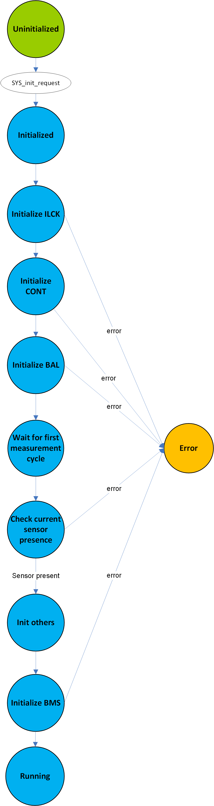

.. include:: ../../../macros.rst

.. _SYS:

======
System
======

.. highlight:: C

The (|mod_sys|) takes care of all system related tasks. Periodic system checks
can be implemented here. In the default configuration, it starts other
important statemachines (e.g., ``ILCK``, ``CONT``, ``BMS``)

Module Files
~~~~~~~~~~~~

Driver:
 - ``embedded-software\mcu-primary\src\engine\sys\sys.c``
 - ``embedded-software\mcu-primary\src\engine\sys\sys.h``
 - ``embedded-software\mcu-secondary\src\engine\sys\sys.c``
 - ``embedded-software\mcu-secondary\src\engine\sys\sys.h``

Driver Configuration:
 - ``embedded-software\mcu-primary\src\engine\config\sys_cfg.c``
 - ``embedded-software\mcu-primary\src\engine\config\sys_cfg.h``
 - ``embedded-software\mcu-secondary\src\engine\config\sys_cfg.c``
 - ``embedded-software\mcu-secondary\src\engine\config\sys_cfg.h``

Structure
~~~~~~~~~

:numref:`Fig. %s <sys_figure1>` shows the statemachine implementing the |mod_sys|.

.. _sys_figure1:

   System Control state machine

First, the following statemachines are initialized with state requests:

- ``ILCK``
- ``CONT``
- ``BAL``

The state of these modules is checked to ensure that the initialization was successful. A timeout mechanism is used: the ``SYS`` statemachine goes into an error state goes in case one of the initializations goes wrong.

The next step is to wait until a complete measurement cycle of the cell voltages and temperatures has taken place before enabling the periodic sending of values per CAN, to avoid the transmission of invalid data at startup.

The presence of a current sensor is then checked.

The last step is the initialization of ``BMS`` state machine with a state request.

After all these steps, the system is fully running. If necessary, additional periodic system checks can be implemented in the ``SYS`` state machine.
