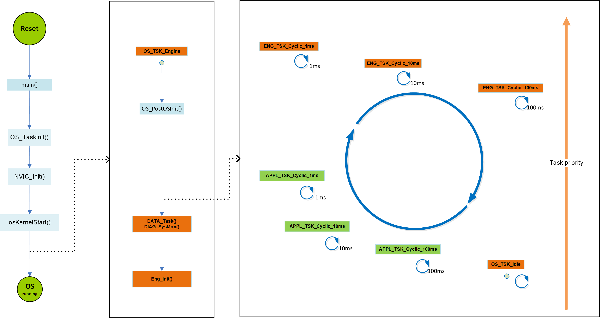
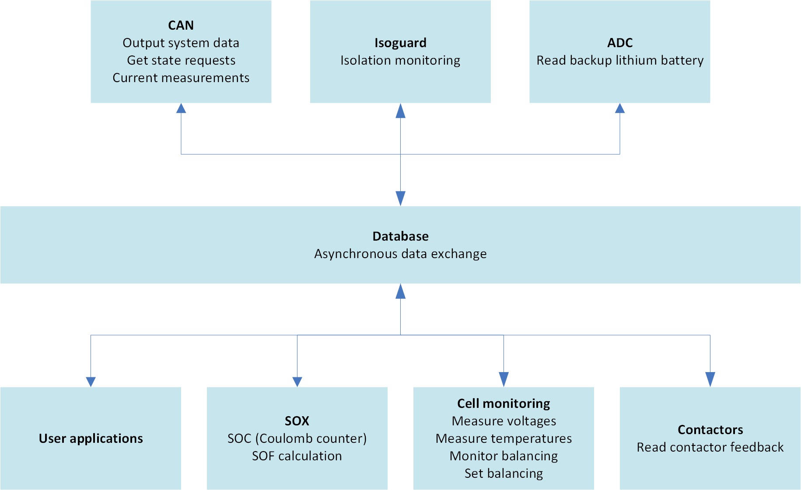
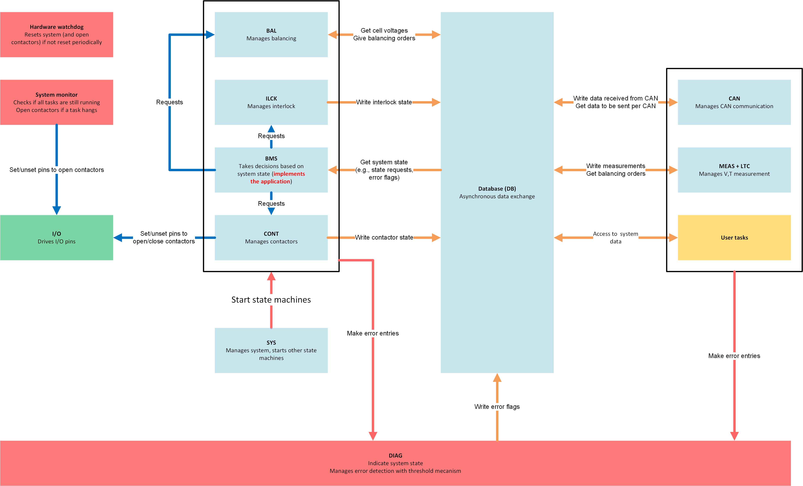

.. include:: ../../macros.rst

.. _software_documentation_overview:

=================
Software Overview
=================

.. highlight:: C

Startup
-------
The startup code begins at the label ``Reset_Handler`` in
``general\config\startup_stm32f429xx.s``. After initialization of the main
microcontroller registers, the system clock unit and the memory data (e.g.,
stack- and program pointer, system control block (SCB), interrupt vector,
pre-initialization of data-sections, FPU settings), the C function ``main()``
is called.
In ``general\main.c`` the second step of initializations of the
microcontroller unit, peripherals and software modules are done (e.g.,
interrupt priorities, hardware modules like SPI and DMA). At this point,
interrupts are still disabled. The steps are indicated by the global variable
``os_boot``. At the end of the main function, the operating system resources
(tasks, events, queues, mutex) are configured in ``OS_TaskInit()``
(``os/os.c``) and the scheduler is started by enabling the interrupts.
Scheduling is started by invoking all configured tasks (FreeRTOS threads)
regarding their priority. The activation of the scheduling is indicated by
``os_boot = OS_RUNNING``. The OS-scheduler first calls the task
``void ENG_TSK_Engine(void)`` as the highest priority is assigned to this task.
All other tasks are blocked in a while-loop until ``ENG_TSK_Engine()`` finishes
the third initialization step and enters the periodic execution.

Operating System
----------------

The following changes were to the FreeRTOS kernel in file port.c:

- Function ``uint8_t vPortCheckCriticalSection(void)`` was added to check if
  a function is currently executed within a critical section of the OS.

A critical section is entered with the FreeRTOS function ``vPortEnterCritical``
and exited with the function ``vPortExitCritical``. The operating system is
configured in the file ``FreeRTOSConfig.h``. A detailed explanation of the
parameters is given at https://www.freertos.org/a00110.html.

Engine
------

The task ``void ENG_TSK_Engine(void)`` executes the third (and last) step of
system initialization with enabled interrupts in ``ENG_PostOSInit()``. Then
``OS_TSK_Engine()`` manages the database and system monitoring via a periodic
call of ``DATA_Task()`` and ``DIAG_SysMon()`` every 1ms.

After that, ``os_boot`` is set to ``OS_SYTEM_RUNNING`` and the function
``void ENG_Init(void)`` is run before the periodic tasks. Initializations can
be made in this function. The database is already running when it is called.
The system then runs the following tasks periodically:

 - ``void ENG_TSK_Cyclic_1ms(void)``
 - ``void ENG_TSK_Cyclic_10ms(void)``
 - ``void ENG_TSK_Cyclic_100ms(void)``

It must be noted that no changes should be made directly in these functions,
since they are used as wrapper. They call the following functions:

 - ``void ENG_Cyclic_1ms(void)``
 - ``void ENG_Cyclic_10ms(void)``
 - ``void ENG_Cyclic_100ms(void)``

where the effective calls for system tasks are made. These three functions and
``ENG_TSK_Engine()`` make up the core of the system and are called ``engine``.
These function calls are found in ``engine/task/enginetask.c``. Additionally,
three users tasks run periodically. They are described in :ref:`usr_apps`.

.. _usr_apps:

User Applications
-----------------

For the user applications, three periodic tasks are available:

 - ``void APPL_TSK_Cyclic_1ms(void)``
 - ``void APPL_TSK_Cyclic_10ms(void)``
 - ``void APPL_TSK_Cyclic_100ms(void)``

It must be noted that no changes should be made directly in these functions,
since they are used as wrapper. They call the following functions:

 - ``void APPL_Cyclic_1ms(void)``
 - ``void APPL_Cyclic_10ms(void)``
 - ``void APPL_Cyclic_100ms(void)``

Here, the user can implement its own functions, like new battery state estimation
algorithms. The user has access to system data via the database. These function
calls are found in ``application/task/appltask_cfg.c``.

Startup Sequence
----------------

The start-up sequence is shown in :numref:`fig. %s <startup_simplified>`.

.. _startup_simplified:

   |foxbms| system start-up

Software Architecture
---------------------

The database runs with the highest priority in the system and provides
asynchronous data exchange for the whole system. :numref:`Fig. %s <database>`
shows the data exchanges implemented via the database.

.. _database:

   Asynchronous data exchange with the |foxbms| database

:numref:`Fig. %s <engine>` shows the main structure of |foxbms|.

.. _engine:

   Main tasks in |foxbms|

The two key modules used are:

 - ``SYS``
 - ``BMS``

``SYS`` has a lower priority than the database and a higher priority than
``BMS``. Both modules are implemented as a state machine, with a trigger
function that implements the transition between the states. The trigger
functions of ``SYS`` is called in ``void ENG_Cyclic_10ms(void)``. As
``BMS`` implements the user application, it is called in the user task
``void APPL_Cyclic_1ms(void)``.

``SYS`` controls the operating state of the system. It starts the other
state machines (e.g., ``CONT`` for the contactors, ``ILCK`` for the
interlock, ``BMS``).

``BMS`` gathers info on the system via the database and takes decisions based
on this data. The BMS is driven via CAN. Requests are made via CAN to go
either in STANDBY mode (i.e., contactors are open) or in NORMAL mode (i.e.,
contactors are closed). A safety feature is that these requests must be sent
periodically every 100ms. ``BMS`` retrieves the state requests received via
CAN from the database and analyses them. If the requests are not sent
correctly, this means that the controlling unit driving the BMS has a
problem and the correctness of the orders sent to the BMS may not be given
anymore. As a consequence, in this case ``BMS`` makes a request to ``CONT``
to open the contactors. Currently, ``BMS`` checks the cell voltages, the cell
temperatures and the global battery current. If one of these physical
quantities show a value out of the safe operating area, ``BMS`` makes the
corresponding state request to ``CONT`` to open the contactors. ``BMS`` is
started via an initial state request made in ``SYS``.

A watchdog instance is needed in case one of the aforementioned tasks hangs:
in this case, the control over the contactors would not be provided anymore.
This watchdog is made by the System Monitor module which monitors all
important tasks (e.g., ``Database``, ``SYS``, ``BMS``): if any of the
monitored tasks hangs, the contactors are opened to prevent damage and
protect persons and the battery. To ensure the highest level of safety,
opening the contactors is made by direct access to the |mod_io|.

A last barrier is present in case all the preceeding measures fail: the
hardware watchdog timer. In case it is not triggered periodically, it resets
the systems, provoking the opening of the contactors. Function calls (other
than ``SYS``) and closely related to the system are made in the engine tasks,
for example:

 - CAN
 - Battery cells monitoring (voltages and temperatures)
 - Galvanic isolation monitoring
 - Lithium 3V coin cell voltage monitoring
 - EEPROM
 - NVRAM-Handler

Diagnostic
----------

The |mod_diag| is designed to report problems on the whole system. The events
that trigger the |mod_diag| have to be defined by the user. The event handler
``DIAG_Handler(...)`` has to be called when the event is detected. The way the
system reacts to a ``Diag`` event is defined via a callback function or by the
caller according the return value.

Diagnostic events are stored in the Backup SRAM memory in the variable
``DIAG_ERROR_ENTRY_s diag_memory[]``

.. code-block:: C

   typedef struct {
    uint8_t YY;
    uint8_t MM;
    uint8_t DD;
    uint8_t hh;
    uint8_t mm;
    uint8_t ss;
    DIAG_EVENT_e event;
    DIAG_CH_ID_e event_id;
    uint32_t item;
    uint32_t dummy1;
    uint32_t Val0;
    uint32_t Val1;
    uint32_t Val2;
    uint32_t Val3;
    } DIAG_ERROR_ENTRY_s;

Data stored in the database
---------------------------

The following data is stored in the database:

  - Cell voltages
  - Cell temperatures
  - SOX (Battery state, contains State-of-Charge)
  - Balancing control
  - Balancing feedback
  - Current sensor measurements (includes battery current)
  - Hardware information
  - Last state request made to the BMS
  - Minimum, maximum and average values for voltages and temperatures
  - Measurement from isolation monitor
  - Interface to communicate via I2C with extra funcitonalities on slave (e.g., EEPROM, port expander)
  - Result from open-wire check on slaves
  - LTC device parameter
  - LTC accuracy
  - Error state of the BMS (i.e., error flags, set to 0 or 1)
  - MSL, maximum safety limits
  - RSL, recommended safety limits
  - MOL, maximum operating limits
  - Calculated values for moving average
  - Contactor feedback
  - Interlock feedback
  - BMS state (e.g., standby, normal, charge, error)
  - Current limits calcuated for State-of-Function
  - Voltages read on GPIOs of the slaves
