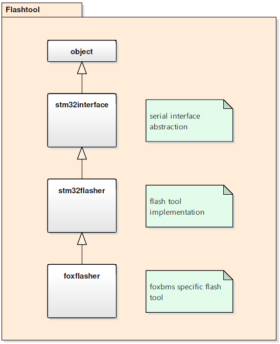

.. include:: ../../../macros.rst

.. _software_documentation_flashtool:

=========
Flashtool
=========

The flashtool is located in ``/path/to/foxbms/tools/flashtool``.

With the command line tool, the flash memory of the foxBMS (or generally STM32F4) microcontroller can be programmed with a binary file. Also a dump read or a full erase of the flash memory can be done.

.. note::

    Make sure that CAN0 connector is either disconnected or that there is no
    traffic on CAN0 bus while flashing ``primary`` MCU. If this is not the case,
    the internal bootloader of the controller will select a wrong boot source
    and the flashing fails.

Module Files
~~~~~~~~~~~~

Source:

 - ``tools/flashtool/__init__.py``
 - ``tools/flashtool/detect.py``
 - ``tools/flashtool/flash.py``
 - ``tools/flashtool/flashconfig.yaml``
 - ``tools/flashtool/foxflasher.py``
 - ``tools/flashtool/mcuconfig.ini``
 - ``tools/flashtool/README.md``
 - ``tools/flashtool/stm32flasher.py``
 - ``tools/flashtool/stm32interface.py``

Flash Memory Areas
~~~~~~~~~~~~~~~~~~

Program Flash:
* starting at 0x08000000
* variable size
* contains the whole foxbms firmware itself
* binary flash file from build process: foxbms_flash.bin

Program Header Flash
* starting at 0x080FFF00
* 256 Byte size
* contains flash area checksum and serial numbers etc.
* binary flash file from build process: foxbms_flashheader.bin

Caution: when flash programming, do not erase for each
flash area, because the full flash memory is erased
and everything that was written before, is erased too!

Procedure
~~~~~~~~~

#. Connect the USB slot of the primary or secondary microcontroller to the computer.

#. Check to which serial interface it is connected (Windows: COMxx, Linux: /dev/ttyUSBx)

#. The tool must be called from the commandline:

.. code-block:: Bash

  usage: foxflasher.py [-h] [-v] [--erase] [--read] [--write] [--verify]
                     [--bytes BYTES] [--bauds BAUDS] [--port PORT]
                     [--address ADDRESS] [--goaddress GOADDRESS]
                     FIRMWARE FILE

  foxBMS---STM32 flash tool

  positional arguments:
  FIRMWARE FILE         firmware binary

  optional arguments:
    -h, --help            show this help message and exit
    -v, --verbosity       increase output verbosity
    --erase, -e           erase firmware
    --read, -r            read and store firmware
    --write, -w           writes firmware
    --verify, -y          verify the firmware
    --bytes BYTES, -s BYTES
                          bytes to read from the firmware
    --bauds BAUDS, -b BAUDS
                          transfer speed (bauds)
    --port PORT, -p PORT  ttyUSB port
    --address ADDRESS, -a ADDRESS
                          target address
    --goaddress GOADDRESS, -g GOADDRESS
                          start address (use -1 for default)

  Example:
  foxflasher.py --port COM3 --erase --write --verify build/src/general/foxbms_flash.bin

  Copyright (c) 2015, 2016 Fraunhofer IISB.
  All rights reserved.
  This program has been released under the conditions of the BSD 3-Clause License.

Commandline examples:

 * read 512 bytes from start address 0x08000000 to file asdf.bin when windows serial interface COM13 is connected to foxBMS ``python foxflasher.py  -r -s 512 -p COM13 asdf.bin``
 * erase flash, write and verify content of file asdf.bin at start address 0x08000100 to  when windows serial interface COM13 is connected to foxBMS ``python foxflasher.py  -e -w -v -a 0x08000100 -p COM13 asdf.bin``

For Developers
~~~~~~~~~~~~~~

Class Diagram
-------------

STM32Interface:
- serial interface abstraction of foxBMS interface to send according to the protocol specified by ST Microelectronics

    - for detailed insight to the USART protocol refer to STM32 appnote AN3155 [1]_
    - for detailed insight to the device bootloader refer to STM32 appnote AN2606 [2]_

STM32flasher:
- easy-to-use flash tool for STM32f4 microcontrollers (similar to popular other flashtools like avrdude)

FoxFlasher:
- specific implementation of the STM32F4 microcontroller flashtool, which has following specialisations:

    - sets bootpin and resets microcontroller by the use of the serial interface DTR and RTS pins after the serial port is opened
    - TODO: read out CTS and DSR serial interface input pins to distinguish between the primary and secondary microcontroller

References
~~~~~~~~~~

.. [1] ST Microelectronics Application Note 3155 [PDF], 'USART protocol used in the STM32 bootloader' http://www.st.com/content/ccc/resource/technical/document/application_note/51/5f/03/1e/bd/9b/45/be/CD00264342.pdf

.. [2] ST Microelectronics Application Note 2606 [PDF], 'STM32 microcontroller system memory boot mode' http://www.st.com/content/ccc/resource/technical/document/application_note/b9/9b/16/3a/12/1e/40/0c/CD00167594.pdf
